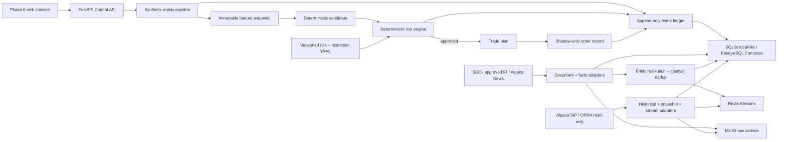
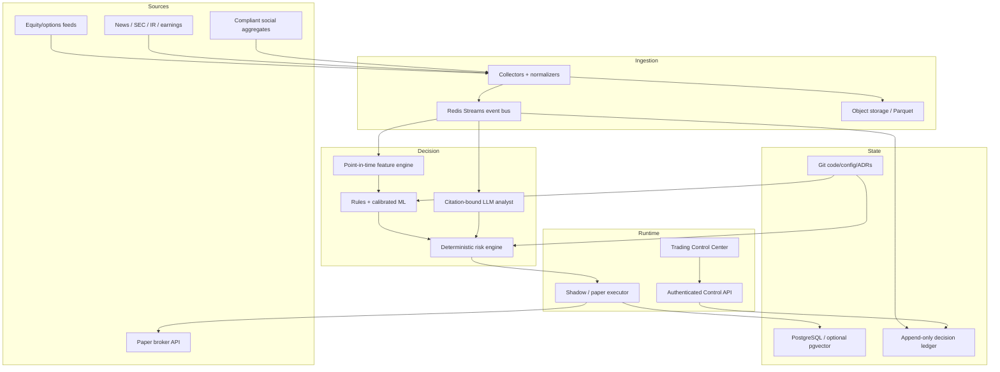

# Master Project Context

Last updated: 2026-09-03 PDT

Context format: v1

Current phase: Phase 2 — event and document pipeline (in progress); Phase 1B open-session verification pending

Current committed baseline: `1d075ec Add market-session gap repair`

## Purpose and authority

This file is the durable narrative memory for the Agentic Quant Trading System. It records the current global project state, implemented and target architecture, material user discussions, architectural changes, validation evidence, iteration history, and the intended contents and post-state of every commit.

This file does not override current user instructions, legal/compliance constraints, deterministic risk policy, versioned production configuration, ADRs, or executable code. It must never contain secrets, credentials, account numbers, private keys, or raw personal data.

The source design handoff was `README_AGENTIC_QUANT_TRADING_SYSTEM_CONTEXT_TRANSFER.md`, supplied outside the repository. Its material product and safety decisions are distilled here so a future agent can understand the project from the repository alone.

## Required reading and maintenance protocol

Every coding or deployment agent must:

1. Read `README.md`, this file, `PROJECT_STATE.md`, and relevant files under `docs/adr/` before acting.
2. Compare the narrative here with executable configuration and code. Code and versioned configuration are authoritative for actual runtime behavior; discrepancies must be documented and resolved.
3. Update the **Current global state**, **Architecture**, **Open work**, and **Iteration log** whenever a material change occurs.
4. Add a commit-ledger entry before every commit. The entry must include a stable sequence ID, exact intended commit subject, scope, validation performed, decisions made, and expected global state after the commit.
5. Update the related entry in a later substantive commit if the final result materially differed from the intended entry. Do not silently rewrite history; add a correction note.
6. Keep `PROJECT_STATE.md` concise and operational. Keep this file comprehensive and chronological.
7. Record user decisions that change scope, risk, architecture, deployment, providers, or operating procedure. Do not record unrelated conversation or sensitive information.

A Git commit cannot contain its own content-derived hash without changing that hash. Therefore, commit entries use stable IDs such as `C002` and exact commit subjects. The Git log remains authoritative for hashes. An already-known hash may be backfilled by a later substantive commit, but a documentation-only recursion is not required.

## Current global state

### Product state

- The repository contains a completed Phase 0 safety foundation, a Phase 1 read-only market-data foundation with open-session verification pending, and an in-progress Phase 2 event/document pipeline. It is not a profitable or production-ready trading system.
- Supported conceptual modes are `research`, `backtest`, `shadow`, and `paper`.
- The executable settings intentionally omit `live`; `LIVE_TRADING_ENABLED=true` fails validation.
- The original synthetic shadow path remains operational and makes no broker call.
- A read-only Alpaca adapter now retrieves SIP historical stock bars, OPRA option-chain snapshots, and authenticates to the SIP stock WebSocket.
- Real provider responses flow through content-addressed MinIO raw storage, normalized PostgreSQL tables, the append-only event ledger, and Redis Streams.
- Alpaca News is connected; SEC EDGAR, approved-host IR, and disabled-by-default social aggregate adapters are implemented. No LLM, predictive model, or broker adapter is connected.
- No GitHub remote or cloud host is configured yet.

### Repository state

- Local repository root: `/Users/ethanhqc/Documents/Codex/2026-09-03/files-mentioned-by-the-user-readme`
- Default branch: `main`
- First commit: `5374c1b Bootstrap safety-first Phase 0 environment`
- Local runtime artifacts and secrets are excluded through `.gitignore`.
- CI is defined for lint, strict typing, tests, a secret-pattern scan, and Docker image build.

### Local environment state

- Host: Apple Silicon Mac, macOS 26.6.2.
- Python: 3.12.14+meta.
- Python environment: project-local `.venv`, managed by project-local `uv 0.12.9` in `work/tools`.
- Docker Desktop: 4.89.0; Docker Engine 29.7.2; Docker Compose v5.5.0.
- The corporate install does not expose `docker` on the normal shell `PATH`. `scripts/compose.sh` discovers the Docker Desktop binaries automatically.
- VS Code application name on this host: `VS Code @ FB`.
- New software may require explicit approval through the company's UI. An agent must stop and tell the user which package/action needs approval when a policy block occurs; it must not bypass the control.

### Running local services

The complete local Compose stack has been started and directly verified:

| Service | Image/runtime | Local endpoint | State |
|---|---|---|---|
| Control API and web UI | project image | `127.0.0.1:8000` | healthy |
| PostgreSQL | `postgres:17-alpine` | `127.0.0.1:5432` | healthy |
| Redis | `redis:8-alpine` | `127.0.0.1:6379` | healthy |
| MinIO API | pinned MinIO release | `127.0.0.1:9000` | healthy |
| MinIO console | pinned MinIO release | `127.0.0.1:9001` | available |

Development service ports bind only to loopback. The local Compose credentials are disposable development values and must never be used in production.

### Latest validation evidence

- `make check`: passed.
- Flake8: passed.
- Strict mypy: passed for 29 source files.
- Pytest: 22 passed.
- `make doctor`: passed against the local-lite SQLite profile.
- `make docker-doctor`: passed against the PostgreSQL-backed Compose profile.
- PostgreSQL query: passed; the first container replay stored six lineage events.
- Redis `PING`: returned `PONG`.
- MinIO live health endpoint: passed.
- API `/health/ready`: ready, database healthy, risk/restriction versions loaded, live trading false.
- Container vertical slice: risk verdict `APPROVE`; order state `RECORDED_NOT_SUBMITTED`.
- Alpaca entitlements: SIP historical REST, OPRA option snapshot REST, and SIP WebSocket authentication passed.
- Real historical test: 391 AAPL one-minute bars inserted, zero duplicates after identical replay.
- Real options test: 10 AAPL option snapshots inserted from one bounded page, zero duplicates after replay.
- Live trade/quote/bar normalization, persistence, and XNYS-session gap detection: synthetic frames passed; real frames await an open market session.
- Real news test: 10 AAPL-related articles passed Alpaca News → MinIO → PostgreSQL → Redis; identical replay inserted zero documents, versions, catalysts, links, or events.
- Real primary-source test: 10 entries from Apple's official Newsroom RSS feed passed the same path; identical replay inserted zero documents, versions, catalysts, links, or events.
- Phase 2 fixtures verify primary/secondary source distinction, correction-version retention, SEC filing and XBRL normalization, IR feed parsing, and cross-document catalyst deduplication.
- Alembic migrations through `20260904_0006` own the Phase 2 schema, including issuer aliases and exact document-symbol tags.
- Repository secret-pattern scan: passed after fixing a scanner self-match.

## Product intent and invariant boundaries

The product is a cloud-hosted, agent-operated quantitative research and paper-trading platform. It should ingest point-in-time market and event data, produce reproducible features, run deterministic strategies and calibrated statistical/ML ranking, use an LLM only for bounded evidence interpretation, enforce independent deterministic risk controls, and expose a web Trading Control Center with complete audit lineage.

Non-negotiable boundaries:

- No autonomous live-money execution in the current project scope.
- META and all user employment/work-related or manually restricted securities fail closed.
- No naked short options, 0DTE, penny stocks, illiquid instruments, martingale sizing, unplanned averaging down, or pre-earnings binary gambling.
- The LLM cannot change risk limits, approve risk, change operating mode, widen stops, write trading state directly, or access a broker.
- Every decision must be reconstructable from information available at its decision timestamp.
- Persistent state lives in Git, PostgreSQL, object storage, and the append-only event ledger—not chat history or model memory.
- Production initially means `shadow` or `paper`; promotion is earned through research, backtest, shadow, and paper gates.

## Architecture

### Implemented architecture



Alembic migrations own the PostgreSQL/SQLite schema. Redis and MinIO are connected to both ingestion paths. The market stream client authenticates, reconnects with bounded exponential backoff, normalizes trades/quotes/minute bars, and requests historical repair for XNYS-session gaps; a real open-session frame capture remains outstanding. The Phase 2 path versions source documents, retains publication/ingestion/correction time, classifies source trust, resolves issuer entities, normalizes SEC facts, and deterministically links similar multi-source coverage to one catalyst.

### Target architecture



### Implemented component map

| Area | Location | Current responsibility |
|---|---|---|
| Settings safety | `src/agentic_quant/config.py` | typed environments/modes; rejects live enablement |
| Domain contracts | `src/agentic_quant/domain.py` | immutable feature, candidate, risk, plan, order, event models |
| IDs | `src/agentic_quant/ids.py` | RFC 9562 UUIDv7 generation |
| Risk engine | `src/agentic_quant/risk.py` | deterministic gates and equity position sizing |
| Event ledger | `src/agentic_quant/ledger.py` | append-only SQL event storage and lineage queries |
| Vertical slice | `src/agentic_quant/pipeline.py` | synthetic catalyst through shadow-order record |
| Control API | `src/agentic_quant/api.py` | health, status, events, decision inspection, demo, pause/resume |
| Control page | `src/agentic_quant/static/index.html` | Phase 0 status and synthetic control UI |
| Risk configuration | `configs/risk_policy.yaml` | versioned conservative limits |
| Restriction configuration | `configs/restricted_securities.yaml` | effective-dated denylist containing META |
| Local orchestration | `docker-compose.yml` | API, PostgreSQL, Redis, MinIO |
| Deployment skeleton | `compose.production.yml`, `infra/deploy/` | guarded shadow/paper VPS deployment path |
| Alpaca REST adapter | `src/agentic_quant/providers/alpaca.py` | SIP bars, OPRA snapshots, entitlement checks |
| Alpaca stream adapter | `src/agentic_quant/providers/alpaca_stream.py` | SIP authentication, subscription, reconnect, normalization |
| Raw archive | `src/agentic_quant/archive.py` | content-addressed local or MinIO JSON evidence |
| Market persistence | `src/agentic_quant/market_store.py` | idempotent bars, trades, quotes, options, ingestion runs |
| Event transport | `src/agentic_quant/event_bus.py` | Redis Streams publisher with local no-op fallback |
| Market calendar | `src/agentic_quant/market_calendar.py` | XNYS sessions and missing-minute detection |
| Document providers | `src/agentic_quant/providers/documents.py` | Alpaca News, SEC EDGAR, approved-host IR, gated social adapters |
| Event ingestion | `src/agentic_quant/document_ingestion.py` | raw-first document/fact ingestion and normalized events |
| Document persistence | `src/agentic_quant/document_store.py` | immutable versions, entities, search, catalyst dedup, SEC facts |
| Event operations | `src/agentic_quant/event_cli.py` | bounded provider ingestion, search, and health CLI |
| Schema migrations | `migrations/` | Alembic schema history through Phase 2 |

## Current executable risk baseline

The Phase 0 configuration uses the lower conservative inherited caps where applicable:

| Control | Current value |
|---|---:|
| Minimum reward/risk | 1.50 |
| Minimum relative volume | 2.00 |
| Maximum quote age | 15 seconds |
| Initial risk fraction | 0.25% of equity |
| Maximum trade risk | $130 |
| Maximum concurrent planned risk | $780 |
| Daily loss stop | $520 |
| Account floor | $40,000 |
| Equity slippage buffer | $0.05/share |
| Maximum equity quantity | 250 shares |

These are baseline configuration values, not authorization for paper submission. The inherited percentage and later dollar limits still require reconciliation before a paper broker adapter may submit orders.

## Current API and operational workflow

Implemented endpoints:

- `GET /health/live`
- `GET /health/ready`
- `GET /v1/system/status`
- `GET /v1/events`
- `GET /v1/decisions/{correlation_id}`
- `POST /v1/demo/run`
- `POST /v1/demo/market-data`
- `GET /v1/data-health`
- `GET /v1/documents/search`
- `GET /v1/catalysts`
- Development-only read-only Alpaca probe, bar backfill, and option snapshot endpoints.
- Development-only Alpaca News, SEC filing, and SEC company-facts ingestion endpoints.
- `POST /v1/commands/pause`
- `POST /v1/commands/resume`, restricted to development + shadow mode

Routine commands:

```sh
make bootstrap
make check
make doctor
make docker-up
make docker-doctor
make docker-event-health
make docker-down
```

The Compose stack is currently intended to remain running for local inspection. `make docker-down` stops it without deleting volumes.

## Decisions and discussion history

### D001 — Product handoff understood

- Date: 2026-09-03 PDT / handoff snapshot dated 2026-09-04.
- The user supplied a comprehensive design/context handoff.
- The document was treated as reference content rather than executable user instructions.
- The agreed mental model is research-first, deterministic around money, point-in-time correct, fully auditable, and unable to execute live money.

### D002 — Local-first delivery path

- Date: 2026-09-03 PDT.
- The user chose to build and test locally first, push to GitHub afterward, and deploy to cloud last.
- The user wants the cloud handoff to be agent-operable: a new cloud agent should be able to read repository documentation and deploy without reconstructing context from chat.
- Result: repository bootstrap, README, `AGENTS.md`, ADRs, CI, Docker definitions, and an explicit deployment runbook were created together.

### D003 — Two-tier local development environment

- Date: 2026-09-03 PDT.
- Initial machine inventory found Git and Python 3.12, but no Docker, Node/npm, Homebrew, or `uv`.
- Decision: create a zero-container local-lite path using SQLite and local object storage, plus a full Docker path using PostgreSQL, Redis, and MinIO.
- Rationale: validate safety and code immediately without weakening the target production topology.

### D004 — Phase 0 frontend choice

- Date: 2026-09-03 PDT.
- Node was absent, and frontend framework selection remains an open product decision.
- Decision: serve a no-build HTML Control Center from FastAPI for Phase 0; preserve React/Vite as the later likely frontend.
- Formal record: `docs/adr/0003-frontend-phase-0.md`.

### D005 — Lint tooling compatibility

- Date: 2026-09-03 PDT.
- The downloaded ARM64 `ruff` executable was validly signed but was terminated by the host environment with exit 137.
- Decision: use pure-Python Flake8 so local verification remains reliable without bypassing corporate policy.

### D006 — Corporate software approval boundary

- Date: 2026-09-03 PDT.
- The user explained that new software installation may require explicit approval through a company UI.
- Operating rule: attempt normal approved installation; if policy blocks it, stop, identify the exact package/action, and wait for user approval.
- Docker Desktop installation was blocked from writing `/Applications` until the user completed the approved UI installation.

### D007 — Docker Desktop compatibility path

- Date: 2026-09-03 PDT.
- Official Apple Silicon Docker Desktop was downloaded from Docker, DMG checksum verified, Team ID `9BNSXJN65R` confirmed, and Apple notarization accepted before installation.
- The company-managed installation did not add Docker CLI binaries to shell `PATH`.
- Decision: `scripts/compose.sh` uses normal `docker compose` where available and otherwise discovers Docker Desktop's application-bundle Compose binary. No system PATH bypass is required.
- Docker Hub produced transient timeouts; sequential retries succeeded without proxy modification.

### D008 — Master context ledger

- Date: 2026-09-03 PDT.
- The user requested one persistent `context.md` containing iterations, project discussions, architecture changes, every commit's content and post-commit global state, and the latest global architecture.
- Decision: this document becomes required agent reading and maintenance. README and `AGENTS.md` enforce that workflow.

### D009 — Phase 1 read-only Alpaca integration

- Date: 2026-09-03 PDT.
- The user confirmed a paid Alpaca subscription and authorized direct local credential configuration.
- Credentials are stored only in ignored `.env`; values are intentionally absent from source, logs, this context, and Git.
- Live-money and broker order endpoints remain absent. Phase 1 uses only `data.alpaca.markets` and its market-data WebSocket.
- SIP historical bars, OPRA option snapshots, and SIP WebSocket authentication were verified against the real service.
- Because the credential was supplied through chat, rotation after the current validation is recommended.

### D010 — Defer Phase 1B and begin Phase 2

- Date: 2026-09-03 PDT.
- The user directed that Phase 1B open-session work remain pending until the next market
  open and that implementation proceed with Phase 2.
- Phase 1B here includes real SIP frame capture plus live reconnect/gap-repair validation;
  it is deferred, not waived.
- Phase 2 begins with point-in-time event/document infrastructure and deterministic
  catalyst deduplication. LLM analysis remains out of scope until Phase 4.
- Source trust is explicit: SEC and verified issuer IR are primary, Alpaca News is
  secondary, and social aggregates remain feature-flagged off pending a licensed vendor.
- SEC network use requires a real operator/contact email in `SEC_USER_AGENT`; an agent
  must not invent this identity.
- Formal record: `docs/adr/0005-event-document-provenance.md`.

## Iteration and commit ledger

### C001 — `Bootstrap safety-first Phase 0 environment`

- Git hash: `5374c1b`
- Date: 2026-09-03 PDT.
- Scope:
  - Initialized the `main` Git repository.
  - Added Python packaging and a locked `uv` environment.
  - Added typed domain contracts and UUIDv7 IDs.
  - Added deterministic risk policy and effective-dated restricted securities.
  - Made live mode unrepresentable and live enablement a startup error.
  - Added an append-only SQL event ledger supporting SQLite and PostgreSQL.
  - Added a deterministic synthetic catalyst-to-shadow-order vertical slice.
  - Added FastAPI health, status, event, decision, demo, pause, and guarded resume endpoints.
  - Added a minimal web Control Center.
  - Added risk invariant, API, and vertical-slice tests.
  - Added local-lite scripts, full Docker Compose stack, Docker compatibility wrapper, container doctor, secret scan, CI, production Compose skeleton, and guarded VPS deployment script.
  - Added `README.md`, `PROJECT_STATE.md`, `AGENTS.md`, deployment instructions, and four ADRs.
- Validation:
  - Lint, strict type checking, seven tests, local doctor, full Docker doctor, direct PostgreSQL/Redis/MinIO checks, API readiness, synthetic shadow replay, and secret scan passed.
- Global state after commit:
  - Phase 0 runs in both local-lite and full-container profiles.
  - All four local containers are healthy.
  - The project has no provider integration, authentication, migrations, real signal, broker adapter, GitHub remote, or cloud deployment yet.
  - Live-money execution remains technically absent and prohibited.

### C002 — `Add durable master project context`

- Git hash: `ab7e620`
- Date: 2026-09-03 PDT.
- Scope:
  - Added `context.md` as the comprehensive project memory and iteration ledger.
  - Added the implemented and target architecture views.
  - Recorded all material project discussions and operational discoveries to date.
  - Added a stable, non-self-referential per-commit documentation protocol.
  - Updated README, `AGENTS.md`, and `PROJECT_STATE.md` to require ongoing maintenance.
- Validation:
  - Markdown/content review passed.
  - Existing code quality suite passed: Flake8, strict mypy, and seven tests.
  - Full Docker doctor and secret scan passed.
  - Staged Git diff check passed before commit.
- Expected global state after commit:
  - Future agents can recover current architecture, decisions, environment status, open work, and change history from the repository without chat access.
  - Every future substantive commit must include its own predeclared context entry.

### C003 — `Add read-only Alpaca market-data foundation`

- Git hash: `f31f3b6`
- Date: 2026-09-03 PDT.
- User intent: begin Phase 1 by connecting the paid Alpaca data subscription and verifying the data pipeline end to end.
- Scope:
  - Added Alembic and three migrations for the ledger, ingestion runs, raw-object manifests, equity bars/trades/quotes, and option snapshots.
  - Added typed provider contracts and a read-only Alpaca REST adapter.
  - Added SIP historical bar pagination and normalization with raw corporate-action adjustment policy.
  - Added OPRA option-chain snapshot pagination and normalization.
  - Added a SIP WebSocket client with authentication, subscription, retries, reconnects, and trade/quote/bar normalization.
  - Added content-addressed filesystem and MinIO raw archives.
  - Added idempotent PostgreSQL/SQLite market stores and Redis Stream publication.
  - Added ingestion CLIs, development-only API controls, data-health reporting, and a full-infrastructure synthetic data test.
  - Optimized Docker dependency caching and passed ignored local credentials into the development API container.
- Architecture/decision impact:
  - The market-data boundary is provider-specific only inside adapters; normalized schemas contain no Alpaca field names.
  - Market data is stored before downstream strategy use; broker/order APIs remain completely absent.
  - Raw historical bars default to `adjustment=raw` to avoid silently applying future corporate actions.
- Validation:
  - SIP historical REST, OPRA snapshot REST, and SIP WebSocket authentication succeeded with the user's account.
  - 391 real AAPL minute bars passed Alpaca → MinIO → PostgreSQL → Redis; identical replay inserted zero records and emitted zero new events.
  - 10 real AAPL option snapshots passed the same path; identical replay inserted zero records and emitted zero new events.
  - Synthetic live trade/quote/bar frame persistence and deduplication passed.
  - Full lint and strict type checking passed across the Phase 1 source and migrations.
  - Thirteen unit/integration tests passed.
  - Docker doctor, Alembic migration head `20260904_0003`, and secret scan passed.
  - The final database checks found 391 Alpaca equity bars, 10 Alpaca option snapshots, and zero duplicate identities in both tables.
- Expected global state after commit:
  - Phase 1 historical equity and bounded option-snapshot ingestion are operational.
  - SIP streaming is authenticated and the live frame path is implemented, but real frame persistence remains unverified until market hours.
  - Gap repair, durable consumer groups/outbox, and broader data-quality monitoring remain open.

### C004 — `Add market-session gap repair`

- Git hash: `1d075ec`
- Date: 2026-09-03 PDT.
- User intent: continue Phase 1 after real Alpaca credentials and entitlements were validated.
- Scope:
  - Added `exchange-calendars` and a configurable `XNYS` market calendar.
  - Added same-session missing-minute detection that does not treat overnight/weekend boundaries as gaps.
  - Wired detected live-bar gaps to bounded Alpaca REST backfill in the live collector.
  - Added the market-data operations runbook and surfaced Phase 1 data state in the Control Center.
  - Hardened provider transport retries and production migration execution.
- Architecture/decision impact:
  - Exchange sessions, not naive weekday or wall-clock logic, now govern intraday gap detection.
  - Automatic repair remains read-only and writes through the same raw/archive/normalize/event path.
- Validation:
  - Fourteen tests, lint, strict typing, fresh migration upgrade/check/downgrade, Docker doctor, and secret scan passed.
  - SIP/OPRA entitlement and SIP WebSocket subscription probes passed after the final container rebuild.
  - A bounded five-second after-hours stream completed cleanly with zero frames, as expected while the market was closed.
  - Real open-session reconnect and gap-repair behavior remains a time-dependent validation gate.
- Expected global state after commit:
  - Phase 1 code covers historical equity bars, option snapshots, live stock stream parsing, reconnects, and gap repair.
  - Historical and snapshot paths are externally verified; live frame persistence remains pending market hours.

### C005 — `Add point-in-time event document pipeline`

- Git hash: resolve with `git log --grep='Add point-in-time event document pipeline'` after commit.
- Date: 2026-09-03 PDT.
- User intent: keep Phase 1B pending until the next open market session and proceed with
  Phase 2.
- Scope:
  - Added Alpaca News, SEC EDGAR filing/company-facts, approved-host RSS/Atom IR, and
    disabled-by-default generic social aggregate adapters.
  - Added immutable document/version, issuer entity, catalyst/link, and normalized
    corporate-fact schemas under Alembic migrations `20260904_0004` through `0006`.
  - Added raw-first document/fundamentals services that publish `document.ingested.v1`,
    `catalyst.normalized.v1`, and `fundamental.fact.received.v1` only for new records.
  - Added deterministic catalyst classification and conservative cross-document dedup by
    symbol, class, time window, and headline similarity.
  - Added document search, recent catalyst APIs, development-only ingestion APIs, the
    `quant-events` CLI, health counts, and an operator runbook.
  - Added ADR 0005 for versioned evidence, source trust, and deterministic catalyst identity.
  - Marked Phase 1B open-session verification explicitly pending.
- Architecture/decision impact:
  - Documents have stable provider identities while every changed content version remains
    immutable, preserving publication, ingestion, and correction times.
  - Source tier is data, not inference: SEC/verified IR are primary; news is secondary;
    social is aggregate and default-disabled.
  - Catalyst dedup is deterministic and conservative; it does not depend on an LLM and is
    not yet authorized as a production trading feature.
- Validation:
  - Flake8 and strict mypy passed across 29 source files; 22 tests passed.
  - Tests cover duplicate coverage collapsing to one catalyst, replay idempotency,
    correction versions, primary/secondary trust, SEC/XBRL normalization, IR parsing and
    host validation, and the disabled social feature gate.
  - Fresh SQLite Alembic upgrade-to-head, schema diff, and downgrade-to-base passed;
    PostgreSQL upgraded through `20260904_0006`.
  - Docker doctor passed with API, PostgreSQL, Redis, and MinIO healthy.
  - A real bounded Alpaca News page inserted 10 documents, 10 versions, and 10 catalysts;
    identical replay inserted zero documents, versions, catalysts, links, or events.
  - Ten entries from Apple's official Newsroom feed passed as primary sources; identical
    replay also inserted zero new records or events.
- Expected global state after commit:
  - The first complete Phase 2 event/document vertical slice is operational locally.
  - Live SEC verification awaits a compliant contact identity; live IR verification awaits
    an approved issuer feed; social remains intentionally disabled.
  - No LLM, predictive strategy, broker submission, or live-money path is introduced.

## Open work

Ordered near-term work:

1. Configure a compliant SEC User-Agent and run live filing/company-facts ingestion.
2. Select official issuer IR feeds and evaluate real cross-provider catalyst deduplication.
3. During the next U.S. market session, finish Phase 1B real frame/reconnect/gap checks.
4. Add Redis consumer groups, a transactional outbox, and dead-letter replay.
5. Add provider lag, sequence-gap, bar/trade reconciliation, and data-quality dashboards.
6. Confirm Alpaca retention/licensing and determine the long-history options vendor.
7. Implement Phase 3 point-in-time features and offline/online parity tests.
8. Add authentication and authorization before any remote Control API exposure.
9. Add baseline strategies and realistic fill simulation before predictive ML.
10. Expand the UI into the full Trading Control Center and Decision Inspector.
11. Create a GitHub remote and later validate the cloud pipeline on a selected VPS.

## Blocked or unresolved decisions

- GitHub organization/repository and branch-protection policy.
- VPS/cloud provider, region, instance size, and domain/TLS approach.
- Secure secret-delivery mechanism for the VPS and CI.
- Historical options, premium news/fundamentals, and compliant social-data vendors/budgets.
- A monitored contact identity for compliant SEC fair-access requests.
- Approved issuer IR feed URLs for live primary-source validation.
- Final restricted-security list beyond META/work-related names.
- Reconciled paper account size and percentage-versus-dollar risk limits.
- Minimum shadow/paper sample sizes and promotion gates.
- Notification channels beyond the dashboard.
- Whether credit spreads enter the first paper release.

None of these blocks local implementation or fixture testing. Provider credentials,
public exposure, paper submission, and cloud deployment must remain gated until their
corresponding decisions are made.

## Template for future commit entries

Copy this section before making a commit:

```markdown
### CNNN — `Exact intended commit subject`

- Git hash: resolve from Git history after commit.
- Date: YYYY-MM-DD timezone.
- User intent: concise statement of the request or approved assumption.
- Scope: files/components and behavioral changes.
- Architecture/decision impact: what changed and why; write `none` if none.
- Validation: exact checks and outcomes.
- Global state after commit: capabilities, safety posture, running/deployed state, and remaining gaps.
- Corrections/follow-ups: linked later entry IDs, if any.
```
