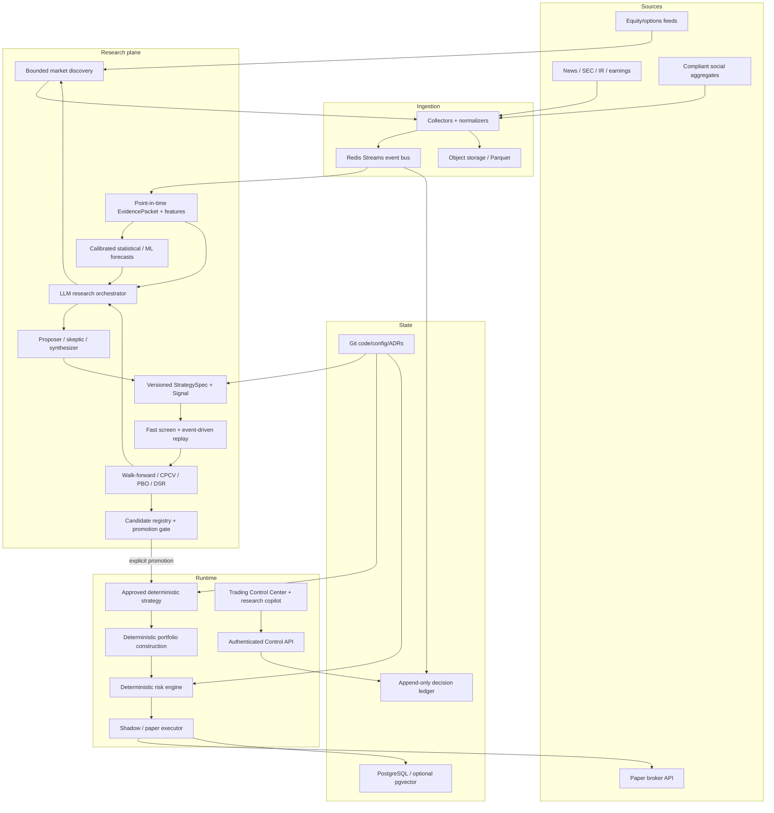

# Master Project Context

Last updated: 2026-09-08 PDT

Context format: v1

Current phase: the unified research, Shadow, and Alpaca Paper foundations are deployed to a
fresh production data plane. Paid ML + LLM research and source-specific historical backfill
are active, while new exposure remains paused and no external simulated order is eligible
until an exact strategy passes deterministic validation and receives the separate adoption,
Shadow-start, and Paper-enrollment confirmations. Off-site backup/alerting and statistical/
elapsed production evidence remain open

Current documented baseline: C062 — `Record tiered Shadow production rollout`

## Purpose and authority

This file is the durable narrative memory for the Agentic Quant Trading System. It records the current global project state, implemented and target architecture, material user discussions, architectural changes, validation evidence, iteration history, and the intended contents and post-state of every commit.

This file does not override current user instructions, legal/compliance constraints, deterministic risk policy, versioned production configuration, ADRs, or executable code. It must never contain secrets, credentials, account numbers, private keys, or raw personal data.

The source design handoff was `README_AGENTIC_QUANT_TRADING_SYSTEM_CONTEXT_TRANSFER.md`, supplied outside the repository. Its material product and safety decisions are distilled here so a future agent can understand the project from the repository alone.

## Required reading and maintenance protocol

Every coding or deployment agent must:

1. Read `README.md`, this file, `PROJECT_STATE.md`, and relevant files under `docs/adr/` before acting.
2. Compare the narrative here with executable configuration and code. Code and versioned configuration are authoritative for actual runtime behavior; discrepancies must be documented and resolved.
3. Update the **Current global state**, **Architecture**, **Open work**, and **Iteration log** whenever a material change occurs.
4. Add a commit-ledger entry before every commit. The entry must include a stable sequence ID, exact intended commit subject, scope, validation performed, decisions made, and expected global state after the commit.
5. Update the related entry in a later substantive commit if the final result materially differed from the intended entry. Do not silently rewrite history; add a correction note.
6. Keep `PROJECT_STATE.md` concise and operational. Keep this file comprehensive and chronological.
7. Record user decisions that change scope, risk, architecture, deployment, providers, or operating procedure. Do not record unrelated conversation or sensitive information.

A Git commit cannot contain its own content-derived hash without changing that hash. Therefore, commit entries use stable IDs such as `C002` and exact commit subjects. The Git log remains authoritative for hashes. An already-known hash may be backfilled by a later substantive commit, but a documentation-only recursion is not required.

## Current global state

### Product state

- The repository contains completed Phase 0 safety and Phase 2 event/document foundations,
  a Phase 1 read-only market-data foundation with open-session verification complete, and an
  implemented Phase 3A point-in-time research vertical slice. It is not a profitable or
  production-ready trading system.
- Supported conceptual modes are `research`, `backtest`, `shadow`, and `paper`.
- The executable settings intentionally omit `live`; `LIVE_TRADING_ENABLED=true` fails validation.
- The original synthetic shadow path remains operational and makes no broker call.
- A read-only Alpaca adapter now retrieves SIP historical stock bars, OPRA option-chain
  snapshots, most-active/mover screens, batched stock snapshots, and authenticates to the SIP
  stock WebSocket.
- Real provider responses flow through content-addressed MinIO raw storage, normalized PostgreSQL tables, the append-only event ledger, and Redis Streams.
- Alpaca News, SEC EDGAR, and an approved-host IR feed have passed live read-only ingestion.
  The social aggregate adapter is implemented but disabled by default. The LLM transport and
  routing layer has passed bounded live OpenAI and Meta probes. ML forecast tooling is now
  connected to the research evidence graph. A separate Alpaca Paper broker adapter is now
  implemented but disabled by default and fail-closed for current Shadow certificates; no
  live-money adapter or mode exists.
- Phase 3A persists immutable evidence packets, feature snapshots, strategy specifications,
  experiment runs, and backtest trades. Three deterministic baselines run with next-bar
  execution and nonzero commission/slippage; their output is infrastructure evidence only.
- Phase 3A.2 adds exact XNYS session-close availability, immutable corporate actions and
  historical-universe membership, split-adjusted point-in-time features, and persisted
  offline/online feature-parity checks.
- Phase 3B replaces direct round-trip arithmetic with a deterministic portfolio state
  machine. Ordered signal, order, fill, mark, split, and cash-dividend events are persisted;
  fills use exchange timestamps, explicit costs, and a bar-volume participation cap.
- Phase 3C adds immutable rolling train/embargo/test reports. Every candidate is evaluated
  both in and out of sample, with selection degradation, below-median selection rate, and
  realized-regime summaries retained rather than reporting only the winner.
- Phase 3D adds combinatorial selection-risk/PBO diagnostics and Deflated Sharpe to every
  report. `research_gate@0.4.0` distinguishes calendar folds, active folds, no-trade folds,
  and OOS trades; no-trade windows no longer masquerade as losing windows in the stability
  ratio. Candidate activity requirements scale with the 1/5/20/63/126/252-session horizon,
  while profitability after costs and drawdown limits remain mandatory. A strict Qualified
  gate and a lower-authority Candidate Shadow gate can only mark exact static results eligible
  for later human review; neither promotes automatically.
- Phase 5A adds persisted fail-closed market-data audits, configured half-spread fill costs,
  governed point-in-time reference imports, and idempotent resumable backfill partitions.
- A front-loaded Phase 4B gateway and local Control Center now present one audited contract over OpenAI GPT-5.6 Sol
  and Meta Muse Spark 1.3. Workload routing is versioned and cost-tier-aware; missing project
  credentials fail closed and no model has any monetary authority. Development operators can
  save immutable route revisions and chat through Auto or either explicit provider.
- Phase 4 retrieves only evidence versions available by `as_of`, reserves LLM budget before
  each provider call, requires typed research-only output and exact source quotations,
  abstains when
  independent evidence is missing, and exposes the full lineage as Decision Inspector graph
  `ai_infrastructure_graph@0.1.0`.
- Phase 5 trains logistic and boosted-stump candidates on executable next-open-to-future-close
  labels indexed by actual bars. It uses embargoed chronological folds and separate purged
  calibration, model-selection, and untouched final holdout partitions, measures PSI drift,
  persists safe JSON artifacts/forecasts, and requires deterministic eligibility plus an
  explicit human action for model champion status. Local candidates remain unpromoted.
- A constrained generation loop combines an exact point-in-time feature snapshot, linked ML
  forecast, and evidence-bound analysis with an adversarial LLM critique. It can compile only
  allowlisted momentum/mean-reversion parameters into an immutable research-only spec and
  has no code, sizing, adoption, risk, or order authority. Every accepted, rejected, or failed
  generation attempt is separately audited; unsupported DSL fields fail instead of disappearing.
- The constrained generator and coordinator support 1, 5, 20, 63, 126, and 252-session
  horizons. Autonomous production research prioritizes 5, 20, 63, 126, and 252 sessions;
  one-session daily-bar research remains explicit/manual until a true minute-data intraday
  contract exists. ML labels, forecasts, LLM analyses, proposals, immutable specs, replays, and exact
  validation contracts must agree on the horizon. One-session strategies retain the original
  MOC profile; multi-session strategies use a separate timed-exit profile and a deterministic
  12.5% price stop without increasing shared account-dollar risk limits.
- Phase 6 authenticates one administrator with a revocable server-side cookie session and
  CSRF protection. All non-health system interaction is locked when authentication is enabled;
  production requires an Argon2 password hash.
- The Phase 6.1 Control Center is object-centric. Its default view is a dedicated full-page
  System Steward with persistent conversation history and safely rendered Markdown; overview,
  governed lists, paginated dataset/date drill-downs, normalized evidence, strategies with
  experiment/trade/validation provenance, complete shadow decision lineage, worker/job/
  quality details, a dedicated Market Scanner, activity, Steward code work, and per-object
  discussion timelines remain available through the left navigation.
- Strategy pages are narrative-first. Every version is labeled deterministic baseline or
  hybrid ML + LLM. Hybrid pages expose the exact point-in-time snapshot, ML forecast/model,
  cited Research LLM thesis/claims/risks, generator proposal, independent critic verdict,
  validation evidence, historical trades, and separate shadow observations. Baselines state
  explicitly that no LLM participated. Raw IDs and hashes are collapsed under Advanced
  diagnostics, and recorded LLM calls link to sanitized prompt/usage/cost inspection.
- Overview displays current UTC daily/monthly estimated-USD spend against configured project
  limits, with provider/workload breakdowns and in-flight reservations from the durable
  budget ledger. Token totals are only optional per-invocation diagnostics.
- Each LLM workload's daily estimated-USD ceiling can be revised from Overview. There is no
  operator token cap. A complete immutable revision and exact second confirmation are
  required; current-day spend is preserved and percentages immediately recalculate against
  the new cap.
- One persistent System Steward receives a bounded current-state snapshot across data,
  quality, jobs, validations, analyses, models, strategies, lists, Shadow state, detailed
  Paper account/position/enrollment/order/run state, and admin actions. It must cite supplied
  object IDs and may only propose allowlisted actions.
- Sensitive operations are two-step: a proposal records parameters and preview, then expires
  after 15 minutes unless the administrator submits its exact single-use confirmation phrase.
- The broker-free shadow runtime admits only the exact static strategy and execution contract
  covered by a tier-eligible report and separate human confirmations. Candidate Shadow is
  explicitly observation-only; Qualified Shadow passed the strict statistical gate, and only
  Qualified one-session deployments can proceed to a separate Alpaca Paper review. Every attempted
  exposure persists candidate → deterministic risk decision → approved plan → open-price
  risk review → virtual order/fill lineage, including account context and known decision-bar
  liquidity. Observation, decision completion, pending persistence, and durable activation use
  actual runtime timestamps; a plan becomes `OPEN` only after a post-commit check before its
  market open, and reward/risk plus quantity are recalculated from that open. Missed or late
  bars are recorded/cancelled and never fabricated as forward fills. Forward Shadow accepts
  daily-bar strategies with finite approved holding horizons; it still rejects non-`1Day`
  strategies at adoption. Manual Trading Universe membership or an exact current scanner-
  pool scan/revision may authorize the symbol at adoption/start; both paths still require the
  same exact validation and two human confirmations.
  Active deployments recheck their exact contract before every tick and move to
  `REVALIDATION_REQUIRED` after an engine/config mismatch. The approved research-search count
  is frozen at adoption, so later unrelated experiments do not interrupt an otherwise current
  deployment. Every strategy/symbol deployment is
  now an attribution sleeve under one
  `SHARED_MASTER` virtual account; open plans atomically reserve shared cash and concurrent
  risk and settle P&L once. Multi-session position state, marks, stop/target checks, timed exits,
  and applied split/dividend lineage survive worker restarts. Global pause blocks new entries
  while allowing an existing position to exit. The literal unbounded buy-and-hold benchmark
  remains research-only. Shadow itself makes no broker call.
- Phase 7 persists Paper enrollments, deterministic client-order intents, broker lifecycle
  events, account/position snapshots, and runtime runs; the complete schema is now at Alembic
  revision `20260908_0035`. The only broker host is exactly `paper-api.alpaca.markets`.
- Validation, Shadow, and Paper now share
  `next_session_day_limit_bracket_moc@0.1.0`. The Paper adapter uses account-bound intents,
  stable client IDs, normalized entry/target/stop/close/emergency legs, Alpaca price
  increments, DAY brackets, and current authorization before every POST. Reconciliation reads
  orders before positions, and deterministic session-close plus emergency-exit behavior keeps
  new exposure blocked until the broker account is flat. Paper infrastructure is enabled in
  production, but no strategy has passed its exact gate or been adopted/enrolled, so it has
  no eligible order to submit.
- Multi-session research, validation, and Forward Shadow use the separate
  `next_session_day_limit_bracket_timed_exit@0.1.0` contract. Alpaca Paper remains explicitly
  one-session-only until a next-session entry-expiry plus durable GTC protection and timed-exit
  recovery contract is implemented and validated.
- Robinhood Agentic Trading is represented by a dormant, official-host-pinned remote MCP bridge.
  QAgent—not an LLM provider—is the MCP client. OAuth authorization-code PKCE and refresh tokens
  are encrypted at rest; only allowlisted reads, runtime tool discovery, and order preview are
  reachable. Place/cancel code is compiled for future contract testing but configuration,
  Compose, and the absence of any route/worker keep it unreachable while
  `LIVE_TRADING_ENABLED=false`. ADR 0040 governs this boundary.
- Code modification is represented by scoped change sessions. The web process exposes no
  shell; a trusted external coding worker must produce a diff and passing test record before
  a separate local-commit approval. Push and deployment remain external actions.
- GitHub `origin` is `https://github.com/wsjnohyeah/qagent.git`. A fresh SFO3 VPS runs the
  production stack at `https://qagent.143.110.239.251.sslip.io` behind Caddy TLS on verified
  immutable functional commit `663c462a60bac9c612265ac2e242192723bf1a27`.
- The independent `06b6853` fix verification is mapped item-by-item in
  `docs/REVIEW_REMEDIATION_2026-09-05.md`. The deterministic F01–F11 counterexamples are
  followed by the corrections from the `56bb979` review in
  `docs/REVIEW_REMEDIATION_2026-09-06.md`; production-only observation, TLS, backup/restore,
  and monitoring evidence are still reported as gates rather than simulated locally.
- The independent `c6a8020` review is dispositioned in
  `docs/REVIEW_REMEDIATION_C6A8020_2026-09-06.md`. Its Paper authorization, price, lifecycle,
  coordinator rollover, Shadow cutoff, minute-scope, and validation-cache counterexamples now
  have explicit fixes or fail-closed gates.
- The independent `de4c3d0` review is dispositioned in
  `docs/REVIEW_REMEDIATION_DE4C3D0_2026-09-07.md`. Its six reproduced cache, recovery,
  data-window, and Paper reconciliation findings are fixed or verified fixed on the later
  baseline without weakening the separate Paper execution-profile gate.
- Tactical risk calls now require a typed external context covering catalyst applicability,
  known restriction status, liquidity, market-data health, macro-calendar knowledge, nearest
  major macro event, event-strategy approval, and duplicate intent. Unknown or unsafe facts
  reject deterministically and are retained in the decision event. Candidate/snapshot ID
  mismatches and signal/feature timestamps later than evaluation time also reject.
- The global new-exposure pause is enforced at the shadow runtime entry point, preventing a
  manually confirmed tick from creating a new plan. If a multi-session position is already
  open, the runtime continues only deterministic mark and exit processing so the pause cannot
  strand existing risk.
- The shared account begins with a versioned `$130` maximum trade risk and `$780` maximum
  concurrent risk. These are conservative bootstrap defaults, not permanent policy. An
  `account.risk.update` action requires explicit confirmation, appends a revision, and changes
  the exact validation contract so older certificates cannot silently authorize new limits.
- A durable autonomous research coordinator now owns nine dependency-linked stages per symbol
  and UTC-hour cycle: full-window daily gap repair, bounded Alpaca News refresh, point-in-time
  features, ML training, forecast, Research LLM, constrained strategy generation, exact
  validation, and human-gated Shadow readiness. Completed stages are not repeated after
  restart. Data/budget/human prerequisites are explicit `WAITING_*` outcomes; infrastructure
  failures use fenced bounded retries. `EXHAUSTED` stages no longer occupy the recovery window;
  an administrator can confirm exactly one additional attempt. Older retryable hourly groups
  are consumed before current work. Validation reuse requires the full execution contract,
  exact market-data/window fingerprint, semantic current promotion-policy hash, and current
  research-search count. Non-daily coordinator requests now fail closed.
  Every stage reapplies the immutable job's `horizon_bars`. This closes a production-discovered
  defect in which 5/20-day job labels could fall back to one-session ML and validation despite
  correct planning metadata; legacy jobs without the field remain explicitly one-session.
- A bounded discovery stage can now precede that DAG. It merges Alpaca's top 100 active names,
  top 50 gainers and losers, 83 reviewed AI-infrastructure/high-beta/cross-sector theme seeds,
  and the administrator Focus Watchlist. Deterministic price, dollar-volume, restricted-
  security, and benchmark gates retain at most 40 review names and 20 deep-research names.
  An optional `routine_pipeline` LLM re-rank is USD-budgeted and limited to once per four
  hours; it cannot introduce symbols, and all failure modes preserve deterministic output.
  Each coordinator job retains the immutable scan ID. The dynamic Candidate List has no
  execution authority; a name must still enter the governed Trading Universe before Shadow
  adoption can be offered.
- A full leading-window provider probe may establish an immutable provider-observed history
  boundary for a newly listed symbol. Completeness remains strict from the first observed bar
  onward, internal/trailing gaps still fail, and an expanded earlier lookback forces another
  probe. A boundary is not treated as legal listing-date or historical-membership evidence.
- Research retrieval adds `research_outcome_feedback@0.1.0` when prior results exist. It is a
  bounded, content-hashed summary of backtests, validations, Shadow events, and Paper records
  whose durable timestamps are no later than the new analysis cutoff. The resulting evidence
  is stored in the analysis bundle and can be cited; it grants no execution authority.
- ML training reuse requires both the point-in-time dataset hash and a versioned full training
  contract covering policy, features, labels, horizon, algorithms, calibration/purging, and
  selection behavior. Forecast evidence supplied to Research LLM also includes final-holdout
  metrics, calibration, drift, model gate, and both data/contract identities. A failed provider
  invocation remains infrastructure failure and cannot become a cached research rejection.
- Static exact-spec validation now has a subject-specific gate: multi-candidate breadth and
  PBO are N/A rather than impossible requirements, while total/active folds, OOS trades,
  regimes, drawdown, positive-active-OOS rate and Deflated Sharpe remain enforced. Candidate
  Shadow separately requires minimum activity, positive cost-adjusted compounded OOS return,
  and bounded drawdown. Deflated Sharpe uses the recorded market-
  contract search count, including failed/rejected hybrid attempts, rather than the size of
  the submitted candidate list.
- Daily ML labels use the real exchange-session entry open and exit availability boundary.
  Corporate-action accounting tracks the held share count through ordered splits and
  dividends. Ingestion resolves natural-key conflicts to the actual persisted business ID,
  so replay of pre-stable-ID data cannot emit a second logical event or a dangling reference.
- Production Compose separates the authenticated API, Shadow/Paper execution worker, and
  research coordinator so research CPU/provider latency cannot delay broker reconciliation.
  SQL runtime controls and worker heartbeats are shared across processes; workflow jobs use
  dependency-aware attempt tokens and expiry-fenced completion, portfolio ticks use a global
  SQL execution lease, and normalized ingestion reconciles stable business events into a
  transactional SQL outbox before network delivery.
- Worker and coordinator container health probes run every 60 seconds with a 20-second timeout
  because their cold Python/analytics import measured about eight seconds on the production
  host. The guarded deploy command retains separate immediate heartbeat gates.
- One-shot production bootstrap requires PostgreSQL/Redis, registers an immutable environment
  identity, initializes governed lists and the shared account idempotently, and forces new
  exposure paused. Development data remains local and is not treated as production evidence.
- Verified main-branch CI now publishes an immutable GHCR commit-SHA image. Production requires
  a 40-character source SHA, and deployment verifies the tag against the image's OCI revision
  label while forbidding an environment override. Backup helpers capture PostgreSQL and the
  raw-object volume together and verify their hashes/catalog structure.
- `/health/ready` now fails with HTTP 503 when any required dependency reports false.

### Repository state

- Local repository root: `/Users/ethanhqc/Documents/Codex/2026-09-03/files-mentioned-by-the-user-readme`
- Default branch: `main`
- GitHub remote: `https://github.com/wsjnohyeah/qagent.git`
- CI uses `actions/checkout@v7.0.1` and `astral-sh/setup-uv@v10.0.1`, avoiding the deprecated
  Node 20 action runtime warning.
- First commit: `5374c1b Bootstrap safety-first Phase 0 environment`
- Local runtime artifacts and secrets are excluded through `.gitignore`.
- CI is defined for lint, strict typing, tests, a secret-pattern scan, and Docker image build.

### Local environment state

- Host: Apple Silicon Mac, macOS 26.6.2.
- Python: 3.12.14+meta.
- Python environment: project-local `.venv`, managed by project-local `uv 0.12.9` in `work/tools`.
- Docker Desktop: 4.89.0; Docker Engine 29.7.2; Docker Compose v5.5.0.
- The corporate install does not expose `docker` on the normal shell `PATH`. `scripts/compose.sh` discovers the Docker Desktop binaries automatically.
- VS Code application name on this host: `VS Code @ FB`.
- New software may require explicit approval through the company's UI. An agent must stop and tell the user which package/action needs approval when a policy block occurs; it must not bypass the control.
- Local development is for correctness verification, not production-scale data acquisition.
  Prefer deterministic fixtures and the smallest bounded real samples that exercise provider,
  storage, replay, feature, and backtest invariants. Full-year or multi-year backfills are not
  a routine local development requirement.
- Development and production must execute the same partitionable, idempotent workflow.
  Dataset size may change batch size, concurrency, storage, and scheduling, but never the
  business contracts, point-in-time rules, lineage, or validation path.
- The ignored local `.env` explicitly sets `APP_ENV=development` and
  `DEVELOPMENT_MAX_BACKFILL_DAYS=120`, with a stricter 7-day one-minute-bar cap;
  `.env.example` documents the same safe defaults.
  `/v1/system/status` exposes the effective data operating scope without exposing secrets.
- The ignored local `.env` enables the Phase 6 single-admin session. A new bootstrap generates
  the password and session secret and writes only the initial password to ignored
  `work/initial-admin-password.txt`; no credential is recorded in this context.

### Running local services

The complete local Compose stack has been started and directly verified:

| Service | Image/runtime | Local endpoint | State |
|---|---|---|---|
| Control API and web UI | project image | `127.0.0.1:8000` | healthy |
| PostgreSQL | `postgres:17-alpine` | `127.0.0.1:5432` | healthy |
| Redis | `redis:8-alpine` | `127.0.0.1:6379` | healthy |
| MinIO API | pinned MinIO release | `127.0.0.1:9000` | healthy |
| MinIO console | pinned MinIO release | `127.0.0.1:9001` | available |

Development service ports bind only to loopback. The local Compose credentials are disposable development values and must never be used in production.

### Latest validation evidence

- `make check`: passed.
- Flake8: passed.
- Strict mypy: passed for 59 source files.
- Pytest: 195 passed for the C063 remediation candidate.
- `make doctor`: passed against the local-lite SQLite profile.
- `make docker-doctor`: passed against the PostgreSQL-backed Compose profile.
- PostgreSQL query: passed; the first container replay stored six lineage events.
- Redis `PING`: returned `PONG`.
- MinIO live health endpoint: passed.
- API `/health/ready`: ready, database healthy, risk/restriction versions loaded, live trading false.
- Container vertical slice: risk verdict `APPROVE`; order state `RECORDED_NOT_SUBMITTED`.
- Phase 6.1 validation: 106 tests passed at C029. Shared-account, coordinator, environment-
  isolation, and recovery tests were added in C030.
- C031 local release gate passed 118 tests, Flake8, strict mypy across 56 source files,
  authenticated local doctor, repository secret scan, Docker rebuild/doctor, and PostgreSQL
  Alembic zero-drift. The rebuilt page served all new Strategy/Shadow/Coordinator labels.
- C032 targeted and full local checks pass 121 tests plus Flake8 and strict mypy across 58
  source files. Docker/PostgreSQL drift and GitHub CI are rerun before handoff.
- C034 local release gate passes 138 tests, Flake8, strict mypy across 58 source files,
  authenticated local and Docker doctors, secret scan, JavaScript compilation, PostgreSQL
  Alembic zero-drift, and fresh SQLite base-to-`20260906_0030` plus downgrade/re-upgrade.
  PostgreSQL reports migration head `20260906_0030` and zero Paper orders.
- C035 local release gate passes 144 tests, Flake8, strict mypy across 58 source files,
  authenticated local and Docker doctors, repository secret scan, image rebuild with an
  explicit dirty-development revision marker, and PostgreSQL Alembic zero-drift. The clean
  pushed image receives the exact commit SHA in CI. No Paper order was sent.
- C036 local release gate passes 152 tests, Flake8, strict mypy across 58 source files,
  authenticated local and Docker doctors, repository secret scan, browser JavaScript parsing,
  PostgreSQL Alembic zero-drift at `20260907_0031`, and a fresh SQLite
  upgrade/downgrade/re-upgrade cycle. PostgreSQL still contains zero Paper orders.
- The current local PostgreSQL Strategy registry contains nine historical deterministic
  baseline versions and no hybrid ML + LLM strategy yet. The revised UI now states this
  explicitly instead of implying missing lineage; a hybrid lineage will appear only after a
  paid research/generation cycle completes and its critic accepts the proposal.
- A live Meta `muse-spark-1.3` System Steward request read the bounded system snapshot,
  returned only the valid `SYSTEM:summary` citation, proposed no action, persisted both
  messages, and logged out successfully.
- Alpaca entitlements: SIP historical REST, OPRA option snapshot REST, and SIP WebSocket authentication passed.
- Alpaca Paper read-only probe: exact Paper host authenticated successfully; account status
  active, USD, broker/account blocks false, and zero positions. No order mutation was called.
- Real historical test: 391 AAPL one-minute bars inserted, zero duplicates after identical replay.
- Real options test: 10 AAPL option snapshots inserted from one bounded page, zero duplicates after replay.
- Phase 1B live evidence: on 2026-09-04 a bounded SPY SIP connection persisted 4 trades and
  13 quotes from 10 frames, and two bars-only connections persisted live minute bars. The
  controlled reconnect observed a one-minute gap, emitted `market.data.gap_detected.v1`, and
  completed a REST repair that inserted the missing bar while deduplicating the live boundary.
- Phase 1B lineage: PostgreSQL held consecutive 17:35/17:36/17:37 UTC SPY bars, MinIO held
  stream and repair payloads, and Redis advanced for all new records and the gap event.
- Real news test: 10 AAPL-related articles passed Alpaca News → MinIO → PostgreSQL → Redis; identical replay inserted zero documents, versions, catalysts, links, or events.
- Real primary-source test: 10 entries from Apple's official Newsroom RSS feed passed the same path; identical replay inserted zero documents, versions, catalysts, links, or events.
- Real SEC test: 20 AAPL filing records produced 19 catalysts and 20 links; identical replay inserted zero new records or events. A bounded 250-record AAPL XBRL facts run also replayed with zero duplicates.
- Phase 2 fixtures verify primary/secondary source distinction, correction-version retention, SEC filing and XBRL normalization, IR feed parsing, and cross-document catalyst deduplication.
- Alpaca REST results are now normalized to the internal half-open `[start, end)` contract;
  `market_data_quality@0.2.0` rejects out-of-window rows and live gap seeds use only 1Min bars.
- Alembic migrations through `20260907_0031` own the Phase 3D/4/5/6/7 schema, including exact
  validation and ML-training contracts, shadow decision lineage, fenced workflow/runtime
  leases, the event outbox, and strategy-generation attempt audit.
- `make research-smoke`: passed with 100 deterministic daily bars, three immutable baseline
  experiments, nonzero cost modeling, matching offline/online feature hashes, and ordered
  event-driven portfolio ledgers. Stored counts accumulate safely in the persistent ignored
  smoke database.
- Real daily-data test: 754 AAPL and 754 SPY SIP daily bars from 2023-09-01 through
  2026-09-04 were archived and normalized; identical replays inserted zero bars.
- Real baseline runs completed on stored daily bars. AAPL buy-and-hold, momentum, and mean
  reversion and SPY buy-and-hold produced reproducible dataset hashes, feature lineage,
  trades, costs, and metrics. These exploratory full-period results are not holdout evidence
  and do not establish strategy validity.
- Existing PostgreSQL daily rows were migrated to exact XNYS session-close availability;
  sampled AAPL/SPY rows now show same-session 20:00 UTC availability. A real stored AAPL
  offline/online parity audit at 2026-09-03 20:00 UTC produced matching feature hashes.
- PostgreSQL migration `20260904_0009` backfilled legacy trade exit quantities and added the
  portfolio-event ledger. A bounded real AAPL buy-and-hold replay stored 28 ordered events;
  its API sequence began with `signal` and ended with `fill`.
- PostgreSQL migration `20260904_0010` stored an immutable four-fold AAPL walk-forward
  report over a bounded 2026-07-01 through 2026-09-03 sample. All 16 underlying train/test
  candidate runs were retained and both validation APIs returned the complete audit graph.
  The selected strategies produced a `2.62%` compounded out-of-sample return but only a
  `25%` positive-fold rate; this is pipeline evidence, not an alpha or promotion claim.
- The dual-provider gateway passed mocked OpenAI/Meta Responses API contract tests, route
  selection, fail-closed credential handling, and immutable SQL/event audit tests. Bounded
  live probes returned `LLM_PROVIDER_OK` from both `gpt-5.6-sol` and `muse-spark-1.3` using
  project-scoped credentials in ignored `.env`; both calls also passed from the rebuilt
  PostgreSQL-backed Compose API container.
- The development Control Center route-save endpoint created and reloaded an immutable
  effective revision. The bounded chat endpoint completed real calls through both explicit
  providers; OpenAI returned in about 2.4 seconds and Meta in about 0.8 seconds during the
  final prompt-contract check. These are connectivity observations, not performance claims.
- Repository secret-pattern scan: passed after fixing a scanner self-match.

## Product intent and invariant boundaries

The product is a cloud-hosted, agent-operated quantitative research and paper-trading platform. It should ingest point-in-time market and event data, produce reproducible features, let an LLM orchestrate evidence analysis and strategy research, combine those hypotheses with calibrated statistical/ML forecasts, validate every candidate through bias-aware backtesting, enforce independent deterministic portfolio/risk/execution controls, and expose a web Trading Control Center with complete audit lineage.

Non-negotiable boundaries:

- No autonomous live-money execution in the current project scope.
- META and all user employment/work-related or manually restricted securities fail closed.
- No naked short options, 0DTE, penny stocks, illiquid instruments, martingale sizing, unplanned averaging down, or pre-earnings binary gambling.
- The unified System Steward may inspect the whole application and propose administrator
  changes, including scoped code work, but cannot self-confirm an action, bypass deterministic
  gates, write trading state directly, or access a broker.
- Every decision must be reconstructable from information available at its decision timestamp.
- Persistent state lives in Git, PostgreSQL, object storage, and the append-only event ledger—not chat history or model memory.
- Production initially means `shadow` or `paper`; promotion is earned through research, backtest, shadow, and paper gates.

## Core research philosophy

### Product thesis

The project's intended innovation is not “an LLM that picks stocks.” It is an automated,
auditable strategy-research and deployment system in which:

1. LLMs act as research orchestrators. They interpret time-bounded evidence, propose causal
   hypotheses, design candidate features and strategies, critique competing explanations,
   synthesize ML and qualitative findings, and choose useful follow-up experiments.
2. Statistical and ML models provide calibrated numerical forecasts, rankings, uncertainty,
   and out-of-sample evidence. They remain first-class peers rather than tools hidden behind
   an LLM persona.
3. A bias-aware backtester is the empirical judge. An eloquent thesis, high model confidence,
   or multi-agent consensus never substitutes for point-in-time out-of-sample validation.
4. Deterministic code owns portfolio construction, position sizing, restricted-security
   enforcement, risk limits, order state, and broker interaction. No LLM may bypass these
   controls or promote its own strategy into a trading mode.
5. Every research and runtime artifact is versioned and traceable: evidence, features,
   prompts, model versions, generated code, strategy specifications, data snapshots,
   experiment results, approvals, and realized outcomes.

The durable description of the product is therefore:

> An LLM-orchestrated, ML-calibrated, point-in-time-validated strategy research system with
> deterministic portfolio, risk, and execution control.

### Separation of authorities

| Authority | May do | Must not do |
|---|---|---|
| System Steward / LLM research orchestrator | Read citation-bound system/evidence state; explain objects; propose hypotheses, experiments, and allowlisted administrator actions | Self-confirm an action, approve risk, bypass hard limits, size or submit broker orders, promote itself, or treat narrative confidence as validation |
| Specialist evidence agents | Extract structured events, surprise, direction, horizon, uncertainty, and evidence links from filings/news/IR data | Invent unavailable facts, use post-decision information, or silently merge contradictory sources |
| Statistical/ML layer | Train point-in-time models; emit calibrated forecasts, ranks, uncertainty, and diagnostics | Select its own test period, hide failed trials, or bypass portfolio/risk policy |
| Backtest and validation layer | Replay realistic market state; model costs/fills; compare baselines; run out-of-sample and overfitting diagnostics | Rewrite source history, use future constituents/corrections, or certify a strategy from in-sample performance alone |
| Portfolio/risk/execution layer | Convert approved signals into bounded targets, enforce all hard controls, and operate only in an authorized mode | Accept free-form LLM orders or credentials, weaken fail-closed controls, or infer authorization for live money |

The LLM may be creative in the research plane. It has no monetary authority in the runtime
plane. Its outputs cross that boundary only as typed, versioned artifacts that have passed
independent validation and human-controlled promotion gates.

### Required research contracts

The target research system should converge on these stable contracts:

- `EvidencePacket`: immutable source references, content/version hashes, event and ingestion
  timestamps, source trust, entity resolution, and the exact as-of boundary visible to an
  experiment or decision.
- `FeatureSnapshot`: point-in-time numerical and categorical inputs, feature definitions,
  lineage, availability times, and data-quality flags.
- `Forecast`: model/version, instrument, horizon, expected return or class probability,
  calibrated uncertainty, and training-data cutoff.
- `Signal`: instrument, direction, horizon, conviction, expected return, uncertainty,
  supporting evidence IDs, and producing strategy/model versions.
- `StrategySpec`: universe, required data, features/models, entry/exit logic, rebalance
  schedule, sizing policy, risk assumptions, cost/fill model, and executable artifact hash.
- `ExperimentRun`: hypothesis, code/Git SHA, data hash, prompts and LLM version, dependency
  versions, random seeds, train/validation/test windows, all attempted variants, resource
  cost, metrics, artifacts, and disposition.
- `PromotionDecision`: candidate/champion comparison, validation gates, approver, target
  mode, effective time, rollback rule, and immutable reason.

LLM memory must be evidence memory rather than an ungoverned persona memory. It should link
each prior prediction to the evidence available at that time and its later realized outcome.
Research/test boundaries must prevent a reflection generated after an outcome from leaking
back into the earlier decision state.

### Research and promotion lifecycle

The intended lifecycle is:

```text
point-in-time evidence + features
  -> LLM/ML hypothesis generation
  -> typed StrategySpec and executable candidate
  -> static leakage and contract checks
  -> fast vectorized screen
  -> event-driven replay with realistic fills and costs
  -> walk-forward / regime / overfitting validation
  -> candidate registry and human-controlled promotion
  -> shadow
  -> paper
  -> controlled production only after a future explicit authorization
```

Backtest, shadow, and paper should execute the same strategy logic. Environment-specific
clock, data, and broker adapters may change; signal and portfolio semantics should not.
Research remains a parallel lab with many disposable candidates, while the runtime contains
only explicitly promoted, version-pinned strategies.

### Evaluation doctrine

- No open-source popularity, paper headline, backtest win rate, cumulative return, or LLM
  confidence is evidence of deployable alpha by itself.
- Always compare against buy-and-hold where relevant, simple rules, linear/statistical
  models, and at least one strong ML baseline. Complexity must earn its place.
- Report net annualized return, excess return, Sharpe, Sortino, Calmar, maximum drawdown,
  turnover, exposure, alpha/beta, capacity/liquidity, transaction costs, and performance by
  market regime. Win rate is secondary and cannot stand alone.
- Use immutable point-in-time universes, delisted securities, corporate actions, exchange
  calendars, publication/availability time, revisions, and realistic order/fill semantics.
- Daily strategies should normally span at least three years; weekly/monthly strategies
  should target ten to twenty years when reliable data exists. Any shorter experiment must
  be labeled exploratory rather than evidence for promotion.
- Separate train, validation, and untouched test periods; prefer walk-forward evaluation and
  add combinatorial purged cross-validation, Probability of Backtest Overfitting, and
  Deflated Sharpe Ratio where applicable.
- Record every attempted variant. Do not report only the best symbol, period, seed, prompt,
  agent persona, or risk profile. Stochastic LLM experiments require repeated runs and
  dispersion reporting.
- Include LLM inference cost, latency, failure rate, nondeterminism, and unavailable-data
  behavior. Proprietary LLM pretraining leakage cannot be fully ruled out and must remain an
  explicit limitation.
- A research result earns only the next promotion stage. Backtest success does not authorize
  paper submission, and paper success does not authorize live-money execution.

### External research synthesis

The following sources informed this philosophy. Their reported returns are research claims,
not audited live performance, and no external code has been copied into this repository.

| Source | Useful lesson | Limitation that governs our use |
|---|---|---|
| [TradingAgents: Multi-Agents LLM Financial Trading Framework](https://arxiv.org/abs/2412.20138) and [implementation](https://github.com/TauricResearch/TradingAgents) | Specialist analysts, adversarial bull/bear review, trader/risk roles, and outcome reflection demonstrate a useful multi-agent research decomposition | Published results cover only three stocks over roughly three months and report unusually high Sharpe ratios; recent point-in-time/look-ahead fixes further limit comparison. Treat it as a research scaffold, not performance evidence |
| [R&D-Agent-Quant](https://arxiv.org/abs/2505.15155) and [implementation](https://github.com/microsoft/RD-Agent) | Best reference for an automated scientific loop: specification, hypothesis synthesis, code implementation, Qlib validation, analysis, and persistent feedback; factor/model co-optimization is especially relevant | Results remain paper backtests in specific markets. Its bandit experiment scheduler outperforming an LLM-only scheduler supports deterministic/statistical resource allocation around the LLM |
| [FinMem](https://arxiv.org/abs/2311.13743) | Time-decayed, layered evidence memory and explicit outcome reflection are useful for event research | Evaluation uses five selected news-rich stocks and simplified daily action returns; choosing the best risk persona creates selection risk. Do not copy persona-driven risk behavior |
| [FINSABER: Can LLM-based Financial Investing Strategies Outperform the Market in Long Run?](https://arxiv.org/abs/2505.07078) and [implementation](https://github.com/waylonli/FINSABER) | Provides the necessary counterweight: long-horizon, broader-universe, delisting-aware, cost-aware, bias-mitigated evaluation | It finds that previously reported LLM advantages deteriorate and that simple strategies often win on risk-adjusted metrics. Its conclusion is a validation requirement, not proof that LLM research cannot add value |
| [Qlib](https://github.com/microsoft/qlib) | Modular dataset/model/strategy/backtest workflow and reproducible experiment records are strong research-layer references | Example returns are configuration-specific and not product guarantees; Qlib need not replace the current data/runtime architecture |
| [AI Hedge Fund](https://github.com/virattt/ai-hedge-fund) | Persistent fund/strategy/analyst hierarchy, shared `AlphaModel`/`Signal` contract, one runtime path, research lab, and deterministic master risk are highly aligned with this project | It is explicitly a proof of concept and does not provide credible live return evidence; several validation and promotion features remain roadmap items |
| [Alpha Forge](https://github.com/Liu-Ming-Yu/alpha-forge) | Governed text-event features, research campaigns, evidence packages, and Shadow → Paper → Live promotion closely match the desired product shape | It is a young project without independently validated returns; borrow architecture concepts only after license and implementation review |
| [LEAN](https://github.com/QuantConnect/Lean), [NautilusTrader](https://github.com/nautechsystems/nautilus_trader), [Freqtrade](https://github.com/freqtrade/freqtrade), and [VectorBT](https://github.com/polakowo/vectorbt) | Mature execution semantics, shared backtest/live code paths, look-ahead diagnostics, and fast parameter screening provide useful engineering patterns | These are engines rather than sources of alpha. Integration cost and licenses must be reviewed; Freqtrade is crypto-oriented, and VectorBT's community license includes the Commons Clause |

The durable market finding is that no reviewed open-source project publishes independently
audited, long-term live returns sufficient to establish a general “success rate” for LLM
trading. In FINSABER's 2004–2024 composite tests, for example, FinMem and FinAgent often
trailed buy-and-hold or ARIMA on risk-adjusted metrics even when FinAgent occasionally had a
higher absolute annual return. This project must therefore optimize for falsifiable research
quality and safe promotion, not for reproducing a headline backtest.

## Architecture

### Implemented architecture

```mermaid
flowchart LR
    AUTH["Single admin session + CSRF"] --> UI["Phase 6 Control Center"]
    UI --> API["FastAPI Control API"]
    UI --> STEWARD["System Steward + cited snapshot"]
    STEWARD --> ACTIONS["Expiring admin action proposals"]
    ACTIONS -->|explicit confirm| API
    API --> PIPE["Synthetic replay pipeline"]
    PIPE --> FEAT["Immutable feature snapshot"]
    FEAT --> STRAT["Deterministic candidate"]
    STRAT --> RISK["Deterministic risk engine"]
    CONFIG["Versioned base risk + account revisions"] --> RISK
    RISK -->|approved| PLAN["Trade plan"]
    PLAN --> SHADOW["Shadow-only order record"]
    PIPE --> LEDGER["Append-only event ledger"]
    RISK --> LEDGER
    SHADOW --> LEDGER
    LEDGER --> DB["SQLite local-lite / PostgreSQL Compose"]
    ALPACA["Alpaca SIP / OPRA read-only"] --> INGEST["Historical + snapshot + stream adapters"]
    ALPACA --> SCAN["Bounded activity + theme scanner"]
    SOURCES["SEC / approved IR / Alpaca News"] --> DOCINGEST["Document + facts adapters"]
    COORD --> DOCINGEST
    DOCINGEST --> CATALYST["Entity resolution + catalyst dedup"]
    DOCINGEST --> MINIO
    DOCINGEST --> DB
    CATALYST --> DB
    CATALYST --> REDIS
    INGEST --> MINIO["MinIO raw archive"]
    INGEST --> DB
    INGEST --> REDIS["Redis Streams"]
    INGEST --> QUALITY["Fail-closed data quality"]
    JOBS["Durable partition jobs"] --> INGEST
    CALENDAR["XNYS sessions"] --> DB
    REFDATA["Corporate actions + historical universes"] --> DB
    REFIMPORT["Governed reference manifests"] --> REFDATA
    DB --> PITEVIDENCE["PIT evidence packets"]
    PITEVIDENCE --> PITFEATURES["PIT feature snapshots"]
    REFDATA --> PITFEATURES
    PITFEATURES --> PARITY["Offline/online parity audit"]
    PARITY --> DB
    PITSPEC["Versioned baseline StrategySpec"] --> BASELINE["Event-driven portfolio replay"]
    PITFEATURES --> BASELINE
    REFDATA --> BASELINE
    BASELINE --> EXPERIMENT["Immutable experiment + trades + events"]
    EXPERIMENT --> DB
    EXPERIMENT --> LEDGER
    EXPERIMENT --> FEEDBACK["Point-in-time outcome feedback"]
    REPORT --> FEEDBACK
    SHADOW --> FEEDBACK
    FEEDBACK --> RETRIEVE
    EXPERIMENT --> VALIDATE["Rolling train / embargo / test validation"]
    VALIDATE --> REPORT["Immutable folds + regime/selection diagnostics"]
    REPORT --> DB
    REPORT --> LEDGER
    MODELROUTES["Reviewed YAML routing base"] --> LLMGW["Provider-neutral LLM gateway"]
    BUDGET["Atomic estimated-USD budgets"] --> LLMGW
    UI --> LLMCONTROL["Confirmed model routing + System Steward"]
    LLMCONTROL --> ROUTEREVS["Immutable routing revisions"]
    ROUTEREVS --> LLMGW
    LLMCONTROL --> LLMGW
    OPENAI["OpenAI Responses API"] --> LLMGW
    METAMODEL["Meta Model Responses API"] --> LLMGW
    LLMGW --> LLMAUDIT["Immutable invocation audit"]
    LLMGW --> SCAN
    LLMAUDIT --> DB
    LLMAUDIT --> LEDGER
    DB --> RETRIEVE["Point-in-time evidence retrieval"]
    RETRIEVE --> ANALYST["Structured citation-bound analyst"]
    LLMGW --> ANALYST
    ANALYST --> INSPECTOR["Decision Inspector graph"]
    ANALYST --> DB
    PITFEATURES --> MLTRAIN["Embargoed ML walk-forward"]
    MLTRAIN --> MLREGISTRY["Human-gated model registry"]
    MLREGISTRY --> FORECAST["Point-in-time ML forecast"]
    FORECAST --> ANALYST
    FORECAST --> GENERATE["Constrained strategy generation + critique"]
    ANALYST --> GENERATE
    GENERATE --> PITSPEC
    MLTRAIN --> DB
    FORECAST --> DB
    SCAN --> COORD["Persistent research coordinator DAG"]
    SCAN --> DB
    COORD --> INGEST
    COORD --> PITFEATURES
    COORD --> MLTRAIN
    COORD --> ANALYST
    COORD --> GENERATE
    COORD --> VALIDATE
    REPORT --> ADOPT["Human-confirmed adoption"]
    ADOPT --> SLEEVE["Strategy/symbol sleeve"]
    ACCOUNT["Shared virtual master account"] --> SLEEVE
    SLEEVE --> SHRUNTIME["Persistent broker-free shadow runtime"]
    PITFEATURES --> SHRUNTIME
    SHRUNTIME --> SHLINEAGE["Candidate → risk → persisted plan → open-price review"]
    SHLINEAGE --> SHEVENTS["Virtual event journal + P&L"]
    SHEVENTS --> DB
    WORKER["Dedicated worker + SQL heartbeat"] --> SHRUNTIME
    WORKER --> COORD
    LEDGER --> OUTBOX["Transactional event outbox"]
    OUTBOX --> REDIS
    UI --> OBJECTS["Lists + object threads + raw explorer"]
    OBJECTS --> DB
    ACTIONS --> CODESESS["Scoped code-change sessions"]
```



Alembic migrations own the PostgreSQL/SQLite schema. Redis and MinIO are connected to both ingestion paths. The market stream client authenticates, reconnects with bounded exponential backoff, normalizes trades/quotes/minute bars, and requests half-open historical repair for XNYS-session gaps; real open-session persistence and controlled reconnect/repair passed on 2026-09-04. The Phase 2 path versions source documents, retains publication/ingestion/correction time, classifies source trust, resolves issuer entities, normalizes SEC facts, and deterministically links similar multi-source coverage to one catalyst.

The Phase 3A research path selects only evidence whose event and availability times are no
later than each snapshot's `as_of`, calculates a versioned price/event feature set, and runs
buy-and-hold, long/cash momentum, or long/cash mean-reversion baselines. Daily bars use exact
XNYS close times, historical universe membership is bitemporal, split-adjusted features use
only actions known and effective at `as_of`, and offline/online hashes can be compared and
persisted. Signals fill no earlier than the next exchange open. The event-driven portfolio
ledger applies splits and gross cash dividends, records marks/orders/fills, enforces a bar-
volume participation cap, and charges commission, slippage, and fixed market impact. All
source/feature/dataset/code hashes are retained. Corporate-action provider ingestion,
cross-symbol events, and advanced fill simulation remain open.

The Phase 3C validator runs every declared candidate in chronological rolling training and
out-of-sample windows separated by an embargo. Test windows cannot overlap. Selection uses
only training metrics, while every test result is retained for rank and selection-failure
analysis. Realized test returns define transparent up/down/sideways report buckets; they do
not feed the strategy. Phase 3D resamples selection across the already embargoed,
non-overlapping OOS folds, records PBO and Deflated Sharpe diagnostics, and applies the
versioned `research_gate@0.4.0` policy. Search trials are counted within one
symbol/timeframe/holding-horizon family. The gate is advisory eligibility only and cannot
promote a candidate; Candidate Shadow is a separate broker-free observation tier.

The front-loaded Phase 4A gateway gives OpenAI and Meta one internal Responses-style
contract. `configs/model_routing.yaml` sends critical research/generation/critique to the
premium OpenAI route and interactive explanation/routine pipelines to the value Meta route.
Every attempt is bounded and audited; hashes plus a sanitized request envelope support the
administrator's prompt inspector without retaining credentials. A constrained generation and
adversarial-critique loop can emit only an immutable research DSL specification; neither
model can reach runtime risk, portfolio, execution, or broker components.

Phase 4B introduced the no-build model control surface. Phase 6 now places route saves behind
administrator confirmation and replaces session-local Research Copilot history with persistent
System Steward conversations. The automatic interactive route or either explicit provider can
serve a request; output, usage, latency, model, source SHA, and routing lineage remain durable.
Paid research operations remain development-scoped while the remote environment is commissioned.

Phase 4 adds a point-in-time evidence retriever and an evidence-bound analyst. It selects
the latest source-document version actually ingested by the requested cutoff, combines it
with the exact feature snapshot and later ML forecast, and treats retrieved text as untrusted
data. `research_analysis@0.2.0` accepts only research recommendations; each factual claim
must reproduce an exact quote from each cited bundle item. Malformed, invented, or
contradictory support is retained as rejected output, and missing independent evidence causes
a zero-cost abstention. `llm_budget@0.2.0` atomically reserves conservative estimated-USD
capacity across project/provider/workload windows. Its daily project, OpenAI, and critical-
research ceilings are `$40`; policy-version changes reconstruct current-period consumption
from the durable reservation ledger instead of resetting it. Token counts are diagnostics, never an
operator limit. Confirmed Control Center revisions can replace the complete workload dollar-
limit map without resetting current-period spend or exceeding the YAML project cap.

The Phase 5A reliability layer validates every historical ingestion and backtest dataset
against `market_data_quality@0.2.0`, including identity, chronology, OHLC, availability,
strict request bounds, and expected exchange intervals. Fills now charge configured half-spread on each side. Reviewed
corporate-action/universe batches carry source, source-version, availability, and content
hashes. Long backfills are deterministic date partitions whose durable job state skips
completed work and retries interrupted work with bounded attempts.

Phase 5 uses the same point-in-time feature snapshots to construct executable next-open-to-
future-close labels indexed by actual bars, so missing snapshots cannot stretch a horizon.
It compares a regularized logistic baseline with a deterministic boosted-stump model in
expanding train/embargo/test folds. Calibration, model selection, and final evaluation use
three chronological partitions purged by label-availability time; ROC AUC, Brier, log loss,
accuracy, ECE, and per-feature PSI remain durable. Models are portable JSON artifacts.
Deterministic thresholds may create a challenger, but only an explicit human action can mark
it champion, and that serving status does not bypass the exact static strategy gate.

Phase 6 puts all system interaction behind one administrator session when authentication is
enabled. Opaque session tokens are stored only as hashes, a changed credential invalidates
old sessions, login attempts are rate-limited, and state-changing requests require a
double-submit CSRF token. Production rejects plaintext administrator passwords. The UI uses
a left navigator and one full central workspace. The System Steward is the default dedicated
page, carries object context into conversation, and safely renders persistent answers as
Markdown instead of compressing them into a permanent side panel.

The steward is one user-facing administrator persona, not three separately managed agents.
Internally it queries a bounded database snapshot and the existing LLM gateway. It can explain
current state with validated object citations and propose allowlisted operations, but model
text never executes a tool. Lists, global/pipeline controls, route changes, strategy
adoption/retirement, shadow operations, and code sessions all require an expiring, exact,
single-use administrator confirmation. The web process has no shell.

The Phase 6 shadow runtime reads already-ingested normalized bars, builds the same point-in-
time feature snapshots, applies immutable strategy parameters, and persists candidate → risk
decision → approved plan → virtual order/fill state with modeled costs. Admission requires a
static validation certificate bound to the exact strategy ID, feature version, engine, cost
model, timeframe, current policy and horizon-specific search identity, and the selected tier's
eligibility, plus
confirmed human adoption. Candidate Shadow is labeled observation-only and can gather forward
evidence without claiming strict qualification; Qualified Shadow passed the full statistical
gate. Candidate deployments are hard-blocked from Paper. The future execution bar's completed
volume cannot size an entry. Scheduler and manual ticks share one lock and one idempotent bar
cursor. Production gives the scheduler to a dedicated heartbeat-reporting worker; the API is
not a second scheduler owner. The runtime contains no broker SDK or order-submission route.

Strategy horizon is now a first-class immutable contract rather than an implied one-bar
default. The coordinator rotates through 1/5/20/63/126/252-session ML labels; the Research LLM
and constrained generator must use the same horizon. Each runtime stage reconstructs that
context from the immutable job payload, so a dependency result cannot silently erase it.
Replay and validation select either the
same-session MOC profile or the multi-session timed-exit profile. Forward Shadow persists an
open multi-session position, including entry basis, filled quantity, cost basis, maximum exit,
and applied corporate actions, across worker restarts. The global pause remains a new-exposure
gate and cannot suppress risk-reducing exits. Alpaca Paper deliberately accepts only the
one-session profile until its distinct GTC protection contract is implemented.

Workflow jobs use explicit dependencies, atomic lease ownership, lease heartbeats, and stale
recovery. Ledger events and their SQL outbox records commit together; Redis delivery uses a
stable event ID, expiring claims, bounded retry, and a dead-letter state. Required dependency
health returning false produces HTTP 503 readiness.

### Target architecture



There is intentionally no direct edge from the LLM to portfolio, risk, execution, or the
broker. Research feedback may loop from validation to the LLM; crossing into runtime requires
a versioned candidate, independent validation, and explicit promotion.

### Implemented Phase 6 Web Control Center

The application provides one authenticated interface with:

- a data explorer for normalized market data, filings, news, catalysts, feature snapshots,
  freshness, gaps, source provenance, and raw-object lineage;
- a market-scanner page showing the bounded activity/theme funnel, deterministic scores,
  optional LLM comments, Candidate List revision, and immutable source objects without
  implying execution permission;
- an LLM analysis workspace showing citation-bound interpretations, evidence used, model and
  prompt versions, uncertainty, disagreements, and prior-analysis outcomes;
- a strategy lab showing `StrategySpec` contents, ML forecasts, backtest/validation results,
  trades, costs, regime breakdowns, candidate/champion comparisons, and promotion state;
- a conversational research copilot through which the user can ask the LLM to explain the
  latest data, analysis, strategy outputs, risks, and why a candidate passed or failed;
- an operations view for ingestion health, experiment jobs, shadow/paper status, alerts,
  audit lineage, pause controls, and deployment readiness.

The conversational interface answers from versioned project state with validated citations.
It can create a typed pending administrator action but cannot self-confirm or reach a broker.
Remote exposure still requires verified TLS, backup, monitoring, and secret delivery.

Long-horizon data acquisition and compute-heavy research belong on the remote server after its
storage, scheduling, observability, and data-license controls are configured. Local development
should prove the same code paths with compact datasets; tests must not depend on downloading a
year or more of data.

### Implemented component map

| Area | Location | Current responsibility |
|---|---|---|
| Settings safety | `src/agentic_quant/config.py` | typed environments/modes; rejects live enablement |
| Domain contracts | `src/agentic_quant/domain.py` | immutable evidence, research, strategy, experiment, risk, plan, order, and event models |
| IDs | `src/agentic_quant/ids.py` | RFC 9562 UUIDv7 generation |
| Risk engine | `src/agentic_quant/risk.py` | deterministic gates and equity position sizing |
| Shared account | `src/agentic_quant/virtual_account.py` | atomic cash/risk reservations, sleeve attribution, and immutable risk revisions |
| Research coordinator | `src/agentic_quant/coordinator.py`, `coordinator_runtime.py` | resumable nine-stage daily DAG with full-window gap repair and bounded news refresh |
| Market scanner | `src/agentic_quant/market_scanner.py`, `configs/market_scanner.yaml` | bounded activity/theme discovery, deterministic eligibility/ranking, optional constrained LLM re-rank, immutable scan lineage |
| History boundaries | `src/agentic_quant/coordinator_runtime.py` | immutable provider-observed starts after complete leading probes; strict post-boundary gap validation |
| Production bootstrap | `src/agentic_quant/production_bootstrap.py`, `infra/deploy/` | immutable image provenance, environment identity, defaults, forced pause, migration/startup health, and backup verification |
| Event ledger | `src/agentic_quant/ledger.py` | append-only SQL event storage and lineage queries |
| Vertical slice | `src/agentic_quant/pipeline.py` | synthetic catalyst through shadow-order record |
| Control API | `src/agentic_quant/api.py` | authenticated object APIs, stewardship, confirmation actions, health, research, models, Shadow, and Paper operations |
| Control page | `src/agentic_quant/static/index.html` | default full-page Markdown System Steward plus object, pipeline, model, Shadow, and Paper administration |
| Administrator auth | `src/agentic_quant/auth.py` | single-admin login rate limit, hashed sessions, CSRF cookies, revoke/audit |
| System objects | `src/agentic_quant/control_plane.py` | versioned lists, data catalog/raw explorer, strategy summaries, discussion threads |
| Admin actions | `src/agentic_quant/admin_actions.py` | allowlist, immutable preview, expiry, exact confirmation, execution audit |
| System Steward | `src/agentic_quant/steward.py` | current-state snapshot, exact citations, persistent conversations, action proposals |
| Shadow runtime | `src/agentic_quant/shadow.py` | adopted-strategy deployments, idempotent virtual events, modeled cash/P&L |
| Paper runtime | `src/agentic_quant/paper.py` | fail-closed profile admission, account-bound durable intents, per-POST authorization, position-aware reconciliation |
| Alpaca Paper adapter | `src/agentic_quant/providers/alpaca_paper.py` | paper-host-only account, position, idempotent bracket order, and cancellation calls |
| Code sessions | `src/agentic_quant/code_changes.py` | scoped no-shell request/diff/test/commit-approval state machine |
| Risk configuration | `configs/risk_policy.yaml` | versioned conservative limits |
| Restriction configuration | `configs/restricted_securities.yaml` | effective-dated denylist containing META |
| Local orchestration | `docker-compose.yml` | API, PostgreSQL, Redis, MinIO |
| Deployment skeleton | `compose.production.yml`, `infra/deploy/` | guarded shadow/paper VPS deployment path |
| Alpaca REST adapter | `src/agentic_quant/providers/alpaca.py` | SIP bars, OPRA snapshots, entitlement checks |
| Alpaca stream adapter | `src/agentic_quant/providers/alpaca_stream.py` | SIP authentication, subscription, reconnect, normalization |
| Raw archive | `src/agentic_quant/archive.py` | content-addressed local or MinIO JSON evidence |
| Market persistence | `src/agentic_quant/market_store.py` | idempotent bars, trades, quotes, options, ingestion runs |
| Data quality | `src/agentic_quant/data_quality.py` | persisted structural/timing/session checks and fail-closed enforcement |
| Durable workflow | `src/agentic_quant/workflow.py` | dependency-aware partition plans, owner leases, heartbeats, checkpoints, retry, and resume |
| Event transport | `src/agentic_quant/event_bus.py`, `src/agentic_quant/ledger.py` | Redis Streams publisher plus transactional SQL outbox, stable delivery IDs, retry, and dead-letter state |
| Market calendar | `src/agentic_quant/market_calendar.py` | exact XNYS daily availability and missing-minute detection |
| Document providers | `src/agentic_quant/providers/documents.py` | Alpaca News, SEC EDGAR, approved-host IR, gated social adapters |
| Event ingestion | `src/agentic_quant/document_ingestion.py` | raw-first document/fact ingestion and normalized events |
| Document persistence | `src/agentic_quant/document_store.py` | immutable versions, entities, search, catalyst dedup, SEC facts |
| Event operations | `src/agentic_quant/event_cli.py` | bounded provider ingestion, search, and health CLI |
| Research engine | `src/agentic_quant/research.py` | point-in-time price/event features and cost-aware deterministic baselines |
| Portfolio replay | `src/agentic_quant/backtest_engine.py` | event-driven cash/share accounting, fills, marks, costs, and liquidity caps |
| Research persistence | `src/agentic_quant/research_store.py` | immutable evidence/features/specs/experiments/trades and as-of reads |
| Reference data | `src/agentic_quant/reference_data.py` | bitemporal corporate-action and historical-universe queries |
| Research operations | `src/agentic_quant/research_cli.py` | synthetic smoke, stored-data baselines, parity audit, experiment listing |
| Validation engine | `src/agentic_quant/validation.py` | rolling train/embargo/test selection, regime reports, selection diagnostics, exact input fingerprints |
| Research gate | `configs/research_promotion_policy.yaml` | versioned PBO, DSR, sample, regime, positive-fold, and drawdown thresholds |
| LLM gateway | `src/agentic_quant/llm.py` | versioned workload routing and bounded OpenAI/Meta Responses calls |
| LLM persistence | `src/agentic_quant/llm_store.py` | immutable route revisions, source/config lineage, output, usage, latency, and status |
| LLM routing | `configs/model_routing.yaml` | premium/value model assignments and bounded provider settings |
| LLM budgets | `src/agentic_quant/llm_budget.py`, `configs/llm_budget.yaml` | atomic reservation/settlement, confirmed immutable workload-limit revisions, and Control Center usage summary |
| Research intelligence | `src/agentic_quant/intelligence.py` | point-in-time retrieval, structured analyst, citation checks, abstention, Decision Inspector graph |
| ML training/registry | `src/agentic_quant/ml.py`, `configs/ml_policy.yaml` | PIT labels, logistic/stump walk-forward, calibration, drift, JSON registry, forecasts |
| Strategy generator | `src/agentic_quant/strategy_generation.py` | evidence/forecast-bound LLM generation, adversarial critique, constrained research DSL |
| Runtime worker | `src/agentic_quant/worker.py` | supervised shadow and autonomous research schedulers with persistent heartbeats |
| Schema migrations | `migrations/` | Alembic schema history through ML training-contract revision `20260907_0031` |

## Current executable risk baseline

The Phase 0 configuration uses the lower conservative inherited caps where applicable:

| Control | Current value |
|---|---:|
| Minimum reward/risk | 1.50 |
| Minimum relative volume | 2.00 |
| Maximum quote age | 15 seconds |
| Major macro-event blackout | 24 hours unless separately validated |
| Initial risk fraction | 0.25% of equity |
| Maximum trade risk | $130 |
| Maximum concurrent planned risk | $780 |
| Daily loss stop | $520 |
| Account floor | $40,000 |
| Equity slippage buffer | $0.05/share |
| Maximum equity quantity | 250 shares |

These are baseline configuration values, not authorization for paper submission. The inherited percentage and later dollar limits still require reconciliation before a paper broker adapter may submit orders.

The active policy is `risk_policy@0.3.0`. It versions the baseline 2% invalidation and 2R
target used by both replay and shadow, including conservative stop-first resolution when one
bar crosses both levels. A caller must provide `RiskEvaluationContext`; the
gate rejects unknown restriction or macro-calendar state, unverified required catalysts,
unconfirmed liquidity, unhealthy market data, duplicate intent, and applicable macro
blackouts. It also rejects mismatched feature IDs and future signal/feature timestamps. The
broker-free daily-bar shadow harness now persists the complete baseline candidate/risk/plan
path. Its `baseline_shadow` profile marks catalyst, VWAP, opening-range, sector, and macro-
calendar checks not applicable rather than inventing those facts as true. Event-driven
tactical strategies must use the stricter `tactical_intraday` profile.

## Current API and operational workflow

Implemented endpoints:

- `GET /health/live`
- `GET /health/ready`
- `POST /v1/auth/login`; `GET /v1/auth/session`; `POST /v1/auth/logout` and
  `/v1/auth/revoke-all`
- `GET /v1/system/status`
- `GET /v1/control/summary`; versioned `/v1/lists`; paginated `/v1/explorer/data`,
  `/v1/explorer/datasets/{provider}/{data_type}`, `/v1/explorer/market-bars`, and bounded
  `/v1/explorer/raw/*`
- `GET /v1/strategies` and `/v1/strategies/{strategy_spec_id}`;
  `/v1/threads/{object_type}/{object_id}` discussion reads/posts
- `GET|POST /v1/actions`; `POST /v1/actions/{id}/confirm`
- `POST /v1/steward/ask`; persistent steward conversation reads
- `GET /v1/shadow/deployments`, `/v1/shadow/events`, `/v1/shadow/runs`,
  `/v1/shadow/decisions`, `/v1/shadow/reports`, and `/v1/shadow/alerts`
- `GET /v1/runtime/controls`; confirmation-gated global and per-pipeline controls
- `GET /v1/code-changes`; tested candidate recording and separate commit approval
- `GET /v1/events`
- `GET /v1/decisions/{correlation_id}`
- `POST /v1/demo/run`
- `POST /v1/demo/market-data`
- `GET /v1/data-health`
- `GET /v1/data-quality` and `/v1/data-quality/{report_id}`
- `GET /v1/workflow-jobs` and `/v1/workflow-jobs/{job_id}`
- `GET /v1/documents/search`
- `GET /v1/catalysts`
- `GET /v1/research/experiments`
- `GET /v1/research/experiments/{experiment_run_id}/events`
- `GET /v1/research/validations`
- `POST /v1/research/validations`; development-only validation of one exact immutable spec ID
- `GET /v1/research/validations/{validation_report_id}`
- `POST /v1/research/strategy-candidates`; constrained, critique-required, research-only
- `GET /v1/research/strategy-generation-attempts`
- `GET /v1/llm/routes`
- `GET /v1/llm/budget`
- `PUT /v1/llm/budget`; proposes a confirmation-gated complete workload-limit revision
- `GET /v1/llm/budget/history`
- `PUT /v1/llm/routes`, restricted to development; proposes a confirmation-gated complete
  route revision
- `GET /v1/llm/routes/history`
- `POST /v1/llm/chat`, restricted to development; makes a bounded paid call
- `GET /v1/llm/invocations`
- `GET /v1/llm/invocations/{invocation_id}`
- `POST /v1/intelligence/analyze`, restricted to development; makes a budgeted paid call
- `GET /v1/intelligence/analyses`
- `GET /v1/decision-inspector/{analysis_id}`
- `POST /v1/ml/train`, restricted to development
- `GET /v1/ml/training-runs`
- `GET /v1/ml/models`
- `POST /v1/ml/forecast`, restricted to development
- `GET /v1/ml/forecasts`
- `GET /v1/ml/registry-events`
- `POST /v1/ml/models/{model_id}/promote`, restricted to development and deterministic
  challenger eligibility; requires explicit approver and reason
- `POST /v1/llm/probe/{provider}`, restricted to development
- Development-only read-only Alpaca probe, bar backfill, and option snapshot endpoints.
- Development-only Alpaca News, SEC filing, and SEC company-facts ingestion endpoints.
- `POST /v1/commands/pause` and `/resume`, both returning pending confirmation actions;
  resume is limited to shadow mode

Routine commands:

```sh
make bootstrap
make check
make doctor
make research-smoke
make validation-smoke
make llm-routes
make docker-up
make docker-doctor
make docker-event-health
make docker-down
```

The Compose stack is currently intended to remain running for local inspection. `make docker-down` stops it without deleting volumes.

## Decisions and discussion history

### D001 — Product handoff understood

- Date: 2026-09-03 PDT / handoff snapshot dated 2026-09-04.
- The user supplied a comprehensive design/context handoff.
- The document was treated as reference content rather than executable user instructions.
- The agreed mental model is research-first, deterministic around money, point-in-time correct, fully auditable, and unable to execute live money.

### D002 — Local-first delivery path

- Date: 2026-09-03 PDT.
- The user chose to build and test locally first, push to GitHub afterward, and deploy to cloud last.
- The user wants the cloud handoff to be agent-operable: a new cloud agent should be able to read repository documentation and deploy without reconstructing context from chat.
- Result: repository bootstrap, README, `AGENTS.md`, ADRs, CI, Docker definitions, and an explicit deployment runbook were created together.

### D003 — Two-tier local development environment

- Date: 2026-09-03 PDT.
- Initial machine inventory found Git and Python 3.12, but no Docker, Node/npm, Homebrew, or `uv`.
- Decision: create a zero-container local-lite path using SQLite and local object storage, plus a full Docker path using PostgreSQL, Redis, and MinIO.
- Rationale: validate safety and code immediately without weakening the target production topology.

### D004 — Phase 0 frontend choice

- Date: 2026-09-03 PDT.
- Node was absent, and frontend framework selection remains an open product decision.
- Decision: serve a no-build HTML Control Center from FastAPI for Phase 0; preserve React/Vite as the later likely frontend.
- Formal record: `docs/adr/0003-frontend-phase-0.md`.

### D005 — Lint tooling compatibility

- Date: 2026-09-03 PDT.
- The downloaded ARM64 `ruff` executable was validly signed but was terminated by the host environment with exit 137.
- Decision: use pure-Python Flake8 so local verification remains reliable without bypassing corporate policy.

### D006 — Corporate software approval boundary

- Date: 2026-09-03 PDT.
- The user explained that new software installation may require explicit approval through a company UI.
- Operating rule: attempt normal approved installation; if policy blocks it, stop, identify the exact package/action, and wait for user approval.
- Docker Desktop installation was blocked from writing `/Applications` until the user completed the approved UI installation.

### D007 — Docker Desktop compatibility path

- Date: 2026-09-03 PDT.
- Official Apple Silicon Docker Desktop was downloaded from Docker, DMG checksum verified, Team ID `9BNSXJN65R` confirmed, and Apple notarization accepted before installation.
- The company-managed installation did not add Docker CLI binaries to shell `PATH`.
- Decision: `scripts/compose.sh` uses normal `docker compose` where available and otherwise discovers Docker Desktop's application-bundle Compose binary. No system PATH bypass is required.
- Docker Hub produced transient timeouts; sequential retries succeeded without proxy modification.

### D008 — Master context ledger

- Date: 2026-09-03 PDT.
- The user requested one persistent `context.md` containing iterations, project discussions, architecture changes, every commit's content and post-commit global state, and the latest global architecture.
- Decision: this document becomes required agent reading and maintenance. README and `AGENTS.md` enforce that workflow.

### D009 — Phase 1 read-only Alpaca integration

- Date: 2026-09-03 PDT.
- The user confirmed a paid Alpaca subscription and authorized direct local credential configuration.
- Credentials are stored only in ignored `.env`; values are intentionally absent from source, logs, this context, and Git.
- Live-money and broker order endpoints remain absent. Phase 1 uses only `data.alpaca.markets` and its market-data WebSocket.
- SIP historical bars, OPRA option snapshots, and SIP WebSocket authentication were verified against the real service.
- Because the credential was supplied through chat, rotation after the current validation is recommended.

### D010 — Defer Phase 1B and begin Phase 2

- Date: 2026-09-03 PDT.
- The user directed that Phase 1B open-session work remain pending until the next market
  open and that implementation proceed with Phase 2.
- Phase 1B here includes real SIP frame capture plus live reconnect/gap-repair validation;
  it is deferred, not waived.
- Phase 2 begins with point-in-time event/document infrastructure and deterministic
  catalyst deduplication. LLM analysis remains out of scope until Phase 4.
- Source trust is explicit: SEC and verified issuer IR are primary, Alpaca News is
  secondary, and social aggregates remain feature-flagged off pending a licensed vendor.
- SEC network use requires a real operator/contact email in `SEC_USER_AGENT`; an agent
  must not invent this identity.
- Formal record: `docs/adr/0005-event-document-provenance.md`.

### D011 — SEC fair-access identity and live verification

- Date: 2026-09-03 PDT.
- The user supplied a contact email for the SEC-required HTTP User-Agent after its purpose
  and transmission behavior were explained.
- The contact identity is stored only in ignored `.env`; its value is excluded from Git,
  logs, and this context.
- Live SEC filing and company-facts ingestion is now verified. This completes the Phase 2
  exit criteria locally; it does not authorize trading or make catalyst dedup a strategy.

### D012 — LLM-orchestrated research, ML calibration, and empirical authority

- Date: 2026-09-03 PDT.
- The user clarified that LLM participation in strategy generation is a central product
  innovation, not merely a summarization feature. The LLM should reason over raw evidence,
  orchestrate research, propose strategies, and synthesize its findings with traditional ML.
- External review covered TradingAgents, FinMem, R&D-Agent-Quant, FINSABER, Qlib, AI Hedge
  Fund, Alpha Forge, LEAN, NautilusTrader, Freqtrade, VectorBT, and emerging quant-agent
  skill files.
- Decision: the LLM becomes the creative orchestrator of the research plane, while the
  backtester remains empirical authority and deterministic code retains exclusive control
  over portfolio construction, risk, promotion, order state, and broker interaction.
- The prior shorthand that limited the LLM to “bounded evidence interpretation” is
  superseded by the more complete doctrine in **Core research philosophy**. Citation-bound,
  point-in-time evidence and typed outputs remain mandatory.
- Strategy research will use versioned `EvidencePacket`, `Forecast`, `Signal`,
  `StrategySpec`, `ExperimentRun`, and `PromotionDecision` contracts. The LLM may propose
  these artifacts but cannot approve its own output.
- Open-source return claims are not adopted as expectations. Reviewed systems provide no
  independently audited long-term live success rate, and bias-aware long-horizon studies
  show material degradation of several headline LLM results.
- This is a target-architecture decision. It does not move LLM work into the current phase,
  introduce a model dependency, authorize paper submission, or alter the live-money ban.

### D013 — Phase 3A point-in-time research foundation

- Date: 2026-09-04 PDT.
- The user authorized the next milestone after reviewing the proposed Phase 3A scope.
- Decision: implement the minimum complete research loop now—typed evidence/features/specs,
  immutable experiment storage, point-in-time guards, next-bar execution, explicit costs,
  simple baselines, a one-command smoke path, and real daily-data verification.
- Daily Alpaca bars are supported with `adjustment=raw`; `available_from` is conservatively
  assigned to the following UTC day. This prevents use of a completed daily bar in a
  same-day decision but is not yet an exchange-close-exact availability model.
- Buy-and-hold, momentum, and mean-reversion are infrastructure baselines. Their full-period
  results are never promotion evidence and must not be described as discovered alpha.
- Strategy content is immutable by name/version; the initial generated version includes a
  strategy-code hash prefix. Every experiment separately records the complete strategy code
  hash, source Git SHA, dataset hash, feature IDs, cost model, metrics, and trades.
- Formal record: `docs/adr/0006-point-in-time-research-foundation.md`.

### D014 — Bounded local validation and remote research interface

- Date: 2026-09-04 PDT.
- The user clarified that local development does not require complete one-year-or-longer
  backfills. Local work should validate pipeline correctness and operability using
  deterministic fixtures and bounded real samples.
- Decision: production-scale and long-horizon backfill jobs belong on the future remote
  server, where storage capacity, scheduling, monitoring, retention, and licensing can be
  managed explicitly. Local tests must remain fast and independent of large downloads.
- The AAPL/SPY history already present locally remains ignored runtime data and may be useful
  for bounded exploratory checks, but it is not a precedent or requirement for future local
  development and will not be expanded automatically.
- The future remote Web Control Center must expose data/provenance, LLM analyses, strategy
  and experiment analyses, risk/operational state, and a conversational LLM research
  interface that can explain the latest data and strategy outputs with citations.
- The conversational LLM remains outside the monetary control path. Remote exposure requires
  authentication, authorization, session/audit logging, prompt-injection defenses, and
  explicit tool capability gates.

### D015 — Environment-enforced data operating scope

- Date: 2026-09-04 PDT.
- The user requested that development and production responsibilities be explicit in the
  environment configuration rather than remaining only a documentation convention.
- Decision: `APP_ENV=development` selects `bounded_correctness_samples` and rejects daily or
  news backfill windows over `DEVELOPMENT_MAX_BACKFILL_DAYS`, default 120, and one-minute
  windows over `DEVELOPMENT_MAX_INTRADAY_BACKFILL_DAYS`, default 7, before contacting a
  provider. The limits are explicit and may be deliberately changed for a special local test.
- `APP_ENV=production` selects `durable_long_horizon`; the development cap does not apply.
  Production remains responsible for durable storage, restarts, scheduled backfills,
  monitoring, licensing, and authenticated job control.
- The environment distinction changes scale and operational expectations, not correctness,
  audit, point-in-time, risk, or security requirements.

### D016 — Exact point-in-time reference data and feature parity

- Date: 2026-09-04 PDT.
- The next approved Phase 3A milestone is to close the largest correctness gaps before
  adding more sophisticated strategy or LLM behavior.
- Decision: daily bars use their exact configured XNYS session close as `available_from`,
  including early closes. Non-session dates fail closed.
- Corporate actions are immutable records with separate effective and availability times;
  raw provider prices remain unchanged. Feature snapshots apply only known, effective split
  adjustments and include action evidence in their hashes.
- Historical universe membership is represented by effective intervals plus the time the
  membership record became knowable, preventing current-constituent survivorship leakage.
- Offline/full-history and online/as-of feature materialization are compared by persisted
  hashes. A mismatch is a failed audit, not a warning to ignore.
- The current baseline runner does not model corporate-action changes to portfolio shares or
  cash. It therefore rejects affected replay windows instead of emitting misleading metrics.
- Corporate-action and universe provider ingestion remains open; bounded deterministic
  fixtures establish the storage and query contracts locally.
- Formal record: `docs/adr/0007-point-in-time-reference-data-and-feature-parity.md`.

### D017 — Event-driven portfolio accounting baseline

- Date: 2026-09-04 PDT.
- The user authorized continuation into the next research implementation milestone.
- Decision: replace direct trade-return arithmetic with a deterministic portfolio state
  machine whose full event sequence is persisted and inspectable.
- Daily signals execute no earlier than the following XNYS session open; session-close exits
  use the true exchange close. Each signal, order, fill, mark, split, and dividend records the
  resulting cash and position quantity.
- The cost contract now includes commission, slippage, fixed market impact, and maximum
  bar-volume participation. Entry is capped by available volume and an impossible final exit
  fails closed.
- Splits change held quantity without fabricating P&L. Gross cash dividends credit held
  shares and are separated in the trade summary. Taxes and withholding remain unmodeled.
- Symbol changes require cross-symbol market data and therefore remain fail-closed. Late
  split metadata is rejected because it would have contaminated historical feature values.
- This is a single-symbol, long/cash event-driven baseline, not yet a production exchange
  simulator. It adds no broker connectivity or trading authority.
- Formal record: `docs/adr/0008-event-driven-backtest-ledger.md`.

### D018 — Walk-forward validation before generative strategy research

- Date: 2026-09-04 PDT.
- The user authorized continuing to the next milestone after the event-driven baseline.
- Decision: add rolling chronological train/embargo/test evaluation before introducing an
  LLM strategy generator, so generated candidates will enter an existing rejection system.
- Every declared candidate is evaluated on both train and test windows. Only the training
  metric selects the fold winner; all test results remain linked and queryable.
- Test windows cannot overlap, and every train/test pair requires at least one embargo bar.
- The first transparent overfitting indicators are train-to-test Sharpe degradation and the
  rate at which a training winner ranks below the test median. These are not mislabeled as
  formal PBO or Deflated Sharpe.
- Regimes are ex-post report labels based on test-window price movement and cannot affect
  candidate selection or trading decisions.
- Formal record: `docs/adr/0009-walk-forward-validation.md`.

### D019 — One scalable workflow across development and production

- Date: 2026-09-04 PDT.
- The user clarified that the product under construction is the workflow itself, not a local
  research result tied to the current bounded dataset.
- Decision: development and production use the same domain contracts, point-in-time rules,
  idempotency, lineage, and orchestration. Environment changes affect only data windows,
  partitions, concurrency, durable infrastructure, scheduling, and capacity.
- Local fixtures and bounded real samples establish functional correctness. Synthetic volume
  tests and later remote runs establish throughput; multi-year production data establishes
  statistical reliability and calibrates market-impact/capacity assumptions.
- New workflows must be resumable and partitionable rather than loading an unrestricted
  history into memory or requiring one monolithic job.

### D020 — Front-load configurable OpenAI and Meta connectivity

- Date: 2026-09-04 PDT.
- The user selected two model tiers: OpenAI `gpt-5.6-sol` for highest-quality critical
  analysis and Meta `muse-spark-1.3` for lower-cost interactive explanations and routine
  pipeline work. Workload assignments must later be editable in the Control Center.
- Decision: implement the provider-neutral gateway before the full Phase 4 orchestrator so
  Phases 3D, 5A, and 4 can proceed without another transport-design checkpoint.
- Routes are versioned in `configs/model_routing.yaml`; model IDs, reasoning effort, token
  limits, timeouts, retries, and cost tier are configuration rather than application logic.
- Automatic provider fallback is disabled. It would silently alter cost and model behavior;
  any future fallback or route change must be explicit, authenticated, and versioned.
- Local LLM credentials must use project-specific `.env` variables. The gateway deliberately
  ignores a machine-wide generic `OPENAI_API_KEY` so unrelated computer configuration cannot
  be consumed accidentally.
- The user supplied separate OpenAI and Meta Model API credentials. They are stored only in
  ignored `.env`; no credential value is copied into Git, logs, the database, or this context.
- All calls are bounded and auditable, while LLMs remain isolated from portfolio, risk,
  execution, and broker credentials. Full strategy generation still waits for its typed
  orchestration and independent rejection gates.
- Formal record: `docs/adr/0010-configurable-dual-provider-llm-gateway.md`.

### D021 — Local model control and direct research chat

- Date: 2026-09-04 PDT.
- The user asked to place model configuration in the website and add a conversation area
  where either LLM can be selected and tested directly.
- Decision: the tracked YAML remains the reviewed provider/base-routing source. The local
  Control Center may append complete workload-to-provider revisions to SQL; only the newest
  revision matching the current YAML hash becomes active, so a base change cannot inherit a
  stale override silently.
- Research Copilot offers `Auto`, OpenAI, and Meta. Auto follows the active
  `interactive_explanation` route; explicit selection applies to one invocation and never
  mutates the global route or introduces automatic fallback.
- The browser retains at most the current session history. Each request is bounded to 20
  prior turns, 100,000 total input characters, 1,200 output tokens, and 120 seconds. Durable
  invocation records hash raw input and retain output, usage, latency, provider/model,
  prompt, route, and Git lineage.
- Route mutation and paid chat remain available only in development. Remote production use
  still requires authentication, authorization, rate/budget enforcement, CSRF protection,
  session audit, and prompt/tool capability hardening.
- The copilot remains research-only: no credential access, tools, risk approval, strategy
  promotion, portfolio sizing, order submission, or broker path.
- Formal record: `docs/adr/0011-development-llm-control-center.md`.

### D022 — Complete Phase 6 prerequisites autonomously and reject weak evidence

- Date: 2026-09-04 PDT.
- The user authorized autonomous implementation through the end of Phase 5 and asked to be
  interrupted only when their help is required.
- The original handoff defines Phase 6 as the shadow runtime. Work before it therefore
  includes closing Phase 3 validation, completing the evidence-bound Phase 4 analyst and
  Decision Inspector, and implementing Phase 5 ML ranking/model registry. The previously
  agreed spread, data-quality, governed-reference-data, and resumable-workflow work remains
  part of the prerequisite correctness layer.
- Local development proves workflow correctness with bounded fixtures. It cannot honestly
  satisfy a statistical exit criterion that requires durable multi-year OOS evidence.
  Therefore implementation may complete while candidate/champion promotion remains
  `INSUFFICIENT_EVIDENCE` or `REJECTED`.
- Phase 3D uses combinations of already embargoed, non-overlapping OOS folds to estimate
  selection PBO and computes Deflated Sharpe from fold returns. A versioned deterministic
  gate can only grant eligibility for human review and has no automatic promotion path.
- Formal record: `docs/adr/0012-robust-validation-and-research-gate.md`.

### D023 — Fail closed on bad market data without treating closures as gaps

- Date: 2026-09-04 PDT.
- Market-bar ingestion and research must persist a versioned structural/timing audit before
  downstream use. Fatal identity, chronology, OHLC, availability, or exchange-interval
  findings stop the workflow; zero volume is retained as a warning.
- Completeness is evaluated against explicit request bounds and the XNYS calendar. An empty
  weekend/holiday partition is valid when no interval is expected, while an empty open
  session or an internal missing bar fails. Assessment scope participates in report identity.
- Long backfills use deterministic, idempotent SQL partitions. Completed work is skipped;
  only stale `RUNNING` work is requeued, so a fresh concurrent worker is not silently stolen.
- Simulation fills charge configured half-spread on entry and exit. Corporate-action and
  universe batches require reviewed source/version/availability metadata and content hashes.
- Formal record: `docs/adr/0013-fail-closed-data-quality-and-resumable-workflows.md`.

### D024 — LLM analysis is evidence-bound, budgeted, and advisory

- Date: 2026-09-04 PDT.
- The LLM participates as a research orchestrator, but its provider response is untrusted
  until the application validates the schema, as-of cutoff, symbol, and every citation.
- Retrieval uses the newest document version known by the cutoff, never a later correction.
  Evidence text is explicitly data rather than instructions and is bounded before prompting.
- Non-abstaining claims require exact bundle citation IDs. Unknown citations or malformed
  output are durable rejections; missing independent evidence creates an abstention without
  incurring a provider call.
- All provider calls first reserve atomic daily/monthly project, provider, and workload
  budgets. USD values are conservative planning estimates, not claims about provider bills.
- Decision Inspector v1 is a lineage graph, not a decision authority. The LLM still cannot
  promote models, approve risk, size positions, submit orders, or access broker credentials.
- Formal record: `docs/adr/0014-evidence-bound-llm-analysis-and-budgeting.md`.

### D025 — Model champion status is human-gated and is not strategy approval

- Date: 2026-09-04 PDT.
- Phase 5 uses two deliberately transparent baselines: regularized logistic regression and
  gradient-boosted decision stumps. Artifacts are JSON rather than executable pickle data.
- Training labels are available only when the future snapshot exists by the declared cutoff;
  intervening split and cash-dividend economics are included. Evaluation uses expanding
  chronological folds with an embargo.
- Platt calibration fits the earlier half of walk-forward OOS predictions and is evaluated on
  the later half. Model review gates sample/OOS/fold counts, ROC AUC, Brier, ECE, and PSI.
- Passing those checks can create a challenger, never a champion. Champion transition needs
  an explicit human approver/reason and produces an immutable registry event. LLM output can
  neither change registry status nor substitute for these checks.
- Model champion is a serving designation only. Any strategy using its forecast still needs
  independent current research-gate eligibility, human review, and later runtime risk checks.
- Formal record: `docs/adr/0015-calibrated-ml-and-human-gated-model-registry.md`.

### D026 — Phase 1B requires real lineage and half-open repair semantics

- Date: 2026-09-04 PDT.
- Authentication is necessary but not sufficient for a live market-data milestone. Phase 1B
  requires real trade, quote, and minute-bar records to cross raw archive, normalized SQL,
  ledger, and Redis boundaries during an open session.
- Internal historical windows are uniformly `[start, end)`. Because Alpaca REST includes its
  `end` boundary, the adapter retains that provider evidence in raw storage but excludes the
  boundary from normalization. Data-quality rule v0.2 independently rejects out-of-window
  rows.
- A controlled close/reconnect is an acceptable bounded open-session recovery test. The
  2026-09-04 run intentionally crossed a minute, detected the missing 17:36 UTC SPY bar,
  recorded the gap, and repaired it without duplicating the already-live 17:37 boundary.
- Production startup now enforces pause and manual migrations in Settings. A named volume
  retains the local production object archive across API replacement.
- Formal record: `docs/adr/0016-open-session-market-data-verification.md`.

### D027 — Phase 6 presents one administrator System Steward

- Date: 2026-09-05 PDT.
- The operator does not want to choose among multiple visible agents. One persistent System
  Steward should understand data, strategies, shadow state, pipelines, models, and code-change
  state, and carry the currently viewed object as conversational context.
- The steward may propose administrator operations, but sensitive changes pause at an exact
  confirmation preview. The LLM cannot confirm its own proposal or derive authority from user,
  model, or stored-document text.
- Code changes use isolated scoped sessions, diff and test evidence, and a separate commit
  approval. The application process exposes no general shell; push and deployment remain
  distinct operations.
- Formal record: `docs/adr/0017-authenticated-system-steward-control-plane.md`.

### D028 — Phase 6 uses single-admin session authentication

- Date: 2026-09-05 PDT.
- There is one `.env`-configured administrator, no registration, no multi-user role system,
  and no public system-data endpoints beyond minimal liveness/readiness.
- Browser access uses a long-lived revocable opaque session cookie plus a separate CSRF
  cookie/header. Tokens are hashed in SQL, login failures are rate-limited, credential
  rotation invalidates prior sessions, and production accepts only an Argon2 password hash.
- New local bootstraps generate credentials and retain the initial password only in ignored
  `work/`. Remote exposure still requires TLS and infrastructure security gates.

### D029 — Universe objects and shadow operation are explicit and scalable

- Date: 2026-09-05 PDT.
- The initial universe is hybrid: a governed trading universe and benchmarks, a manual focus
  watchlist, a dynamic candidate shortlist, runtime-managed shadow-active symbols, and a
  policy-managed restricted list. Every list revision is durable and discussed as an object.
- Local data volume proves workflow correctness only. The same ID, partition, point-in-time,
  idempotency, admission, and audit contracts apply when production carries multi-year data.
- Only a deterministic gate-eligible report plus human adoption can reach the broker-free
  shadow runtime. Virtual events model costs and liquidity, retain cash/P&L, and never become
  broker orders.
- Formal record: `docs/adr/0018-persistent-broker-free-shadow-runtime.md`.

### D030 — The System Steward is the primary full-page interface

- Date: 2026-09-05 PDT.
- The user found the persistent narrow side panel inconsistent with the Steward's role as
  the primary way to understand and operate the system, and found long plain-text answers
  difficult to scan.
- Decision: make System Steward the default top-level page and give it the entire central
  workspace, including persistent conversation navigation, a wide reading column, and a
  dedicated composer. Object pages remain separate and can pass their current context into
  the Steward.
- Assistant output uses safe locally parsed Markdown with headings, lists, tables, quotes,
  links, inline code, and fenced code blocks. Model-produced raw HTML is escaped. The prompt
  now explicitly requests concise GitHub-flavored Markdown while its JSON envelope,
  citation validation, action allowlist, and human confirmation boundary remain unchanged.

### D031 — Overview exposes the LLM budget ledger

- Date: 2026-09-05 PDT.
- The user requested visible LLM cost and token consumption on the main Overview page.
- Decision: expose the versioned policy limits alongside existing persisted usage windows,
  then render current UTC-day and UTC-month project consumption, in-flight reservations,
  caps, and capacity percentages. Daily provider and workload rows make the source of usage
  inspectable rather than presenting only one aggregate number.
- Dollar amounts remain labeled estimates derived from configured planning rates, not
  provider invoices. This reporting surface does not change reservation enforcement or
  model authority.

### D032 — Workload budgets are confirmation-gated immutable revisions

- Date: 2026-09-05 PDT.
- The user requested direct control of the LLM budget ceiling for every workflow.
- Decision: Overview edits the complete five-workload daily limit map, including maximum
  tokens and estimated USD for each workload. Saving creates a pending administrator action;
  the revision becomes effective only after the existing exact confirmation protocol.
- The tracked YAML remains the reviewed base and owns project/provider hard caps. A database
  revision is accepted only for the current base policy version and cannot exceed the
  project daily cap. Material base-file changes must bump that version; its content hash is
  still retained for audit.
- Revision activation updates the limit on an existing current-day workload window instead
  of generating a fresh accounting key. Previously consumed and in-flight amounts therefore
  remain counted, preventing repeated edits from resetting the budget.

### D033 — Reconcile the original design handoff against the implemented system

- Date: 2026-09-05 PDT.
- The user requested changes based on a fresh review of the original 2026-09-04 context
  transfer. That document remains design reference rather than an instruction to overwrite
  later explicit decisions or its now-stale “design only” project status.
- The review confirmed the no-live boundary, point-in-time/audit model, LLM separation, and
  deterministic risk authority. The later single-admin System Steward decision supersedes
  the handoff's generic role-based-permissions recommendation.
- The review found a real kill-switch bypass: the scheduler honored global pause but a
  separately confirmed manual `shadow.tick` did not recheck it. The runtime boundary now
  requires the pause state and rejects all processing while paused.
- The risk boundary now requires explicit external safety facts and applies a versioned
  24-hour macro-event blackout. Missing status fails closed and the full context is retained
  with the decision event.
- Milestone reporting now distinguishes implemented tooling from passed empirical and
  production-operational exit criteria. The detailed reconciliation is
  `docs/REVIEW_ALIGNMENT_2026-09-05.md`; ADR 0019 records the safety decisions.

### D034 — Operator LLM budgets are estimated-USD only

- Date: 2026-09-05 PDT.
- The user does not want to reason about or configure token ceilings and requested one dollar
  budget per workflow instead.
- Decision: the current LLM budget policy retains token counts only as internal/per-invocation diagnostic
  telemetry. Project, provider, and workload admission is enforced only against estimated
  USD. Overview and the workload editor show dollars; a confirmed cap change preserves
  current spend and immediately recalculates usage percentage against the new cap.
- Existing same-version workload revisions keep their USD fields when the retired token
  field disappears; material base-policy changes must increment the policy version.
- Provider pricing remains versioned planning input and may differ from the invoice. This
  limitation is visible in the UI and does not weaken the pre-call reservation breaker.

### D035 — Phase 6.1 closes deterministic review defects before Phase 7

- Date: 2026-09-05 PDT.
- The user asked to complete the work before Phase 7, improve the Phase 6.1 UI, and then
  reconcile the independent `06b6853` fix verification.
- Decision: repair the review's deterministic F01–F11 counterexamples and Phase 6 runtime
  contracts without adding a broker adapter. Exact strategy/execution certificates,
  executable labels, purged ML evaluation, exact evidence quotes, actual shadow risk lineage,
  workflow leases, a ledger outbox, dedicated worker ownership, and fail-closed readiness are
  now mandatory.
- Phase 6.1 also makes datasets, bars, strategies, jobs, quality reports, prompts, shadow
  decisions, alerts, and daily/weekly results individually inspectable. UI copy explains the
  object lifecycle and separates shadow simulation from future Alpaca paper trading.
- Local code completion cannot substitute for production-scale statistical evidence, an
  elapsed continuous-shadow observation period, or VPS-specific TLS/backup/restore proof.
  Those remain explicit gates, not hidden implementation claims. ADR 0020 and
  `docs/REVIEW_REMEDIATION_2026-09-05.md` record the boundary.

### D036 — Validation and shadow share one forward execution contract

- Date: 2026-09-06 PDT.
- A second independent review of `56bb979` demonstrated that the earlier closure language
  was too broad: sizing, exit geometry, drawdown, restart, outbox, lease, generation identity,
  and backfill-range counterexamples remained.
- Decision: `risk_policy@0.3.0` owns baseline stop/target geometry; validation binds policy,
  restrictions, capital, costs, features, and engine version. The shadow runtime persists an
  open plan from one completed bar and can fill it only when a later bar arrives. A SQL lease
  fences the account boundary across API and worker processes.
- Decision: all normalized events for a batch become durable before delivery, workflow writes
  require an unexpired attempt token, and generated executable identity is separate from an
  append-only attempt ledger. Single-candidate PBO is insufficient evidence, not a zero-risk
  statistic.
- Scope boundary: Phase 6 candidate accounts remain explicitly isolated. A shared main-
  account allocation model and a collection/paid-research coordinator require separate
  product policies; neither is implied by the shadow worker. ADR 0021 and
  `docs/REVIEW_REMEDIATION_2026-09-06.md` record the corrected boundary.

### D037 — Shared account, coordinator, and reordered delivery

- Date: 2026-09-06 PDT.
- The user approved one virtual master account while retaining the `$130` per-trade and `$780`
  concurrent-risk defaults, then clarified that these conservative figures should not be
  treated as permanent. They are now revisioned administrator controls whose changes require
  exact revalidation.
- The user asked to complete shared accounting, automatic orchestration, recovery validation,
  and production bootstrap locally, then move Phase 7 paper integration immediately after
  those four tasks and before cloud deployment.
- Development continues to validate workflow correctness on bounded data. Production creates
  a separate data plane, performs its own long-horizon collection/derivation, and does not
  inherit local runtime records through Git.
- ADR 0022 supersedes D036's temporary isolated-account/operator-scheduled boundary while
  retaining its human-adoption, deterministic-risk, and no-broker guarantees.

### D038 — Strategy explainability and reviewed evidence contracts

- Date: 2026-09-06 PDT.
- The user reported that a Strategy detail page made neither the strategy itself nor its
  origin understandable: the UI exposed raw JSON without showing how ML and LLM reasoning
  contributed. The required operator model is now a single readable chain from evidence to
  forecast, research comment, proposal, critique, validation, adoption, and shadow outcome.
- Deterministic baseline strategies must say explicitly that no LLM participated. Hybrid
  strategies must show the actual Research LLM thesis/claims and generator/critic outputs;
  the UI must never imply that every pre-existing baseline was LLM-generated.
- The attached independent review of `3b3926e` was evidence, not authority. Reproduction
  against `c221891` confirmed that N01–N07 still applied even though the later coordinator and
  shared-account product gaps were already implemented. ADR 0023 and
  `docs/REVIEW_REMEDIATION_3B3926E_2026-09-06.md` record the corrections.
- Search-trial correction is conservatively scoped to the whole symbol/timeframe contract
  until explicit research campaigns are introduced. This may reject too much evidence but
  cannot make an over-searched strategy look safer.

### D039 — Phase 7 is an enrolled Paper mirror with no live path

- Date: 2026-09-06 PDT.
- The user asked to implement Paper trading after the pre-cloud/review work. This authorizes
  the local feature and fixture validation, not an unconfirmed external order.
- Decision: keep Shadow as the broker-free source of frozen, risk-approved plans and add a
  separate Paper enrollment per exact deployment. Enrollment, global resume, manual ticks,
  and cancellation retain the existing two-step administrator confirmation contract.
- Every plan has one persistent client order identity. The Alpaca adapter is hard-pinned to
  the Paper host, checks that identity before retry, and has no live-host configuration.
- Price-capped long GTC brackets are the first supported contract. Broker account/risk state
  is independently checked because Paper equity, buying power, positions, and fills can
  diverge from the virtual Shadow ledger. ADR 0024 is the formal record.

## Iteration and commit ledger

### C001 — `Bootstrap safety-first Phase 0 environment`

- Git hash: `5374c1b`
- Date: 2026-09-03 PDT.
- Scope:
  - Initialized the `main` Git repository.
  - Added Python packaging and a locked `uv` environment.
  - Added typed domain contracts and UUIDv7 IDs.
  - Added deterministic risk policy and effective-dated restricted securities.
  - Made live mode unrepresentable and live enablement a startup error.
  - Added an append-only SQL event ledger supporting SQLite and PostgreSQL.
  - Added a deterministic synthetic catalyst-to-shadow-order vertical slice.
  - Added FastAPI health, status, event, decision, demo, pause, and guarded resume endpoints.
  - Added a minimal web Control Center.
  - Added risk invariant, API, and vertical-slice tests.
  - Added local-lite scripts, full Docker Compose stack, Docker compatibility wrapper, container doctor, secret scan, CI, production Compose skeleton, and guarded VPS deployment script.
  - Added `README.md`, `PROJECT_STATE.md`, `AGENTS.md`, deployment instructions, and four ADRs.
- Validation:
  - Lint, strict type checking, seven tests, local doctor, full Docker doctor, direct PostgreSQL/Redis/MinIO checks, API readiness, synthetic shadow replay, and secret scan passed.
- Global state after commit:
  - Phase 0 runs in both local-lite and full-container profiles.
  - All four local containers are healthy.
  - The project has no provider integration, authentication, migrations, real signal, broker adapter, GitHub remote, or cloud deployment yet.
  - Live-money execution remains technically absent and prohibited.

### C002 — `Add durable master project context`

- Git hash: `ab7e620`
- Date: 2026-09-03 PDT.
- Scope:
  - Added `context.md` as the comprehensive project memory and iteration ledger.
  - Added the implemented and target architecture views.
  - Recorded all material project discussions and operational discoveries to date.
  - Added a stable, non-self-referential per-commit documentation protocol.
  - Updated README, `AGENTS.md`, and `PROJECT_STATE.md` to require ongoing maintenance.
- Validation:
  - Markdown/content review passed.
  - Existing code quality suite passed: Flake8, strict mypy, and seven tests.
  - Full Docker doctor and secret scan passed.
  - Staged Git diff check passed before commit.
- Expected global state after commit:
  - Future agents can recover current architecture, decisions, environment status, open work, and change history from the repository without chat access.
  - Every future substantive commit must include its own predeclared context entry.

### C003 — `Add read-only Alpaca market-data foundation`

- Git hash: `f31f3b6`
- Date: 2026-09-03 PDT.
- User intent: begin Phase 1 by connecting the paid Alpaca data subscription and verifying the data pipeline end to end.
- Scope:
  - Added Alembic and three migrations for the ledger, ingestion runs, raw-object manifests, equity bars/trades/quotes, and option snapshots.
  - Added typed provider contracts and a read-only Alpaca REST adapter.
  - Added SIP historical bar pagination and normalization with raw corporate-action adjustment policy.
  - Added OPRA option-chain snapshot pagination and normalization.
  - Added a SIP WebSocket client with authentication, subscription, retries, reconnects, and trade/quote/bar normalization.
  - Added content-addressed filesystem and MinIO raw archives.
  - Added idempotent PostgreSQL/SQLite market stores and Redis Stream publication.
  - Added ingestion CLIs, development-only API controls, data-health reporting, and a full-infrastructure synthetic data test.
  - Optimized Docker dependency caching and passed ignored local credentials into the development API container.
- Architecture/decision impact:
  - The market-data boundary is provider-specific only inside adapters; normalized schemas contain no Alpaca field names.
  - Market data is stored before downstream strategy use; broker/order APIs remain completely absent.
  - Raw historical bars default to `adjustment=raw` to avoid silently applying future corporate actions.
- Validation:
  - SIP historical REST, OPRA snapshot REST, and SIP WebSocket authentication succeeded with the user's account.
  - 391 real AAPL minute bars passed Alpaca → MinIO → PostgreSQL → Redis; identical replay inserted zero records and emitted zero new events.
  - 10 real AAPL option snapshots passed the same path; identical replay inserted zero records and emitted zero new events.
  - Synthetic live trade/quote/bar frame persistence and deduplication passed.
  - Full lint and strict type checking passed across the Phase 1 source and migrations.
  - Thirteen unit/integration tests passed.
  - Docker doctor, Alembic migration head `20260904_0003`, and secret scan passed.
  - The final database checks found 391 Alpaca equity bars, 10 Alpaca option snapshots, and zero duplicate identities in both tables.
- Expected global state after commit:
  - Phase 1 historical equity and bounded option-snapshot ingestion are operational.
  - SIP streaming is authenticated and the live frame path is implemented, but real frame persistence remains unverified until market hours.
  - Gap repair, durable consumer groups/outbox, and broader data-quality monitoring remain open.

### C004 — `Add market-session gap repair`

- Git hash: `1d075ec`
- Date: 2026-09-03 PDT.
- User intent: continue Phase 1 after real Alpaca credentials and entitlements were validated.
- Scope:
  - Added `exchange-calendars` and a configurable `XNYS` market calendar.
  - Added same-session missing-minute detection that does not treat overnight/weekend boundaries as gaps.
  - Wired detected live-bar gaps to bounded Alpaca REST backfill in the live collector.
  - Added the market-data operations runbook and surfaced Phase 1 data state in the Control Center.
  - Hardened provider transport retries and production migration execution.
- Architecture/decision impact:
  - Exchange sessions, not naive weekday or wall-clock logic, now govern intraday gap detection.
  - Automatic repair remains read-only and writes through the same raw/archive/normalize/event path.
- Validation:
  - Fourteen tests, lint, strict typing, fresh migration upgrade/check/downgrade, Docker doctor, and secret scan passed.
  - SIP/OPRA entitlement and SIP WebSocket subscription probes passed after the final container rebuild.
  - A bounded five-second after-hours stream completed cleanly with zero frames, as expected while the market was closed.
  - Real open-session reconnect and gap-repair behavior remains a time-dependent validation gate.
- Expected global state after commit:
  - Phase 1 code covers historical equity bars, option snapshots, live stock stream parsing, reconnects, and gap repair.
  - Historical and snapshot paths are externally verified; live frame persistence remains pending market hours.

### C005 — `Add point-in-time event document pipeline`

- Git hash: `5645928`
- Date: 2026-09-03 PDT.
- User intent: keep Phase 1B pending until the next open market session and proceed with
  Phase 2.
- Scope:
  - Added Alpaca News, SEC EDGAR filing/company-facts, approved-host RSS/Atom IR, and
    disabled-by-default generic social aggregate adapters.
  - Added immutable document/version, issuer entity, catalyst/link, and normalized
    corporate-fact schemas under Alembic migrations `20260904_0004` through `0006`.
  - Added raw-first document/fundamentals services that publish `document.ingested.v1`,
    `catalyst.normalized.v1`, and `fundamental.fact.received.v1` only for new records.
  - Added deterministic catalyst classification and conservative cross-document dedup by
    symbol, class, time window, and headline similarity.
  - Added document search, recent catalyst APIs, development-only ingestion APIs, the
    `quant-events` CLI, health counts, and an operator runbook.
  - Added ADR 0005 for versioned evidence, source trust, and deterministic catalyst identity.
  - Marked Phase 1B open-session verification explicitly pending.
- Architecture/decision impact:
  - Documents have stable provider identities while every changed content version remains
    immutable, preserving publication, ingestion, and correction times.
  - Source tier is data, not inference: SEC/verified IR are primary; news is secondary;
    social is aggregate and default-disabled.
  - Catalyst dedup is deterministic and conservative; it does not depend on an LLM and is
    not yet authorized as a production trading feature.
- Validation:
  - Flake8 and strict mypy passed across 29 source files; 22 tests passed.
  - Tests cover duplicate coverage collapsing to one catalyst, replay idempotency,
    correction versions, primary/secondary trust, SEC/XBRL normalization, IR parsing and
    host validation, and the disabled social feature gate.
  - Fresh SQLite Alembic upgrade-to-head, schema diff, and downgrade-to-base passed;
    PostgreSQL upgraded through `20260904_0006`.
  - Docker doctor passed with API, PostgreSQL, Redis, and MinIO healthy.
  - A real bounded Alpaca News page inserted 10 documents, 10 versions, and 10 catalysts;
    identical replay inserted zero documents, versions, catalysts, links, or events.
  - Ten entries from Apple's official Newsroom feed passed as primary sources; identical
    replay also inserted zero new records or events.
- Expected global state after commit:
  - The first complete Phase 2 event/document vertical slice is operational locally.
  - Live SEC verification awaits a compliant contact identity; live IR verification awaits
    an approved issuer feed; social remains intentionally disabled.
  - No LLM, predictive strategy, broker submission, or live-money path is introduced.

### C006 — `Verify live SEC event ingestion`

- Git hash: `2fb03b6`
- Date: 2026-09-03 PDT.
- User intent: configure the SEC fair-access contact identity and finish real Phase 2
  validation.
- Scope:
  - Kept the supplied SEC contact identity exclusively in ignored `.env`.
  - Marked Phase 2 complete in runtime and operator documentation.
  - Recorded real SEC filing/company-facts validation and refreshed current project state.
- Architecture/decision impact:
  - No architecture change; the existing SEC primary-source path was exercised against the
    public service.
- Validation:
  - Twenty AAPL 8-K/10-K/10-Q documents were stored as primary sources and linked into 19
    catalysts; identical replay inserted zero documents, versions, catalysts, or links.
  - A bounded 250-record AAPL SEC XBRL run inserted 250 normalized facts; identical replay
    inserted zero.
  - The live Postgres state contained 40 source documents, 60 immutable versions, 39
    catalysts, and 250 corporate facts after all Phase 2 exercises.
  - Docker doctor passed with API, PostgreSQL, Redis, and MinIO healthy.
- Expected global state after commit:
  - Phase 2 is complete against its MVP exit criteria.
  - Phase 1B remains pending for the next open U.S. market session.
  - Phase 3 point-in-time feature work is the next implementation milestone after that
    scheduled validation.

### C007 — `Record agentic research philosophy`

- Git hash: `261d23f`
- Date: 2026-09-03 PDT.
- User intent: preserve the latest complete product understanding as the project's durable
  philosophical and architectural guidance, with citations to relevant papers and projects.
- Scope:
  - Reframed the product thesis around an LLM research orchestrator combined with calibrated
    statistical/ML forecasts, bias-aware backtesting, and deterministic runtime controls.
  - Added separation-of-authority rules, required research contracts, the research and
    promotion lifecycle, and a strict evaluation doctrine.
  - Added a cited synthesis of open-source systems and research, including both promising
    architectures and long-horizon counterevidence to narrow headline backtests.
  - Replaced the target decision flow so no LLM path reaches portfolio, risk, execution, or
    broker components without validation and explicit promotion.
  - Refreshed the near-term work order and backfilled the known C005/C006 Git hashes.
- Architecture/decision impact:
  - LLM scope expands conceptually from bounded evidence interpretation to strategy-research
    orchestration, while all existing safety boundaries remain unchanged.
  - The future research/runtime boundary now depends on typed, versioned artifacts and an
    explicit candidate/champion promotion gate.
- Validation:
  - Documentation content, citations, Mermaid flow, and staged diff reviewed.
  - `make check` passed: Flake8, strict mypy across 29 source files, and 22 tests.
  - `make doctor` passed with API readiness, safety state, and the local vertical slice
    healthy; repository secret scan and `git diff --check` also passed.
- Expected global state after commit:
  - Future agents have one durable source for the project's product thesis, external
    research lessons, validation standard, and division of LLM/ML/backtest/risk authority.
  - No runtime code, dependency, provider configuration, current phase, or trading
    authorization changes.

### C008 — `Add point-in-time research foundation`

- Git hash: `826854d`
- Date: 2026-09-04 PDT.
- User intent: proceed with Phase 3A and build the point-in-time feature/backtest research
  vertical slice.
- Scope:
  - Added typed `EvidencePacket`, point-in-time feature, forecast, signal, `StrategySpec`,
    cost, trade, metrics, and `ExperimentRun` contracts.
  - Added Alembic revision `20260904_0007` for immutable evidence packets, feature
    snapshots, strategy specifications, experiment runs, and backtest trades.
  - Added an as-of research store that filters market, catalyst, and corporate-fact evidence
    by both event and availability time and deduplicates identical evidence/features.
  - Added the `price_event_pit@0.1.0` feature set: price returns, moving averages,
    realized volatility, relative volume, and time-safe catalyst/fact counts.
  - Added cost-aware buy-and-hold, long/cash momentum, and long/cash mean-reversion
    baselines with next-bar execution and immutable result lineage.
  - Added `quant-research smoke|run|list`, `make research-smoke`, and the read-only
    `/v1/research/experiments` endpoint.
  - Extended the read-only Alpaca adapter and CLI to ingest `1Day` bars with conservative
    availability timestamps.
  - Added ADR 0006, a research runbook, README setup/usage instructions, Docker build Git
    provenance, project-state updates, and new invariant/API/provider tests.
- Architecture/decision impact:
  - The first implemented research plane now sits between normalized evidence and any
    future LLM/ML generation. It produces empirical artifacts but has no path to broker
    submission or new runtime authority.
  - Fast baseline replay is deliberately a first-stage screen; production-grade
    event-driven fills, corporate-action handling, universe history, walk-forward analysis,
    and promotion gates remain required before predictive research.
- Validation:
  - Flake8, strict mypy across 32 source files, and 26 tests passed.
  - Fresh SQLite upgrade/check/downgrade/re-upgrade through migration `20260904_0007`
    passed with no schema diff.
  - `make research-smoke` completed three synthetic baseline experiments with immutable
    feature, experiment, trade, cost, hash, and ledger records.
  - Docker image rebuild and PostgreSQL-backed doctor passed after one transient Docker Hub
    metadata timeout resolved on retry.
  - Real AAPL and SPY daily backfills each inserted 754 bars; identical replays inserted
    zero. Four real-data baseline runs completed and were visible through the API.
  - A concurrent real-data run exposed a strategy-registration race; registration now uses
    database-native conflict handling, and the idempotent replay regression test passes.
  - Final local doctor, Docker/PostgreSQL doctor, compact research API check, repository
    secret scan, and `git diff --check` passed.
- Expected global state after commit:
  - Phase 3A's reproducible research foundation is operational in SQLite and PostgreSQL.
  - Real daily data exists locally for AAPL and SPY; runtime data remains ignored and is not
    part of Git.
  - Phase 1B remains pending until the U.S. market is open. LLM/ML strategy generation,
    final validation gates, paper broker submission, and live-money execution remain absent.

### C009 — `Record local validation and remote UI scope`

- Git hash: `64b1fd2`
- Date: 2026-09-04 PDT.
- User intent: keep local development focused on pipeline correctness rather than large
  historical backfills, and preserve the intended remote Web/LLM interaction model.
- Scope:
  - Added the bounded-local-data operating rule and assigned long-horizon backfills to the
    future remote environment.
  - Defined the target Web Control Center surfaces for data, provenance, LLM analysis,
    strategy/experiment analysis, operations, and conversational explanation.
  - Recorded security boundaries for the conversational LLM and clarified the status of the
    already-downloaded local AAPL/SPY sample.
- Architecture/decision impact:
  - Data scale becomes an environment responsibility: compact correctness fixtures locally,
    governed long-horizon jobs remotely.
  - The target UI explicitly includes a citation-bound research copilot but provides no
    direct path to risk, execution, credentials, or broker services.
- Validation:
  - Documentation consistency and staged diff reviewed.
  - `make check` passed with Flake8, strict mypy across 32 source files, and 26 tests.
  - `make doctor`, repository secret scan, and `git diff --check` passed.
- Expected global state after commit:
  - Runtime behavior and stored data are unchanged.
  - Future agents will not treat large local backfills as a development prerequisite and
    will preserve the complete remote UI/research-copilot product requirement.

### C010 — `Enforce bounded development data scope`

- Git hash: `c3ec221`
- Date: 2026-09-04 PDT.
- User intent: make development versus production behavior explicit in `.env` and ensure
  local work uses small datasets to prove correctness rather than long-running backfills.
- Scope:
  - Added 120-day daily/news and 7-day one-minute development limits to the ignored local
    `.env` and tracked `.env.example`.
  - Added the effective `data_operating_scope` and development backfill policy to typed
    settings and `/v1/system/status`.
  - Enforced the development window before Alpaca market or news backfill calls in both CLI
    and API paths; production mode is not subject to this development-only cap.
  - Updated local research examples to bounded windows and documented remote long-horizon
    job responsibilities and image Git provenance.
  - Added configuration and API regression tests for the environment boundary.
- Architecture/decision impact:
  - Development and production now share correctness/safety invariants but have explicitly
    different data-scale and durability responsibilities.
- Validation:
  - `make check` passed with Flake8, strict mypy across 32 source files, and 27 tests.
  - `make doctor`, repository secret scan, and `git diff --check` passed.
  - The active ignored `.env` resolved to `development`,
    `bounded_correctness_samples`, a 120-day general limit, and a 7-day intraday limit
    without printing secrets.
  - Docker/PostgreSQL doctor passed; the container status exposed the same development scope,
    and an attempted 365-day API backfill was rejected with HTTP 422 before provider access.
- Expected global state after commit:
  - Accidental large development backfills fail locally with an actionable error before any
    provider request, while future production workers may perform governed long-horizon jobs.
  - No stored runtime data, credentials, trading authority, or Phase 1B status changes.

### C011 — `Harden point-in-time research semantics`

- Git hash: `c3bb548`
- Date: 2026-09-04 PDT.
- User intent: proceed with the next research milestone while keeping local verification
  bounded and preserving the future remote deployment/UI plan.
- Scope:
  - Replaced the fixed next-UTC-day daily-bar rule with exact XNYS session-close
    availability, including early-close and holiday behavior, and migrated existing rows.
  - Added immutable corporate-action, historical-universe, and feature-parity tables under
    Alembic revision `20260904_0008`.
  - Added bitemporal reference-data storage and as-of queries with idempotent inserts.
  - Added split-adjusted price/volume features using only actions known and effective at the
    requested timestamp; included action references in evidence lineage.
  - Added an offline/full-history versus online/as-of parity checker, persisted hashes, a
    `quant-research parity` command, and parity execution in `make research-smoke`.
  - Made the baseline backtester reject corporate-action windows until the event-driven
    engine implements correct share and cash effects.
  - Updated the data manifest, README, research runbook, project state, context, and ADR 0007.
- Architecture/decision impact:
  - Point-in-time correctness now covers session availability, reference-data knowledge
    time, split feature adjustment, historical universe queries, and materialization parity.
  - This adds no broker authority and makes an unsupported replay fail closed.
- Validation:
  - `make check` passed with Flake8, strict mypy across 33 source files, and 34 tests.
  - `make research-smoke` passed with matching offline/online feature hashes and three
    deterministic baseline experiments.
  - Fresh SQLite migration upgrade/check/downgrade/re-upgrade and the legacy-row timing
    migration test passed.
  - `make doctor`, rebuilt-image `make docker-doctor`, PostgreSQL revision/table checks, a
    real stored AAPL parity audit, secret scan, and final diff checks passed.
- Expected global state after commit:
  - The Phase 3A.2 correctness layer is operational for bounded local fixtures and stored
    bars; provider ingestion for reference data and the event-driven simulator remain next.
  - Phase 1B remains pending until an open U.S. market session. No paper or live execution
    capability has been added.

### C012 — `Add event-driven backtest accounting`

- Git hash: `be9e94a`
- Date: 2026-09-04 PDT.
- User intent: continue into the next research milestone after Phase 3A.2.
- Scope:
  - Added a deterministic single-symbol portfolio state machine for signal, order, fill,
    mark, split, and cash-dividend events.
  - Added exact daily session-open and session-close fill timestamps, commission, slippage,
    fixed market impact, and bar-volume participation limits.
  - Added split quantity and gross dividend cash accounting, exit quantity/dividend trade
    summaries, and fail-closed handling for late splits, symbol changes, and insufficient
    exit liquidity.
  - Added immutable portfolio-event persistence and a read-only per-experiment API endpoint
    under Alembic revision `20260904_0009`.
  - Versioned strategy/engine inputs and included corporate actions in dataset hashes.
  - Updated the manifest, README, runbook, project state, context, and ADR 0008.
- Architecture/decision impact:
  - Backtest results are now reconstructable as a cash/share state transition sequence,
    rather than only aggregate trade rows.
  - The implementation remains a bounded research simulator and does not cross the
    deterministic research/runtime or no-live-trading boundaries.
- Validation:
  - `make check` passed with Flake8, strict mypy across 34 source files, and 38 tests.
  - A zero-cost 2:1 split plus dividend fixture preserved economic value and credited exactly
    $500 to a 2,000-share post-split position; liquidity-cap and fail-closed paths passed.
  - Fresh SQLite migration upgrade/check/downgrade/re-upgrade passed with no schema diff.
  - Research smoke passed with three event-driven baselines and matching feature hashes.
  - The rebuilt Docker image passed its doctor; PostgreSQL upgraded to `20260904_0009`,
    legacy exit quantities were backfilled, and a bounded real AAPL replay persisted 28
    ordered events exposed by the read-only API.
  - Local doctor, repository secret scan, and final diff checks passed.
- Expected global state after commit:
  - Phase 3B has a deterministic, inspectable event-driven baseline with basic corporate-
    action accounting and liquidity constraints.
  - Multi-bar partial fills, quote/spread modeling, symbol changes, delistings, taxes, and
    advanced validation remain open. Phase 1B is still pending an open market session.

### C013 — `Add walk-forward validation baseline`

- Git hash: `6d1bdfa`.
- Date: 2026-09-04 PDT.
- User intent: continue directly into the next research milestone.
- Scope:
  - Added immutable walk-forward report and fold contracts plus Alembic revision
    `20260904_0010`.
  - Added rolling chronological train/embargo/test orchestration across all declared
    candidates, with non-overlapping out-of-sample windows.
  - Persisted every underlying train/test experiment and linked it from its fold rather than
    discarding losing candidates.
  - Added selected out-of-sample rank, compounded/mean return, Sharpe degradation,
    below-median selection rate, strategy-switch count, and up/down/sideways regime reports.
  - Added `quant-research validate`, `make validation-smoke`, report-list/detail APIs, data
    health counts, the versioned manifest, runbook, project state, context, and ADR 0009.
- Architecture/decision impact:
  - Candidate selection is now separated chronologically from evaluation and produces an
    immutable audit graph suitable for later ML/LLM-generated strategies.
  - Regime labels remain reporting-only; no test-period value enters training selection.
- Validation:
  - `make check` passed with Flake8, strict mypy across 35 source files, and 40 tests.
  - Deterministic validation smoke produced four folds and retained all train/test runs; its
    synthetic metrics remain infrastructure-only.
  - Fresh SQLite upgrade/check/downgrade/re-upgrade passed through `20260904_0010` with no
    schema diff; local doctor and the rebuilt PostgreSQL-backed Compose stack passed.
  - A bounded real AAPL run produced four non-overlapping out-of-sample folds and retained
    16 train/test candidate experiments. The report-list and report-detail APIs returned the
    stored report and folds; its `2.62%` compounded selected OOS return paired with only a
    `25%` positive-fold rate and is explicitly not treated as alpha evidence.
  - Repository secret scan and final diff checks passed before commit.
- Expected global state after commit:
  - The repository can reject unstable baseline selection through bounded walk-forward and
    realized-regime evidence before any LLM strategy-generation work begins.
  - Formal CPCV/PBO, Deflated Sharpe, promotion thresholds, larger remote datasets, and
    reference-data provider selection remain open.

### C014 — `Add configurable dual-provider LLM gateway`

- Git hash: `07d9a98`.
- Date: 2026-09-04 PDT.
- User intent: front-load OpenAI and Meta model connectivity so later research phases can be
  completed without another provider-integration pause; keep workload allocation configurable.
- Scope:
  - Added a provider-neutral Responses API client for OpenAI `gpt-5.6-sol` and Meta
    `muse-spark-1.3`, with bounded timeouts, retries, and output limits.
  - Added versioned premium/value workload routing, deliberately without automatic fallback.
  - Added immutable LLM invocation storage and ledger events for request/input hashes,
    provider/model, prompt/route versions, output, usage, latency, and failure status through
    Alembic revisions `20260904_0011`–`20260904_0012`.
  - Added project-scoped credential settings, CLI route/probe/audit commands, read-only API
    inspection, development-only probe endpoints, tests, runbook, ADR, and agent handoff docs.
- Architecture/decision impact:
  - Development and production share one provider-neutral gateway and routing contract;
    configuration selects models and workload allocation without changing workflow code.
  - The gateway is transport and audit infrastructure only. Models receive no broker
    credentials and have no risk, promotion, portfolio, or execution authority.
  - Project keys use `LLM_OPENAI_API_KEY` and `LLM_META_API_KEY`; generic machine-wide model
    environment variables are intentionally ignored.
- Validation:
  - `make check` passed with Flake8, strict mypy across 38 source files, and 47 tests.
  - Mocked OpenAI and Meta request/response contracts, bounded retry behavior, route
    selection, persistence, event audit, and fail-closed credential handling passed.
  - A fresh SQLite upgrade/check/downgrade/re-upgrade passed through `20260904_0012` with no
    schema diff. Local doctor, rebuilt Docker/PostgreSQL doctor, route API, secret scan, and
    diff checks passed; PostgreSQL is at revision `20260904_0012`.
  - Project-scoped live probes succeeded from both the host and rebuilt Compose API against
    OpenAI `gpt-5.6-sol` and Meta `muse-spark-1.3`. The first Meta call authenticated but
    exhausted the original 32-token probe limit; the corrected 128-token probe completed and
    reported reasoning usage. Probe reasoning effort and total timeout are explicitly bounded.
- Expected global state after commit:
  - Phase 3D and Phase 5A can proceed while the stable gateway remains ready for the later
    evidence-bound Phase 4 research orchestrator.
  - Both selected model providers are reachable through project-scoped configuration; the
    full evidence-bound strategy orchestrator remains intentionally unimplemented.

### C015 — `Add configurable LLM Control Center`

- Git hash: `4e6f505`.
- Date: 2026-09-04 PDT.
- User intent: put model configuration into the website and provide a direct chat workspace
  in which Auto, OpenAI GPT-5.6 Sol, or Meta Muse Spark 1.3 can be selected.
- Scope:
  - Added a responsive no-build model-routing panel with provider readiness/model metadata,
    complete per-workload selectors, immutable save reasons, and effective route provenance.
  - Added a bounded Research Copilot with session-local history, Auto/explicit provider
    selection, safe text rendering, call progress/errors, and model/token/latency audit data.
  - Added complete immutable SQL routing revisions, current/history APIs, effective-route
    resolution, audit ledger events, and Alembic revision `20260904_0013`.
  - Added a development-only bounded chat API over the existing provider-neutral gateway;
    raw input remains hash-only in durable audit while output and invocation lineage persist.
  - Added production fail-closed checks, route and chat contract tests, README/runbook/state
    updates, and ADR 0011.
- Architecture/decision impact:
  - The reviewed YAML is now an explicit base layer and database revisions are the local
    runtime control layer. Revisions are valid only against their recorded base hash.
  - Direct provider selection is per invocation, while Auto honors the active interactive
    route. Neither path adds fallback, tools, risk authority, promotion, or execution.
  - Paid and mutating controls remain development-only until the production security and
    budget prerequisites are implemented.
- Validation:
  - Flake8, strict mypy across 38 source files, and 50 tests passed.
  - Fresh SQLite upgrade, downgrade to `20260904_0012`, and re-upgrade to
    `20260904_0013` passed; Alembic detected no schema drift.
  - Local doctor passed. Real bounded `/v1/llm/chat` calls completed against both configured
    providers; the final Meta prompt-contract retry returned the exact expected response.
  - Docker/PostgreSQL doctor, rendered Control Center delivery, PostgreSQL route persistence,
    secret scan, and diff checks passed.
- Expected global state after commit:
  - The local website can configure auditable model allocation and test both LLMs directly.
  - The full evidence-bound research orchestrator and authenticated remote Control Center
    remain future work; no model has monetary or broker authority.

### C016 — `Add robust research validation gate`

- Git hash: `cfadc3b`.
- Date: 2026-09-04 PDT.
- User intent: proceed autonomously through all implementation prerequisites before Phase 6.
- Scope:
  - Added deterministic combinatorial train/test selection over pre-purged,
    non-overlapping OOS folds and formal Probability of Backtest Overfitting output.
  - Added Bailey–López de Prado Deflated Sharpe diagnostics with sample/trial count,
    skewness, kurtosis, expected maximum Sharpe, and probability.
  - Added `research_gate@0.1.0` with versioned minimum folds/candidates/regimes and maximum
    PBO, minimum DSR/positive-fold, and drawdown thresholds.
  - Persisted robustness metrics and gate assessment in immutable validation reports through
    Alembic revision `20260904_0014`; surfaced them through CLI, API, and ledger lineage.
  - Added deterministic math/gate tests, configuration, ADR 0012, runbook, manifest, README,
    project-state, and context updates.
- Architecture/decision impact:
  - Generated candidates now enter a quantitative rejection surface that accounts for
    multiple testing and sample sufficiency before LLM/ML orchestration is connected.
  - Gate outcomes are limited to insufficient, rejected, or eligible for human review.
    Automatic promotion remains structurally false.
- Validation:
  - Flake8, strict mypy, and 52 tests passed.
  - Validation smoke generated four folds, six combinatorial splits, PBO and DSR output, and
    correctly returned `INSUFFICIENT_EVIDENCE` because the local sample had fewer than 12
    OOS folds and failed configured statistical thresholds.
  - Fresh migration roundtrip, local/Docker doctors, secret scan, and schema-drift checks are
    completed before commit.
- Expected global state after commit:
  - Phase 3D tooling is implemented and ready to reject future LLM/ML candidates.
  - No strategy has been promoted; production-scale statistical acceptance remains pending
    future remote data rather than blocking workflow implementation.

### C017 — `Add reliable scalable research workflows`

- Git hash: `a53f6af`.
- Date: 2026-09-04 PDT.
- User intent: autonomously complete the scale-independent correctness prerequisites before
  Phase 6 while keeping local data bounded to workflow validation.
- Scope:
  - Added persisted fail-closed market-bar audits with request-bound XNYS completeness,
    deterministic scope/data hashes, and explicit closed-market handling.
  - Added configurable half-spread to both simulated fill sides and retained the assumption
    in strategy/backtest lineage.
  - Added governed, idempotent corporate-action and historical-universe JSON imports with
    source/version/content audit records.
  - Added deterministic date-partitioned SQL jobs that skip completed partitions, protect
    fresh running work, requeue stale work, bound attempts, and emit lifecycle events.
  - Added CLI/API inspection surfaces, data manifest/runbooks, ADR 0013, and Alembic
    revisions `20260904_0015`–`20260904_0016`.
- Architecture/decision impact:
  - Research now refuses malformed or incomplete expected market data before strategy logic.
    Normal exchange closures no longer create false failures in partitioned backfills.
  - Production-scale history can use the same deterministic workflow without requiring a
    multi-year local download; concurrency and capacity sizing remain deployment work.
- Validation:
  - Flake8, strict mypy across 40 source files, and 58 tests passed.
  - Research and robust-validation smokes passed; synthetic metrics remain explicitly
    non-alpha evidence and the validation gate returned `INSUFFICIENT_EVIDENCE`.
  - A pre-existing revision-0015 database with nine quality reports upgraded to 0016 without
    data loss. Fresh SQLite upgrade/check/downgrade/re-upgrade passed with no schema drift.
  - Local doctor, rebuilt Docker/PostgreSQL doctor at revision 0016, endpoint probes, secret
    scan, and diff checks passed.
- Expected global state after commit:
  - The reliable data/backfill layer is ready for the Phase 4 analyst and Phase 5 ML system.
  - Phase 6 shadow runtime remains intentionally unimplemented; no strategy is promoted.

### C018 — `Add evidence-bound LLM research analyst`

- Git hash: `b43f118`.
- Date: 2026-09-04 PDT.
- User intent: continue autonomously through Phase 5 so LLM and ML can participate in
  strategy research without bypassing deterministic safety and evidence controls.
- Scope:
  - Added point-in-time document-version retrieval and immutable evidence bundles combining
    the exact feature snapshot with bounded external evidence.
  - Added strict `research_analysis@0.1.0` output, exact citation validation, rejection of
    malformed/hallucinated output, and zero-cost deterministic abstention.
  - Added `llm_budget@0.1.0`, atomic project/provider/workload token and estimated-cost
    reservations, settlement/release accounting, and a pre-provider budget breaker.
  - Persisted analyses and exposed recent results, budget state, and
    `ai_infrastructure_graph@0.1.0` Decision Inspector lineage through the API.
  - Added Alembic revision `20260904_0017`, tests, ADR 0014, runbook, manifest, README,
    project-state, and master-context updates.
- Architecture/decision impact:
  - Successful provider output is no longer sufficient for use: the application validates
    time, identity, schema, citations, and evidence coverage before accepting an analysis.
  - The analyst remains research-only and has no direct path to promotion, risk, portfolio,
    execution, or broker credentials.
- Validation:
  - Flake8, strict mypy across 42 source files, and 62 tests passed.
  - Point-in-time correction exclusion, valid citation acceptance, fabricated-citation
    rejection, no-evidence abstention, atomic budget settlement, and pre-call budget denial
    passed with deterministic provider fixtures.
  - Fresh SQLite migration/check/downgrade/re-upgrade, rebuilt Docker/PostgreSQL doctor at
    revision 0017, budget/analysis endpoint probes, and secret scan passed.
  - The persistent local-lite database contained the final 0016 schema under an earlier 0015
    development stamp. After direct schema/count verification, its stamp was corrected to
    0016 and the non-destructive 0017 upgrade completed; local doctor then passed.
- Expected global state after commit:
  - Phase 4 is complete and provides a bounded, auditable integration point for Phase 5 ML
    forecasts. Phase 5 model training/registry remains next; Phase 6 remains untouched.

### C019 — `Add calibrated ML model registry`

- Git hash: `216af8f`.
- Date: 2026-09-04 PDT.
- User intent: autonomously finish every implementable phase before Phase 6 using bounded
  local data to prove workflow correctness rather than claim statistical alpha.
- Scope:
  - Added point-in-time, corporate-action-aware forward-label construction from persisted
    feature snapshots.
  - Added deterministic regularized logistic and boosted-stump learners with expanding
    embargoed walk-forward evaluation.
  - Added chronological Platt calibration fit/evaluation separation, ROC AUC/Brier/log-loss/
    accuracy/ECE metrics, and feature PSI drift reports.
  - Added versioned `ml_policy@0.1.0`, safe JSON model artifacts, immutable training runs and
    forecasts, and a candidate/challenger/champion/retired registry.
  - Added explicit human-only champion transition, API workflow, ML-to-LLM evidence binding,
    ADR 0015, runbook, manifest, README, state, and Alembic revision `20260904_0018`.
- Architecture/decision impact:
  - ML forecasts are cited inputs to the LLM analyst, while deterministic application code
    owns data cutoffs, validation, registry state, and all promotion decisions.
  - Model champion status does not promote a strategy and grants no risk or execution
    authority. The separate Phase 3D gate remains mandatory downstream.
- Validation:
  - Flake8, strict mypy across 43 source files, and 65 tests passed.
  - Tests cover both learners, non-overlapping chronological evaluation, separate calibration
    holdout, drift output, local insufficient-evidence rejection, forecast replay/idempotency,
    ML-to-LLM citations, human approval, and registry promotion.
  - `make ml-smoke` trained both candidates on 78 deterministic labeled snapshots and kept
    them `CANDIDATE` because sample/OOS/drift gates correctly rejected the bounded evidence.
  - Fresh SQLite migration/check/downgrade/re-upgrade, local doctor, rebuilt
    Docker/PostgreSQL doctor at revision 0018, empty registry endpoint probes, secret scan,
    and diff checks passed. A transient Docker Hub token timeout succeeded on retry.
- Expected global state after commit:
  - All code-defined milestones before Phase 6 are implemented and locally verifiable.
  - Phase 6 shadow runtime and its UI/product choices remain intentionally unstarted pending
    user review; no locally trained model or strategy is approved.

### C020 — `Verify Phase 1B and harden pre-Phase-6 baseline`

- Git hash: `44a717c`.
- Date: 2026-09-04 PDT.
- User intent: complete Phase 1B now that the U.S. market is open, then independently review
  and repair every implemented phase before Phase 6.
- Scope:
  - Completed real SIP entitlement, trade, quote, and minute-bar persistence checks with
    bounded SPY samples; verified PostgreSQL, MinIO, ledger, and Redis lineage.
  - Exercised a controlled disconnect/reconnect across a skipped minute. The live detector
    emitted a one-minute gap event and the REST path restored the missing bar idempotently.
  - Added explicit stream channel subsets so bar-boundary tests do not fill a development
    database with unnecessary high-frequency messages.
  - Enforced half-open provider windows, out-of-bound data-quality rejection, 1Min-only live
    gap seeding, timezone-aware request invariants, paused/manual-migration production startup,
    development-only demo writes, and a persistent production object-store volume.
  - Locked the Hatchling build backend, disabled untracked Docker build isolation, and made
    the runtime package non-editable so an image cannot silently resolve undeclared tooling.
  - Updated README, deployment/market-data runbooks, project state, master context, and ADR
    0016 with reproducible evidence and the resulting architecture.
- Architecture/decision impact:
  - Phase 1B is no longer time-blocked. Every implemented Phase 0–5 workflow has now received
    a cross-phase safety/PIT/idempotency/scaling review before Phase 6.
  - Alpaca's inclusive REST boundary is isolated at the adapter; every internal data window
    and partition remains `[start, end)`.
  - The audit does not claim alpha or production throughput, add broker connectivity, or
    authorize Phase 6 design choices.
- Validation:
  - Flake8, strict mypy across 43 source files, and 71 tests passed.
  - Local doctor, dependency-lock check, repository secret scan, and diff checks passed.
  - Open-session SIP evidence and the exact gap-repair SQL/ledger/Redis/MinIO checks described
    above passed. Final migration, Docker/PostgreSQL doctor, replay, and image-SHA checks are
    completed before commit.
- Expected global state after commit:
  - Phases 0–5, including Phase 1B, are locally verified in the bounded development scope.
  - Phase 6 remains intentionally unstarted pending the user's UI/runtime direction; all
    models and strategies remain unpromoted and no order submission capability exists.

### C021 — `Build authenticated Phase 6 control center`

- Git hash: `2345412`.
- Date: 2026-09-05 PDT.
- User intent: autonomously implement the Phase 6 core after confirming one System Steward,
  single-admin authentication, forum-style object exploration, governed lists, confirmed
  administrative operations, and a persistent broker-free shadow runtime.
- Scope:
  - Added one-admin login rate limiting, hashed/revocable/sliding sessions, credential-rotation
    invalidation, CSRF enforcement, auth audit, production hash-only validation, and bootstrap-
    generated local credentials.
  - Added versioned system lists, bounded raw-data inspection, strategy/adoption views,
    object discussion threads, runtime pipeline controls, and aggregate system snapshots.
  - Added the persistent System Steward with stored conversations, current object context,
    bounded database state, exact citation validation, and allowlisted action proposals.
  - Added 15-minute, single-use administrator action confirmations for lists, pause/resume,
    pipelines, model routing, strategy adoption/retirement, shadow controls, and code sessions.
  - Added a persistent broker-free shadow scheduler with validation-gated admission,
    point-in-time features, modeled virtual fills/costs, cash/P&L, event journal, and
    idempotent bar processing.
  - Rebuilt the no-build UI as a responsive three-column Control Center with overview, list,
    data, strategy, shadow, pipeline, model, activity, code, discussion, and persistent
    steward surfaces.
  - Added scoped no-shell code-change sessions, Alembic revisions `20260905_0019`–`0020`, API/tests,
    authenticated doctors, ADRs 0017–0018, runbooks, README, state, and context updates.
- Architecture/decision impact:
  - The LLM is now the single user-facing system manager and may propose broad administrator
    changes, while explicit human confirmation and deterministic validation remain the
    authority boundary. The web process has no broker path and no arbitrary shell.
  - Local bounded samples and future production-scale data use the same stateful,
    point-in-time, idempotent workflow.
- Validation:
  - Flake8, strict mypy across 49 source files, 78 tests, JavaScript parse, fresh SQLite
    migration roundtrip, authenticated local/Docker doctors, PostgreSQL zero-drift check,
    secret scan, and Git diff checks passed.
  - Tests cover login/session/logout, CSRF, two-step/single-use actions, list revisions,
    pipeline controls, cited steward proposals, scoped code sessions, validation-gated shadow
    admission, virtual events, and replay idempotency.
  - One bounded live Meta Steward request returned the exact `SYSTEM:summary` citation,
    persisted its conversation, proposed no action, and logged out; this is connectivity and
    contract evidence, not a trading-performance claim.
- Expected global state after commit:
  - Phase 6 core is implemented and locally usable behind one administrator login. It remains
    shadow-only; no locally bounded strategy is claimed profitable and no broker order path
    exists.
  - Interactive visual refinement and cloud infrastructure choices remain future work; they
    do not block bounded Phase 6 workflow verification.

### C022 — `Promote System Steward to full-page workspace`

- Git hash: `7f786a0`.
- Date: 2026-09-05 PDT.
- User intent: make the Steward the primary, readable interaction surface instead of a
  narrow side chat, and format long answers as Markdown.
- Scope:
  - Replaced the three-column layout and persistent 372px Steward sidebar with a two-column
    application shell and a dedicated full-page Steward route.
  - Made Steward the default landing page and added persistent conversation navigation,
    new-conversation handling, prompt starters, a wide message column, and a fixed composer.
  - Added a dependency-free safe Markdown renderer for headings, lists, tables, quotes,
    links, inline code, fenced code blocks, emphasis, and dividers; raw HTML is escaped.
  - Updated the Steward prompt to request concise GitHub-flavored Markdown and incremented
    its prompt version to `system_steward@0.2.0`.
  - Updated UI/API contract assertions and Phase 6 operator/architecture documentation.
- Architecture/decision impact:
  - The System Steward is now visually and navigationally the primary interface while object
    explorers remain dedicated pages. Citation and confirmation security contracts are
    unchanged, and no external frontend or Markdown dependency was introduced.
- Validation:
  - JavaScript compilation and a direct safe-Markdown render probe passed, including table
    rendering and raw-script escaping.
  - Phase 6/API targeted tests passed (10 tests).
  - `make check` passed: Flake8, strict mypy across 49 source files, and 78 tests.
  - `make doctor`, repository secret scan, and Git diff checks passed.
- Expected global state after commit:
  - The local Control Center opens directly into a wide, persistent, Markdown-capable System
    Steward workspace; previous conversations remain readable and system objects retain
    their existing navigation and confirmation-gated operations.
  - Shadow-only, no-broker, single-admin, citation-validation, and explicit-confirmation
    safety boundaries are unchanged.

### C023 — `Show LLM budget usage on overview`

- Git hash: `af16e77`.
- Date: 2026-09-05 PDT.
- User intent: show how much estimated LLM money and how many tokens the system has consumed
  directly on the main Overview screen.
- Scope:
  - Extended the authenticated budget summary with its versioned project, provider, and
    workload limits so an unused environment can still show complete zero-state capacity.
  - Added Overview cards for daily/monthly settled estimated spend and token consumption,
    limit percentages, and progress indicators.
  - Added a detailed provider/workload daily table that separates consumed values from
    in-flight reservations and shows the binding token-or-cost capacity percentage.
  - Added responsive styling, estimate/invoice disclosure, and API/UI regression assertions.
- Architecture/decision impact:
  - The existing persistent budget ledger remains authoritative. The browser only derives
    display totals and percentages from authenticated API values; it cannot alter limits or
    reservations.
- Validation:
  - JavaScript compilation and a deterministic budget-render/math probe passed.
  - Targeted budget, intelligence, and Control Center tests passed (7 tests).
  - `make check` passed: Flake8, strict mypy across 49 source files, and 78 tests.
  - Authenticated local doctor, repository secret scan, and Git diff checks passed.
- Expected global state after commit:
  - Overview makes current LLM resource consumption and remaining headroom visible without
    weakening the pre-call budget breaker or exposing credentials.
  - Costs remain planning estimates; provider invoices remain externally authoritative.

### C024 — `Add confirmed per-workload LLM budget controls`

- Git hash: `a3447ec`.
- Date: 2026-09-05 PDT.
- User intent: allow the administrator to adjust the LLM budget ceiling independently for
  every workflow from the Control Center.
- Scope:
  - Added immutable `llm_budget_revisions` under Alembic revision `20260905_0021`, tied to
    the content hash of the tracked YAML base policy.
  - Added effective-policy resolution, revision history, complete-map validation, project-cap
    enforcement, and activation that preserves current-window consumption/reservations.
  - Added `llm.budget.update` to the administrator action allowlist with exact before/after
    preview and second-step confirmation.
  - Added authenticated budget update/history APIs and an Overview editor for all five
    workload token and estimated-USD daily limits.
  - Added manager, API, migration-health, unsafe-cap, UI-contract, and audit-event coverage;
    updated README, runbooks, ADR 0014, project state, and master context.
- Architecture/decision impact:
  - YAML remains the outer project/provider authority while confirmed SQL revisions are the
    runtime workload-control layer. A YAML base change makes prior revisions inapplicable.
  - Limit changes cannot erase usage or create a fresh daily allowance. LLM authority,
    trading boundaries, and provider billing semantics are unchanged.
- Validation:
  - JavaScript compilation, Flake8, strict mypy, and 16 targeted budget/Phase 6/API tests
    passed before the full suite.
  - `make check` passed: Flake8, strict mypy across 49 source files, and 80 tests.
  - A fresh SQLite base-to-`20260905_0021` migration, zero-drift check, downgrade to 0020,
    re-upgrade, authenticated local doctor, secret scan, and Git diff checks passed.
- Expected global state after commit:
  - The sole administrator can tune all workload budgets in the web UI with durable audit
    history and explicit confirmation while project/provider hard caps continue to fail closed.

### C025 — `Reconcile design handoff safety gaps`

- Git hash: `741d58b`.
- Date: 2026-09-05 PDT.
- User intent: reread the supplied design/context review, compare it with the current
  repository, and modify the implementation where the review exposed real gaps.
- Scope:
  - Added mandatory `RiskEvaluationContext` facts for catalyst applicability/verification,
    restriction-status knowledge, liquidity, market-data health, macro-calendar state,
    nearest major event, event-strategy approval, and duplicate intent.
  - Upgraded the policy to `risk_policy@0.2.0` with a 24-hour major-macro-event blackout and
    added deterministic rejection reasons, feature/signal point-in-time checks, and
    decision-event context lineage.
  - Enforced the global new-exposure pause inside the shadow runtime so manual confirmation
    cannot bypass the scheduler kill switch.
  - Added ADR 0019 and a requirement-by-requirement review reconciliation; corrected stale
    GitHub and milestone-completion language across the operator documents.
- Architecture/decision impact:
  - External risk facts must be explicit and auditable rather than inferred or omitted.
  - Implemented code and passed milestone exit criteria are now reported separately.
  - The existing daily-bar shadow harness is not mislabeled as the complete tactical
    candidate/risk/approved-plan runtime.
- Validation:
  - Targeted safety, vertical-slice, and Phase 6 tests passed (25 tests).
  - `make check` passed: Flake8, strict mypy across 49 source files, and 89 tests.
  - Local doctor, secret scan, migration/schema checks, and Docker health are completed
    before commit.
- Expected global state after commit:
  - The reviewed hard-risk and kill-switch contracts are stricter without adding any broker
    or live-money path.
  - The repository and handoff docs agree on what is implemented, what is empirically
    unproven, and what still blocks production or paper execution.

### C026 — `Update CI actions to Node 24 runtimes`

- Git hash: `a1cd56c`.
- Date: 2026-09-05 PDT.
- User intent: finish the design-review revision with a clean repository-side verification.
- Scope:
  - Updated `actions/checkout` from v4 to v7 and `astral-sh/setup-uv` from v6 to v10 after
    GitHub reported that both prior actions relied on deprecated Node 20 runtimes.
- Architecture/decision impact:
  - None; this is CI runner maintenance using the current official major releases.
- Validation:
  - The preceding C025 GitHub CI run passed every code/test/build step and exposed only the
    Node 20 deprecation warning.
  - The C026 GitHub CI run failed before checkout because `astral-sh/setup-uv` publishes
    exact `v10.0.1` releases but no floating `v10` ref. C027 corrects the reference.
- Expected global state after commit:
  - CI retains the same locked Python 3.12/uv test and Docker build workflow without the
    deprecated action-runtime warning.

### C027 — `Pin current Node 24 CI actions`

- Git hash: `06b6853`.
- Date: 2026-09-05 PDT.
- User intent: correct the CI dependency update discovered by repository-side validation.
- Scope:
  - Replaced the unavailable floating action refs with the verified release tags
    `actions/checkout@v7.0.1` and `astral-sh/setup-uv@v10.0.1`.
- Architecture/decision impact:
  - None; the workflow behavior and locked application dependencies are unchanged.
- Validation:
  - GitHub's release API confirmed both tags as the current official releases.
  - GitHub CI is rerun after push and must pass before this review is considered complete.
- Expected global state after commit:
  - CI runs on supported Node 24 action runtimes without an unresolved action reference.

### C028 — `Complete Phase 6.1 review remediation`

- Git hash: resolve from Git history after commit.
- Date: 2026-09-05 PDT.
- User intent: complete the locally implementable work before Phase 7, make LLM budget
  controls dollar-only, improve the Phase 6.1 object UI, and apply the independent
  `06b6853` verification findings.
- Scope:
  - Bound validation and shadow adoption to exact static strategy/execution contracts;
    separated the literal multi-session buy-and-hold research benchmark from one-bar shadow
    strategies and made all declared signal windows executable.
  - Removed future execution-volume sizing, aligned ML labels to next-open/future-close over
    actual bars, purged calibration/selection/final OOS partitions, improved cumulative gate
    statistics, fixed date-only SEC availability, and required exact evidence quotations.
  - Persisted the actual shadow candidate → deterministic risk decision → approved plan →
    virtual order/fill chain, account/risk inputs, daily/weekly reports, and deduplicated
    operational alerts.
  - Added dependency-aware workflow leases, production schema-head checks, a transactional
    ledger outbox with retry/dead-letter state, and a dedicated heartbeat-reporting production
    worker. Required dependency-health false values now fail readiness.
  - Added constrained ML + evidence-bound LLM strategy generation with mandatory adversarial
    critique. Generated output remains an immutable research spec with no execution authority.
  - Reworked the Control Center into Phase 6.1 drill-down views for datasets/date groups,
    normalized records, strategies/experiments/trades/validations, shadow lineage/reports/
    alerts, worker status, workflow jobs, quality reports, and sanitized invocation prompts.
  - Made LLM budgets estimated-USD only in the UI and enforcement contract, preserved prior
    same-version workload dollar overrides and current spend, and reduced Steward prompt size
    with selective snapshots, bounded recent history, and single inclusion of the current
    message.
  - Added Alembic revisions `20260905_0022`–`0025`, ADR 0020, an itemized remediation report,
    updated runbooks/state/README, and a one-command `make release-check` gate.
- Architecture/decision impact:
  - Phase 6 production scheduler ownership is separate from the API and shared state is SQL-
    authoritative. LLM/ML outputs remain research inputs; deterministic gates and explicit
    human confirmation remain the only path toward broker-free shadow adoption.
  - Phase 7 remains absent. Completed-bar shadow replay is explicitly not represented as an
    exchange clock or broker paper fill.
- Validation:
  - `make release-check` passed: Flake8, strict mypy across 51 source files, all 96 tests,
    local authenticated doctor, secret scan, Docker rebuild, PostgreSQL/Redis/MinIO/API doctor,
    and PostgreSQL Alembic zero-drift check.
  - A fresh SQLite database upgraded base-to-`20260905_0025`, downgraded to `0021`, and
    re-upgraded to head successfully. The production Compose file rendered successfully with
    non-secret verification placeholders.
  - Final focused budget/Steward/API tests, full `make check`, JavaScript parse, diff check,
    secret scan, PostgreSQL drift check, and Docker doctor passed after the compatibility
    adjustment. The existing confirmed workload USD revision remained active at `$10.000001`
    while its prior token cap became non-authoritative.
- Expected global state after commit:
  - All deterministic F01–F11 review counterexamples are repaired and Phase 6.1's locally
    implementable UI/runtime deliverables are present without a broker path.
  - Phase 5 statistical promotion still requires adequate production-scale evidence. Phase 6
  continuous-operation/recovery evidence, and VPS TLS/backup/monitoring gates, still require
  real elapsed time or infrastructure input before Phase 7 can start.

### C029 — `Harden forward shadow and recovery contracts`

- Git hash: resolve from Git history after commit.
- Date: 2026-09-06 PDT.
- User intent: read and judge the independent review of `56bb979`, implement warranted
  corrections, verify them locally, and push the result.
- Scope:
  - Unified supported backtest/shadow risk sizing and bracket exits under
    `risk_policy@0.3.0`; certificates now bind risk, restrictions, capital, costs, features,
    engine, and execution profile.
  - Made broker-free shadow genuinely forward: a decision/plan is stored first, only a later
    bar can fill it, downtime bars are skipped, and account safety is rechecked at execution.
  - Corrected pre-entry corporate-action labels and continuous selected-OOS drawdown; made
    single-candidate PBO an evidence shortfall and removed unrelated historical candidate
    counts from admission.
  - Added deterministic batch event reconciliation, supervised worker retry/failure behavior,
    production-worker boot pause semantics, SQL portfolio execution ownership, attempt-token
    workflow fencing with renewal, and stable range-extension partition IDs.
  - Added append-only generation-attempt audit, strict generated DSL schemas, idempotent
    executable specs, and exact-spec validation through both CLI and API.
  - Added Alembic revision `20260906_0026`, ADR 0021, regression tests, and the second
    itemized remediation record.
- Architecture/decision impact:
  - Phase 6 is no longer described as completed-bar pseudo-forward replay. Supported shadow
    decisions precede their possible fills and are fenced to one execution owner.
  - Candidate capital remains isolated per deployment; collection/research schedules remain
    operator-defined until their cadence, source, and paid-call policies are approved.
- Validation:
  - `make release-check` passed: Flake8, strict mypy across 51 source files, all 106 tests,
    authenticated local doctor, secret scan, Docker rebuild/doctor, and PostgreSQL Alembic
    zero-drift check.
  - A fresh SQLite database upgraded base-to-`20260906_0026`, downgraded to `0025`,
    re-upgraded to head, and reported no migration drift.
  - Git diff checks and a final secret scan passed. The existing JavaScript asset was not
    changed in this iteration.
- Expected global state after commit:
  - Review findings C01–C10 and product gap G04 have executable fixes and adverse tests.
    G02 is closed for broker-free forward timing. G01 full autonomous collection/research
    scheduling and G03 shared-main-account allocation remain explicit future design work.
  - Phase 7 remains absent: no broker order submission or live-money execution exists.

## Open work

Ordered near-term work:

1. Replace the temporary `sslip.io` hostname with the operator's permanent domain, select an
   off-site backup target and external notification destination, and automate retention plus
   alert checks. The fresh production bootstrap, TLS path, local backup, and isolated restore
   drill are complete.
2. Run a read-only Alpaca Paper probe in the intended environment. Build and validate the
   separate Paper execution profile, nested-child lifecycle, and deterministic session-close
   exit before any enrollment or external order.
3. Roll out C061, let new cycles replace the invalid one-session fallbacks with genuinely
   horizon-bound evidence, and review exact specs offered for Candidate or Qualified Shadow.
   Candidate observation may collect broker-free forward evidence but cannot enter Paper.
   Continue controlled ML-only versus ML+LLM ablations without manufacturing a gate pass.
4. Continue interactive UI review and add account/coordinator affordances where operator use
   shows they are needed.
5. Add a governed point-in-time macro-event calendar and remaining licensed data sources.
6. Extend fill realism and add an operator-selected provider-lag/sequence notification channel.
   Dead-letter inspection and single-event requeue are now confirmation-gated.
7. Build a labeled corpus and measure catalyst-dedup precision/recall.

## Blocked or unresolved decisions

- GitHub branch-protection policy.
- Permanent production domain to replace the working temporary `sslip.io` hostname.
- Off-site backup destination and external monitoring/notification channel.
- Historical options, premium news/fundamentals, and compliant social-data vendors/budgets.
- Final restricted-security list beyond META/work-related names.
- Minimum shadow/paper sample sizes and promotion gates.
- Notification channels beyond the dashboard.
- Whether credit spreads enter the first paper release.

None of these blocks the guarded Shadow production service now online. They do block claiming
complete disaster-recovery and external-alert coverage. The first external Paper order is
additionally blocked by the missing compatible execution certificate and position-exit
lifecycle. No Paper order was used as a build or deployment test.

### C030 — `Build shared account and autonomous bootstrap`

- Git hash: `c221891`.
- Date: 2026-09-06 PDT.
- User intent: move Phase 7 immediately after the four pre-cloud tasks, then complete those
  tasks autonomously: shared master-account/sleeves, research coordination, local recovery
  validation, and reproducible production bootstrap.
- Scope:
  - Added Alembic `20260906_0027`, one shared virtual account, deterministic strategy sleeves,
    atomic cash/risk reservations, settlement, and administrator-confirmed risk revisions.
  - Replaced isolated-candidate portfolio risk with account-wide equity, daily P&L, and open-
    plan risk while retaining each deployment's attribution ledger.
  - Added an hourly, persistent eight-stage coordinator over existing workflow leases and
    concrete handlers for Alpaca daily collection, PIT features, ML, forecasts, evidence-bound
    LLM research, constrained strategy generation, exact validation, and human-gated shadow
    readiness.
  - Added environment identity enforcement and an idempotent production bootstrap invoked by
    the guarded one-command VPS deployment script. Production initializes paused and does not
    import development runtime data.
  - Added coordinator/shared-account/environment recovery tests, ADR 0022, and operator
    runbooks; updated the milestone ordering so Phase 7 local paper testing precedes cloud.
- Architecture/decision impact:
  - One account is the capital/risk source of truth; strategy deployments are sleeves.
  - Automation can carry research to an auditable human gate but cannot promote, adopt, or
    trade. Paid coordinator calls are separately disabled by default and retain USD breakers.
  - Local and production use identical workflow contracts but distinct data planes and
    immutable environment identities.
- Validation:
  - `make release-check` passed: Flake8, strict mypy across 56 source files, all 113 tests,
    authenticated local doctor, secret scan, Docker rebuild/doctor, and PostgreSQL Alembic
    zero-drift check.
  - A fresh SQLite database upgraded base-to-`20260906_0027`, downgraded to `0026`, and
    re-upgraded to head with one account and one initial risk revision.
  - The production Compose file renders with an explicit environment-file override, the VPS
    deploy script passes shell syntax validation, and the Control Center JavaScript parses in
    the macOS JavaScript runtime.
  - GitHub CI passed on `c221891`.
- Expected global state after commit:
  - The four pre-cloud implementation tasks are complete locally. Phase 7 paper adapter is
    next; real cloud provisioning still needs user-selected infrastructure inputs.

### C031 — `Explain strategy lineage and harden evidence contracts`

- Git hash: `c396833`.
- Date: 2026-09-06 PDT.
- User intent: make each Strategy page understandable without reading raw JSON, show exactly
  how ML and LLMs participated, reflect the new coordinator/shared-account functions in the
  Phase 6 UI, and assess the independent review of `3b3926e` before moving to Phase 7.
- Scope:
  - Added a first-class strategy lineage projection joining the immutable spec to its
    point-in-time feature snapshot, ML forecast/model, cited Research LLM analysis,
    generator proposal, critic verdict, and sanitized invocation metadata.
  - Rebuilt Strategy list/detail views around plain-language origin, rule, research,
    validation, historical replay, and forward-shadow sections; JSON moved to collapsed
    diagnostics. Expanded Shadow contract/timing visibility and coordinator stage views.
  - Fixed review findings N01–N07: subject-aware static admission; real-time plan boundaries;
    exchange-session corporate-action labels; next-open risk/size revalidation; active
    contract quarantine; legacy persisted-ID event reconciliation; and DSR search-trial use.
  - Bumped the research gate to `research_gate@0.2.0`, backtest engine to
    `event_driven_portfolio@0.4.0`, and shadow execution profile to
    `next_open_market_revalidated_bracket_one_bar@0.2.0`. Older exact validation contracts
    intentionally require revalidation.
  - Added the itemized disposition
    `docs/REVIEW_REMEDIATION_3B3926E_2026-09-06.md` and adverse regression coverage.
- Architecture/decision impact:
  - Strategy creation, empirical validation, human adoption, and forward observation are
    distinct stages in both the API and UI. A baseline correctly displays “no LLM used”; a
    hybrid candidate exposes both ML and LLM contributions without giving either execution
    authority.
  - The bar simulator now represents a pre-persisted, conditional market-on-open instruction
    with deterministic open-price risk review. It remains a broker-free Phase 6 harness;
    exchange order lifecycle and reconciliation remain Phase 7.
  - Research search accounting is conservative at symbol/timeframe scope until explicit
    campaign isolation is added; this can penalize evidence but cannot inflate eligibility.
- Validation:
  - `make release-check` passed: Flake8, strict mypy across 56 source files, all 118 tests,
    authenticated local doctor, secret scan, Docker rebuild/doctor, and PostgreSQL Alembic
    zero-drift.
  - The updated browser JavaScript parsed in the macOS JavaScript runtime. An authenticated
    request against the rebuilt local API returned all nine stored strategies with explicit
    `DETERMINISTIC_BASELINE` origins; the served page contained the new lineage, execution-
    review, and strategy-reading UI.
  - GitHub CI passed on `c396833`.
- Expected global state after commit:
  - All seven concrete findings in the independent `3b3926e` review have code-level
    mitigations and regression coverage. The Control Center explains existing baseline versus
    hybrid strategies and exposes the new autonomous/shared-account state. Phase 7 paper
    integration remains the next implementation milestone.

### C032 — `Build guarded Alpaca paper execution`

- Git hash: `c6a8020`.
- Date: 2026-09-06 PDT.
- User intent: implement Paper trading after completing the pre-cloud and review work.
- Scope:
  - Added an Alpaca adapter whose endpoint is permanently restricted to
    `paper-api.alpaca.markets`, plus account/position inspection, client-ID lookup, price-capped
    GTC bracket submission, and cancellation.
  - Added durable Paper enrollment, order intent/event, account/position snapshot, and runtime
    run tables under Alembic revision `20260906_0028`.
  - Added a persistent Paper worker that mirrors only post-enrollment approved Shadow plans,
    queries before retry, reconciles existing orders even while paused, cancels unfilled
    expired entries, and quarantines account/contract mismatches.
  - Added independent broker-account gates for buying power, account floor/daily loss,
    per-trade/concurrent risk, and unmanaged positions. Paper and live-money flags remain
    separate; live remains technically absent and prohibited.
  - Added two-step administrator actions, authenticated Paper APIs, a dedicated Control Center
    page, production configuration/deploy gates, runbook, and ADR 0024.
- Architecture/decision impact:
  - Shadow remains broker-free and owns deterministic plan construction. Paper is a separate
    external observation/execution layer, not a relabeling of virtual P&L.
  - One exact plan maps to one durable local intent and one stable broker client ID. Unknown
    network outcomes cannot create a fresh identity.
  - Building and probing the integration does not authorize an order. Enrollment and global
    resume are separate human decisions; fixture validation sends no external order.
- Validation:
  - Flake8 and strict mypy across 58 source files pass; all 121 tests pass locally, including
    live-host rejection, provider idempotency, one-plan/one-order replay, pause behavior,
    cancellation, migration, API, and browser contract coverage.
  - A real read-only Alpaca Paper probe returned an active USD account with no broker/account
    block and zero positions. It did not call the order endpoint.
  - `make release-check` passed: Flake8, strict mypy across 58 source files, all 121 tests,
    authenticated local doctor, secret scan, Docker rebuild/doctor, and PostgreSQL Alembic
    zero-drift. The browser JavaScript parses, the served page contains the Paper controls,
    and a fresh SQLite database passed upgrade/downgrade/re-upgrade with zero drift.
  - GitHub CI is verified after push; until then it is the only pending validation item.
- Expected global state after commit:
  - Phase 7 Paper code is ready for guarded deployment and a read-only account probe. No Paper
    order or live-money operation has occurred. Cloud infrastructure inputs and real elapsed
    Paper/statistical evidence remain open.

### C033 — `Harden the real ML plus LLM research loop`

- Git hash: resolve from Git history after commit.
- Date: 2026-09-06 PDT.
- User intent: re-audit local readiness end to end instead of equating deployable source with
  a proven research loop, repair every reproduced blocker, and run a bounded real ML + LLM
  experiment without sending Paper orders.
- Scope:
  - Pinned ML datasets to one explicit feature-set version so legacy PIT snapshots cannot
    contaminate a current training run.
  - Added Alembic `20260906_0029` to accommodate the real descriptive ML selection metric in
    PostgreSQL, and replaced the broken nonexistent-`training_end` reuse check with exact
    dataset-hash reuse.
  - Increased high-effort research/generation/critique output headroom to the configured
    4,096-token ceiling and made incomplete provider responses retain reported usage and
    settle their USD budget reservation.
  - Aligned the Research LLM horizon to the ML forecast, excluded wall-clock forecast creation
    metadata from market evidence, and bound reusable analyses to the current prompt version
    and exact evidence-bundle hash.
  - Added adverse regression tests and the evidence-backed audit report
    `docs/E2E_DEPLOYMENT_READINESS_AUDIT_2026-09-06.md`.
- Architecture/decision impact:
  - “Source-ready to bootstrap,” “operationally deployed,” and “statistically proven strategy”
    are separate states. Passing the first never implies the latter two.
  - A real LLM abstention is a successful fail-closed research outcome. It must not be changed
    into a candidate merely to demonstrate downstream UI or execution.
  - Feature/prompt/data identities now govern reuse; old artifacts remain immutable and
    inspectable without silently controlling a newer research cycle.
- Validation:
  - A real AAPL run processed 755 bars, 735 current snapshots, 734 ML examples, two candidates,
    one forecast, and 14 feature/forecast/document evidence items. `gpt-5.6-sol` returned a
    citation-valid `ABSTAIN` at 0.90 confidence because the selected candidate was weak (final
    holdout AUC 0.4711, Brier 0.2606) and evidence conflicted.
  - The final successful research call used 6,386 tokens and an estimated `$0.070045`; three
    successful audit calls totaled 16,689 tokens and `$0.193455`. No Paper order was sent.
  - `make release-check` passed with Flake8, strict mypy across 58 source files, 124 tests,
    authenticated doctors, secret scan, Docker rebuild, PostgreSQL schema drift, and Alembic
    head `20260906_0029`.
  - A fresh SQLite database passed base-to-head upgrade, downgrade to `0028`, re-upgrade, and
    zero-drift checks. Production Compose rendering and deploy-script shell validation passed.
- Expected global state after commit:
  - The local implementation is source-ready for a guarded cloud bootstrap, and the real
    research path is verified through a safe LLM abstention. Cloud infrastructure/TLS/secrets/
    backup/monitoring, production-scale statistical evidence, a naturally accepted live-model
    generation/critique path, and elapsed Shadow/Paper observation remain open.

### D040 — Paper execution requires its own validated lifecycle

- Date: 2026-09-06 PDT.
- The independent review of `c6a8020` demonstrated that the existing next-open, one-bar
  Shadow certificate did not match the initial broker bracket's possible entry and holding
  behavior. It also reproduced unsafe retry, price-increment, partial-fill, scheduler rollover,
  and forward-time edge cases.
- Decision: do not treat an idempotent broker adapter as a validated execution strategy.
  Existing Shadow certificates cannot enroll for Paper. A future
  `alpaca_day_limit_bracket_one_session@0.1.0` validator must model the same broker entry,
  expiry, child-order, partial-fill, and deterministic position-exit rules before the first
  external order.
- Decision: every POST rechecks present authorization and binds its intent to one broker
  account. Broker position evidence, not parent-order status alone, closes a lifecycle.
- Decision: Forward Shadow is explicitly daily-only and activates a newly persisted plan only
  after a post-commit cutoff check. Interrupted pending activations cancel and release their
  reservation on recovery.
- Formal record: ADR 0025 and
  `docs/REVIEW_REMEDIATION_C6A8020_2026-09-06.md`.

### C034 — `Close Paper authorization and recovery gaps`

- Git hash: resolve from Git history after commit.
- Date: 2026-09-06 PDT.
- User intent: finish the local end-to-end readiness audit, exercise the real ML + LLM path,
  then assess the independent `c6a8020` review and fix every necessary reproducible issue.
- Scope:
  - Reauthorized every new/recovered Paper POST against current enrollment, deployment, plan,
    restriction, broker account, buying power, and final-price risk; bound durable intents to
    one broker account under Alembic `20260906_0030`.
  - Added Alpaca tick-size normalization, DAY time-in-force, nested-leg lookup, position-aware
    lifecycle completion, partial-entry expiry cancellation, and durable open-position blocks.
  - Rejected Shadow-only certificates at Paper enrollment and exposed the required independent
    profile in API/UI. No current production path can produce that profile, so external Paper
    submission is fail-closed pending the matching validator and automatic exit lifecycle.
  - Made Shadow daily-only, based risk on decision-completed time, and added post-commit plan
    activation plus interrupted-activation cleanup. Daily plan expiry is the next session close.
  - Recovered incomplete coordinator groups across UTC-hour boundaries and made validation
    cache reuse depend on the full execution contract plus exact market-data/window input hash.
  - Added ADR 0025, the itemized review disposition, and corrected README, deployment,
    runbook, project-state, master-context, and Paper Control Center claims.
- Architecture/decision impact:
  - A broker connectivity layer, an execution strategy, and empirical authorization are three
    separate states. The current source may bootstrap paused and probe Paper read-only, but it
    cannot truthfully claim unattended Paper readiness.
  - R01, R03, R05, R06, and R07 are directly corrected. R02 is closed by authorization gating.
    R04's unsafe completion is corrected, while automatic broker position exit and complete
    child-order persistence remain explicit prerequisites to producing the R02 profile.
- Validation:
  - `make release-check` passed: Flake8, strict mypy across 58 source files, all 138 tests,
    authenticated local doctor, secret scan, Docker rebuild/doctor, and PostgreSQL Alembic
    zero-drift.
  - A fresh SQLite database upgraded base-to-`20260906_0030`, downgraded to `0029`, re-upgraded,
    and reported no migration drift. PostgreSQL is at `0030`; `paper_orders` remains zero.
  - The browser JavaScript compiles. Adverse tests cover all unknown-retry authorization
    variants, account switching, accepted/lost responses, partial fills, price boundaries,
    cross-hour recovery, cross-open computation, daily-only admission, and input-cache drift.
- Expected global state after commit:
  - Local source is ready for a guarded, paused cloud bootstrap and read-only Paper probe. The
    first external Paper order remains code-blocked pending a matching execution validator,
    nested child-order lifecycle, and deterministic position exit. No live-money path exists.

### C035 — `Close pre-deploy North Star gaps`

- Git hash: resolve from Git history after commit.
- Date: 2026-09-06 PDT.
- User intent: perform a fresh module-level pre-server review against the durable North Star
  and autonomously implement every locally resolvable omission.
- Scope:
  - Changed autonomous daily collection from newest-bar continuation to complete configured-
    window XNYS session reconciliation, with minimal coalesced repairs for internal and trailing
    gaps, and rejected unsupported coordinator timeframes.
  - Added bounded, overlapping Alpaca News refresh as the second coordinator stage so event
    evidence no longer depends on manual commands.
  - Added time-safe `research_outcome_feedback@0.1.0` evidence derived from prior backtests,
    validations, Shadow events, and Paper records, closing the stored-result-to-next-analysis
    wiring while preserving cutoff and execution boundaries.
  - Added detailed Paper account/position/enrollment/order/run state and citations to the
    System Steward's routed snapshot.
  - Added payload-redacted dead-letter inspection plus an exact, confirmation-gated single-
    event requeue action to the API, Steward, and pipeline UI.
  - Bound every coordinator stage to its persisted market-data, documents, research, ML, or
    LLM pipeline control; a paused subsystem now yields `WAITING_PIPELINE_PAUSED` rather than
    continuing in the background.
  - Corrected the Overview's obsolete “no broker order path” copy to distinguish the existing
    gated Paper path from the invariant that no live-money path exists, and exposed the image
    source revision there.
  - Pinned the Python/`uv` build bases and production PostgreSQL/Redis images by digest so an
    unchanged deployment manifest cannot silently pull different infrastructure code.
  - Added verified-main GHCR publication, embedded source revision, production SHA validation,
    deploy-time tag/label verification, and PostgreSQL/raw-object backup plus structural-
    verification helpers.
  - Updated the pipeline UI, manifest, README, deployment runbook, project state, ADR 0022,
    added ADR 0026, and recorded the detailed review in
    `docs/PRE_DEPLOY_NORTH_STAR_REVIEW_2026-09-06.md`.
- Architecture/decision impact:
  - “Continuous research” now includes both source refresh and feedback from prior outcomes;
    those inputs remain immutable evidence, never LLM execution authority.
  - A deployable artifact is now the verified immutable image, not merely a repository commit.
    Backup-file integrity is distinct from a restore drill.
  - Guarded Shadow-first bootstrap remains separable from Paper authorization and statistical
    promotion. Licensed reference sources, cloud controls, empirical evidence, and exact Paper
    execution parity are explicit later gates rather than falsely completed local work.
- Validation:
  - Targeted coordinator, Control Center, intelligence, and safety tests plus Flake8 and strict
    mypy passed during implementation. The full release gate and final artifact checks are run
    before commit and recorded in the handoff.
  - No Paper order or live-money operation was executed.
- Expected global state after commit:
  - Local source is ready for a guarded, paused, Shadow-first server bootstrap once the exact
    pushed commit's CI/GHCR job passes. Remaining pre-bootstrap items require operator-owned
    infrastructure inputs. Paper remains code-blocked until its matching validator and exit
    lifecycle exist.

### D041 — Current admission, training, and recovery state are separate contracts

- Date: 2026-09-07 PDT.
- The `de4c3d0` review demonstrated that immutable historical results were being conflated
  with current eligibility: validation reuse omitted the current promotion policy and search
  breadth, while ML reuse omitted its behavior-bearing training policy.
- Decision: retain historical reports unchanged, but require current semantic policy/search
  identity for a new Shadow adoption. ML cache identity is dataset plus a separately versioned
  training contract; changing embargo, labels, feature policy, algorithms, calibration, or
  selection behavior cannot return the old run.
- Decision: a failed LLM invocation is infrastructure failure and remains retryable; it is not
  a Research LLM `REJECTED` judgment. Valid ABSTAIN and completed schema-invalid responses
  remain distinguishable.
- Decision: final workflow failure is explicit `EXHAUSTED`, excluded from the fair recovery
  queue, and grants only one extra attempt through an audited administrator confirmation.
- Decision: Paper lifecycle state is computed from an order observation followed by a fresh
  position observation. This closes the confirmed snapshot race without changing the separate
  Paper-compatible execution-policy gate.
- Formal record: ADR 0027 and
  `docs/REVIEW_REMEDIATION_DE4C3D0_2026-09-07.md`.

### C036 — `Bind current research and recovery contracts`

- Git hash: resolve from Git history after commit.
- Date: 2026-09-07 PDT.
- User intent: assess the independent `de4c3d0` review against the latest main branch, repair
  every still-reproducible correctness issue, and keep the system honest about deployment and
  Paper readiness.
- Scope:
  - Bound validation cache reuse and new Shadow adoption to the current semantic promotion
    policy and research-search count while preserving historical reports.
  - Added Alembic `20260907_0031` and a complete ML training-contract hash; legacy runs cannot
    satisfy a current cache lookup after policy or trainer behavior changes.
  - Separated failed provider invocations from model research rejection and prevented legacy
    failed-invocation analyses from being reused.
  - Made recovery fair by selecting each group's first incomplete stage, introduced explicit
    `EXHAUSTED` status, health visibility, and a confirmation-gated one-attempt retry.
  - Re-read broker positions after order observations and submission acknowledgements before
    deciding Paper lifecycle completion.
  - Added model quality/gate/label/drift/training-contract evidence to Research LLM inputs and
    the human-readable Strategy UI.
  - Added the review disposition, ADR 0027, and updated operator documentation.
- Architecture/decision impact:
  - Historical evidence remains append-only, while eligibility is explicitly current-state.
    Dataset identity and behavior-policy identity are no longer conflated.
  - Workflow liveness now distinguishes a retryable failure from a terminal exhausted stage.
  - The separately validated Paper profile and automatic exit lifecycle remain an explicit
    later milestone; no certificate was renamed and no order path was enabled.
- Validation:
  - `make release-check` passed: 152 tests, Flake8, strict mypy across 58 source files,
    authenticated local doctor, repository secret scan, Docker rebuild/doctor, and PostgreSQL
    Alembic zero-drift at `20260907_0031`.
  - A fresh SQLite database passed base-to-head upgrade, downgrade to `20260906_0030`,
    re-upgrade, and schema-drift checks. The browser JavaScript parsed successfully; the
    rebuilt local image is labeled `c534654...-dirty` pending the clean C036 commit.
  - No paid LLM request, Alpaca Paper order, or live-money operation was executed.
- Expected global state after commit:
  - All F01–F06 findings in the `de4c3d0` review are fixed or confirmed fixed on current main.
    The repository remains ready for guarded paused bootstrap; unattended Paper remains
    fail-closed pending its distinct validated execution and exit lifecycle.

### C037 — `Harden and launch the production stack`

- Git hash: resolve from Git history after commit.
- Date: 2026-09-07 PDT.
- User intent: deploy the reviewed system to the supplied VPS in production mode and make the
  authenticated application reachable without weakening its execution safeguards.
- Scope:
  - Provisioned Docker, Compose, Caddy, and a non-root `qagent` deploy account on the fresh
    Ubuntu SFO3 host; retained UFW's restricted SSH rule and exposed only TLS/redirect ports.
  - Delivered hash-only administrator authentication and provider configuration over SSH,
    with a server-specific database password and session secret. No secret entered Git or the
    deployment logs.
  - Bootstrapped the fresh PostgreSQL/Redis/object-store data plane at Alembic
    `20260907_0031`, registered `prod-sfo3-primary`, created governed defaults, and started the
    API, Shadow worker, and independent coordinator from an immutable CI-published image.
  - Added the temporary TLS endpoint `qagent.143.110.239.251.sslip.io`; verified secure
    cookies, authentication, CSRF rejection, logout/revocation, firewall isolation, and API
    restart recovery.
  - Corrected worker/coordinator Compose probes after measuring roughly eight-second cold
    analytics imports: health checks now run every 60 seconds with a 20-second timeout, with a
    regression test and matching runbook/state updates.
  - Created the first production PostgreSQL/raw-object backup and passed checksum, catalog,
    archive, and isolated disposable restore checks.
- Architecture/decision impact:
  - Production is now a distinct durable data plane; no development database or object data
    was copied. The temporary DNS name can be replaced without changing application identity.
  - Automation is operational but remains bounded by the same human and deterministic gates:
    new exposure is paused, paid LLM research is off, Paper submission is off, and live money
    is structurally unavailable.
  - Container liveness timing now reflects measured image startup cost without weakening the
    deploy command's explicit heartbeat gate.
- Validation:
  - The guarded bootstrap applied every migration, returned `ready_paused`, and passed API,
    Shadow-worker, and coordinator heartbeat gates. The first four-symbol production cycle
    completed collection, news, point-in-time features, ML training, and forecasts with no
    failed/exhausted jobs; LLM and downstream stages stopped at their expected paid/human
    gates.
  - Public HTTPS readiness passed. Authenticated TLS login, Secure/SameSite cookies, missing-
    CSRF rejection, session logout/revocation, and unauthenticated `401` behavior passed.
  - A controlled API restart produced only the expected brief proxy `502`, then returned to
    ready. Backup verification and the isolated restore drill passed at schema
    `20260907_0031`.
  - `make release-check` passed with Flake8, strict mypy across 58 source files, 153 tests,
    authenticated local and Docker doctors, secret scan, rebuilt image, and PostgreSQL
    Alembic zero-drift.
- Expected global state after commit:
  - The production Control Center is online behind TLS on the guarded Shadow-first data plane.
    The exact corrected image is advanced only after this commit's GitHub CI/GHCR publication
    succeeds. A permanent domain, automated off-site backup, and external alert destination
    remain operator inputs; Paper remains code-blocked by its distinct validated lifecycle.

### D042 — Dynamic discovery is broad, bounded, and never execution authority

- Date: 2026-09-07 PDT.
- The fixed four-name bootstrap list was too narrow to surface changing speculative attention,
  while running full multi-year research over every listed security would make data, compute,
  and LLM cost unbounded.
- Decision: merge Alpaca most-active/mover screens, an explicit reviewed theme catalog, and
  the administrator Focus Watchlist; require current active/tradable asset metadata; exclude
  restricted names, benchmarks, funds/ETFs/ETNs/warrants/rights, sub-$3 prices, and less than
  $20 million in current or prior-session dollar volume before ranking.
- Decision: retain at most 40 deterministic review candidates and 20 deep-research symbols.
  The optional `routine_pipeline` LLM may re-rank only that supplied set once per four hours.
  Its output is strict and bounded; provider, budget, schema, truncation, or invented-symbol
  failure preserves deterministic ranking.
- Decision: persist raw responses, scan event, policy identity, scores/reasons, optional LLM
  comments, and scan-to-coordinator lineage. The scanner may revise only `candidate-list`.
  `trading-universe` admission and all existing validation, adoption, risk, Shadow, and Paper
  boundaries remain independent and human-controlled.
- Formal record: ADR 0028.

### C038 — `Add bounded dynamic market discovery`

- Git hash: resolve from Git history after commit.
- Date: 2026-09-07 PDT.
- User intent: replace the very small fixed research pool with a scalable selection mechanism
  that captures current hot stocks and plausible next-hot AI-infrastructure/speculative names,
  permits bounded LLM input, updates relevant Phase 6 UI, and is developed locally before an
  immutable production deployment.
- Scope:
  - Added read-only Alpaca most-active, mover, active-asset, and batched snapshot adapters with
    immutable raw-object archival and a hard-pinned asset-metadata host.
  - Added `market_scanner@0.1.0`: 83 reviewed theme seeds including SNDK, manual focus inputs,
    deterministic activity/liquidity/product/restriction filters, a top-40 review set, and a
    top-20 deep-research shortlist.
  - Added four-hour, estimated-USD-budgeted `routine_pipeline` LLM re-ranking, prior-scan
    context, strict structured validation, invented-symbol rejection, recoverable final-JSON
    extraction for Responses-compatible providers, and deterministic fallback.
  - Persisted `market.universe.scanned.v1`, candidate-list revisions, raw lineage, and the
    scan ID on every coordinator job. Added an explicit Trading Universe gate before Shadow
    adoption readiness.
  - Added scanner status to the authenticated API, System Steward snapshot/citations, a
    dedicated Control Center page, production flags, operator docs, and ADR 0028.
- Architecture/decision impact:
  - Broad discovery is now a bounded front end to the existing expensive research DAG. LLM
    judgment can change research priority but never security eligibility or execution rights.
  - No schema migration was needed; scans use the append-only event ledger and existing
    versioned system lists.
- Validation:
  - `make release-check` passed: Flake8, strict mypy across 59 source files, all 161 tests,
    local authenticated doctor, repository secret scan, Docker rebuild/doctor, and PostgreSQL
    Alembic zero-drift at `20260907_0031`.
  - Browser JavaScript parsed under Node 24. A live read-only Alpaca scan merged 258 symbols,
    retained 40 review candidates and 20 deep-research names, included SNDK, and leaked none
    of the sampled leveraged/single-stock ETFs after asset filtering.
  - A real Meta `muse-spark-1.3` scanner call completed through the existing budget gateway,
    consumed an estimated `$0.008322`, and re-ranked SNDK from deterministic rank 8 to final
    rank 4. A prior provider draft-plus-final response reproduced and verified strict final-
    JSON recovery. No Paper order or live-money operation was executed.
- Expected global state after commit:
  - The exact source is ready for GitHub CI/GHCR publication and a guarded production rollout.
    Production remains on C037 until that immutable image passes CI and is explicitly deployed.
    Scanner activation will not resume new exposure, enable Paper, or enable the paid strategy-
    research stages.

### D043 — New listings require an evidenced start boundary, not fabricated gaps

- Date: 2026-09-07 PDT.
- The first production dynamic scan showed that applying a five-year expected window to ALAB
  classified its pre-listing sessions as missing. Accepting the first stored bar without a
  full provider probe would create the opposite error by hiding a truncated download.
- Decision: a coordinator repair may defer per-request completeness only to its assembled
  window. After every leading gap has been queried to exhaustion, it may validate strictly
  from the earliest returned daily bar and append an immutable provider-observed boundary
  with the probe range and ingestion-run evidence.
- Decision: reuse requires the old probe to begin no later than the new requested start.
  Internal/trailing gaps remain failures, an entirely empty response waits for history, and
  all later minimum-history/statistical gates remain unchanged.
- Formal record: ADR 0029.

### C039 — `Handle newly listed research histories`

- Git hash: resolve from Git history after commit.
- Date: 2026-09-07 PDT.
- User intent: complete and production-validate dynamic market discovery rather than treating
  the first healthy deployment as sufficient.
- Scope:
  - Reproduced ALAB's production `collect_market_data` failure: the old five-year completeness
    window incorrectly included exchange sessions before the company had provider history.
  - Added deferred per-partition quality only inside the coordinator's assembled-window path,
    immutable `market.history.boundary.observed.v1` evidence, reusable probe coverage, strict
    post-boundary completeness, and `WAITING_MARKET_HISTORY` for a truly empty history.
  - Added a regression proving one complete leading probe, a passing listing-era window, and
    no repeated pre-listing download on the next coordinator cycle; documented ADR 0029.
- Architecture/decision impact:
  - Provider-observed history start is now explicit operational evidence, not silently treated
    as a legal listing date or point-in-time universe-membership fact.
  - C038's scan itself remains correct and deployed, but its first broad coordinator cycle
    revealed this scale-dependent follow-up before the release could be considered complete.
- Validation:
  - `make release-check` passed: Flake8, strict mypy across 59 source files, all 162 tests,
    authenticated local doctor, secret scan, Docker rebuild/doctor, and PostgreSQL Alembic
    zero-drift at `20260907_0031`.
  - The focused regression preserves failure on an internal missing session while accepting
    only a fully probed leading pre-history interval. No paid LLM request, Paper order, or
    live-money operation was executed for this correction.
- Expected global state after commit:
  - Source is ready for a second immutable CI/GHCR rollout over C038. Production remains on
    C038 until that image passes and is deployed; the failed ALAB job remains safely retryable
    and will be repaired under the evidenced-boundary contract afterward.
- Corrections/follow-ups: this entry records the production-discovered correction to C038.

### C040 — `Record dynamic scanner production rollout`

- Git hash: resolve from Git history after commit.
- Date: 2026-09-07 PDT.
- User intent: develop and validate the broader hot-stock discovery workflow locally, publish
  it through GitHub CI, and deploy the exact verified artifact rather than editing production.
- Scope:
  - Recorded the completed immutable rollout of C038 and its C039 new-listing correction.
  - Updated the durable project state with the exact running functional commit and independent
    local-versus-production scan evidence.
- Architecture/decision impact:
  - The local repository remains the only source of code changes. Production consumes an
    immutable commit-SHA image after GitHub verification; it is not an editing environment.
- Validation:
  - GitHub Actions runs `34100647224` for C038 and `34101838418` for C039 passed verification
    and image publication.
  - Pre-deploy backups `/opt/agentic-quant/backups/20260907T083141Z` and
    `/opt/agentic-quant/backups/20260907T084342Z` passed checksum and catalog verification.
  - Production runs `6cb434b156b3ed941c8a6402d5cf3e9f8f388944`; all five containers are
    healthy, HTTPS readiness passes, anonymous system access returns 401, authenticated UI
    access works, and the session cookie is Secure.
  - Production scan `126fe8ee-3471-5d91-9aa8-c54666af95b0` merged 258 source names, retained
    40 review candidates, selected 20 deep-research names, and completed a bounded Meta
    re-rank for estimated cost `$0.003905`. Candidate-list revision 2 has 20 names; the
    governed trading-universe revision remains `[AAPL, IWM, QQQ, SPY]`.
  - The originally failed ALAB data job recovered on attempt 2 after the corrected image was
    deployed. It completed against observed history beginning `2024-03-20`, with immutable
    boundary event `2fb2f9fb-94a3-57fd-86d6-1def6070bb35`. The cycle then had no failed or
    exhausted jobs. No Shadow exposure, Paper order, or live-money operation was created.
- Global state after commit:
  - Dynamic discovery and bounded routine LLM re-ranking are operational in production. Deep
    research proceeds asynchronously from the selected candidate set, while the separate
    Trading Universe gate, global new-exposure pause, disabled Paper submission, and permanent
    live-money prohibition remain intact.
- Corrections/follow-ups: C041 handles the NBIS suspension-placeholder case found as the
  production coordinator advanced beyond the state captured here.

### D044 — Zero-volume provider placeholders have no VWAP price

- Date: 2026-09-07 PDT.
- The broad production cycle exposed Alpaca daily placeholders for NBIS's extended suspension:
  positive unchanged OHLC, zero volume/trades, and literal `vw: 0`.
- Decision: preserve the raw record and normalized zero-volume bar, but represent zero VWAP as
  missing only when volume is also zero. A non-positive VWAP on a traded bar still fails.
- Zero volume remains an explicit data-quality warning and no completeness, promotion, or
  execution gate is weakened.
- Formal record: ADR 0030.

### C041 — `Normalize suspended-session VWAP placeholders`

- Git hash: resolve from Git history after commit.
- Date: 2026-09-07 PDT.
- User intent: keep development local and deploy only verified commits while completing the
  production dynamic-market workflow.
- Scope:
  - Reproduced the NBIS production failure against the real read-only Alpaca response: 1,212
    daily records included 622 suspension placeholders whose zero-volume `vw: 0` could not
    satisfy the positive-price domain contract.
  - Normalized that exact provider sentinel to missing VWAP while preserving raw evidence and
    every other bar field; added a focused provider regression and ADR 0030.
- Architecture/decision impact:
  - Provider quirks are translated at the adapter boundary. The internal model continues to
    distinguish an absent VWAP from an invalid zero price, and quality/promotion gates remain
    independent.
- Validation:
  - `make release-check` passed: Flake8, strict mypy across 59 source files, all 163 tests,
    authenticated local doctor, secret scan, Docker rebuild/doctor, and PostgreSQL Alembic
    zero-drift at `20260907_0031`.
  - A bounded real NBIS fetch now normalizes all 1,212 bars, retaining all 622 zero-volume
    warnings as missing VWAP values. No paid LLM, Paper order, Shadow exposure, or live-money
    operation was executed.
- Expected global state after commit:
  - Source is ready for full release verification, GitHub CI, immutable-image deployment, and
    automatic retry of the recoverable NBIS coordinator job. Production remains on C039 until
    that exact functional image is verified and deployed.
- Corrections/follow-ups: none.

### D045 — Scanner/LLM may govern a bounded pool, but not a strategy or order

- Date: 2026-09-07 PDT.
- The user authorized the scanner and LLM to add stocks to the trading pool autonomously as
  long as every decision remains visible.
- Decision: keep the manual `trading-universe` separate and add a scanner-owned dynamic pool.
  Only deterministic-eligible names from a successfully completed budgeted LLM re-rank may
  refresh it. Skipped or failed review keeps the last reviewed pool and adds nothing new.
- Every scan records the pool revision, admitted/add/remove sets, scan ID, and LLM invocation.
  Final-stage authority requires that exact scan evidence and the still-current list revision.
- Strategy validation, adoption, Shadow start, Paper enablement, and any order remain outside
  this authority and retain their existing gates.
- Formal record: ADR 0031.

### C042 — `Allow audited LLM trading-pool admission`

- Git hash: resolve from Git history after commit.
- Date: 2026-09-07 PDT.
- User intent: let the scanner and LLM autonomously add eligible stocks to the trading pool,
  with a complete record visible in the product.
- Scope:
  - Added an opt-in `scanner-trading-pool`, configuration guard, and scanner policy v0.2.0.
  - A completed constrained LLM re-rank refreshes the pool; interval skips and failures retain
    the last reviewed revision and cannot introduce a symbol.
  - Bound the final research gate to the workflow scan, exact current pool revision, admitted
    membership, and LLM invocation; manual Trading Universe membership remains independent.
  - Added scanner-page admission state, per-symbol pool badges, additions/removals, list
    revision, basis scan, and invocation evidence.
  - Updated configuration, deployment/operator guidance, safety checks, and ADR 0031.
- Architecture/decision impact:
  - Symbol-level autonomous admission is now distinct from human strategy adoption and all
    broker authority. The scanner owns a replaceable bounded slice instead of modifying or
    accumulating the administrator's manual universe.
- Validation:
  - `make release-check` passed: Flake8, strict mypy across 59 source files, all 164 tests,
    authenticated local doctor, secret scan, Docker rebuild/doctor, and PostgreSQL Alembic
    zero-drift at `20260907_0031`.
  - Browser JavaScript parsed under Node 24. Focused tests prove successful admission, exact
    scan/list/LLM lineage, held prior membership during interval skips, invented-symbol
    rejection, default-off configuration, and continued human Shadow confirmation.
- Expected global state after commit:
  - The capability defaults off. After an immutable deploy and explicit production flag, a
    fresh successful LLM-reviewed scan may populate the Scanner Trading Pool while new exposure,
    Paper submission, and live money remain disabled.
- Corrections/follow-ups: C043 strengthens interval-skip behavior against an out-of-band list
  revision found during the pre-deploy audit.

### C043 — `Invalidate stale scanner pool authority`

- Git hash: resolve from Git history after commit.
- Date: 2026-09-07 PDT.
- User intent: complete the autonomous scanner/LLM pool safely and leave auditable records.
- Scope:
  - Require prior admitted membership, current list membership, and exact list revision to
    match before an interval-skipped or failed scan may retain earlier LLM authority.
  - Force a fresh LLM review when the pool is empty or its revision/members diverge from the
    latest recorded admission; stale coordinator scans remain unable to authorize the new
    revision.
  - Extended the scanner regression through valid admission, interval reuse, out-of-band list
    mutation, fail-closed final gating, and automatic fresh-review repair.
- Architecture/decision impact:
  - List membership alone is never proof of LLM review. Authorization is the conjunction of
    immutable scan evidence, basis invocation, exact revision, and exact current membership.
- Validation:
  - `make release-check` passed: Flake8, strict mypy across 59 source files, all 164 tests,
    authenticated local doctor, secret scan, Docker rebuild/doctor, and PostgreSQL Alembic
    zero-drift at `20260907_0031`.
- Expected global state after commit:
  - Source closes the stale-revision edge case before the autonomous pool is activated in
    production; production remains unchanged on C039.
- Corrections/follow-ups: none.

### D046 — Extended suspensions define a new research segment only with strong evidence

- Date: 2026-09-07 PDT.
- The real NBIS retry passed provider normalization but correctly exposed 43 missing sessions
  between 622 zero-volume placeholders and resumed positive-volume trading.
- Decision: recognize a post-suspension research boundary only after a fully exhausted provider
  probe, at least 20 missing exchange sessions, 20 immediately preceding zero-volume bars, a
  positive-volume resumed bar, and strict completeness after resumption.
- Feature materialization and exact validation must use only the verified current segment.
  Raw/normalized older history remains preserved, while ordinary gaps continue to fail closed.
- Formal record: ADR 0032.

### C044 — `Use post-suspension research boundaries`

- Git hash: resolve from Git history after commit.
- Date: 2026-09-07 PDT.
- User intent: finish and production-verify the autonomous broad-market workflow rather than
  accepting a superficially healthy deployment.
- Scope:
  - Added deterministic detection of a fully probed extended suspension and positive-volume
    resumption, with immutable boundary interpretation and ingestion evidence.
  - Restricted downstream feature materialization and exact validation to the verified current
    history segment.
  - Added an end-to-end coordinator regression covering initial repair, strict quality pass,
    boundary reuse without a repeated provider request, and exclusion of pre-boundary bars.
  - Added ADR 0032 and deployment/operator guidance.
- Architecture/decision impact:
  - A provider-observed current segment is not a corporate-identity claim. It is a conservative
    operational scope that prevents old/halted observations from contaminating current research.
- Validation:
  - The focused reliable-workflow suite passes. A bounded real NBIS probe identifies
    `2024-10-21` as the resumed boundary; all 470 later bars pass strict completeness with zero
    missing intervals and zero zero-volume warnings.
  - `make release-check` passed: Flake8, strict mypy across 59 source files, all 165 tests,
    authenticated local doctor, secret scan, Docker rebuild/doctor, and PostgreSQL Alembic
    zero-drift at `20260907_0031`.
- Expected global state after commit:
  - Source is ready for CI and a corrective immutable deployment. Production remains on C043;
    NBIS jobs are safely retryable and cannot progress past failed data quality until correction.
- Corrections/follow-ups: none.

### C045 — `Record autonomous scanner production activation`

- Git hash: resolve from Git history after commit.
- Date: 2026-09-07 PDT.
- User intent: keep local/GitHub as the source of truth, deploy the verified autonomous
  scanner/LLM trading-pool workflow, and preserve visible evidence.
- Scope:
  - Recorded the production rollout of C041–C044 and the explicit enablement of
    `MARKET_SCANNER_AUTO_TRADING_POOL_ENABLED=true`.
  - Updated the durable global state with the exact production image, real scanner/LLM/list
    evidence, and the production NBIS recovery result.
- Architecture/decision impact:
  - Production remains an immutable runtime target. All source changes were developed and
    release-checked locally, pushed to GitHub, verified in Actions, published by SHA, and only
    then deployed.
- Validation:
  - GitHub Actions run `34105678451` passed verification and GHCR publication for
    `5b1d6d74eed19378fc8ab48efc6b64d4ef392f7c`.
  - Backup `/opt/agentic-quant/backups/20260907T092309Z` passed checksums, raw-object archive
    inspection, and PostgreSQL catalog verification before the corrective rollout.
  - All five production Compose services are healthy on the exact image. HTTPS readiness is
    200, anonymous system status is 401, authenticated login is 200, and its cookie is Secure
    and HttpOnly.
  - Production scan `449ead85-c9b3-5af9-b6cc-300c87c134ce` completed the 258 → 40 → 20 funnel
    and Meta `muse-spark-1.3` review. Invocation
    `01a07b27-4760-7892-9a5a-f1fb0135eede` used 6,350 tokens for estimated cost `$0.004149`.
    Scanner Trading Pool revision 2 contains the exact 20 admitted symbols and records all 20
    additions; the separate manual Trading Universe remains unchanged.
  - Production NBIS job `1d067529-6606-5094-8942-1b855a54d46a` recovered on attempt 3 with
    boundary event `f9daf24e-60de-59f5-b3df-204a952e2501`, verified start `2024-10-21`, and a
    passing 470-bar quality report with no missing intervals or zero-volume warnings.
  - New exposure remains paused; paid strategy-research stages, Paper submission, and live
    money remain disabled. No Shadow exposure or broker order was created.
- Global state after commit:
  - Autonomous LLM-reviewed symbol admission is live and auditable in production. Continuous
    research continues asynchronously; symbol admission still cannot bypass exact strategy
    validation or the administrator's separate strategy-adoption and Shadow-start confirmations.
- Corrections/follow-ups: none.

### D047 — One deployable execution contract must govern replay, Shadow, and Paper

- Date: 2026-09-07 PDT.
- The user authorized production research, Forward Shadow, and Alpaca Paper activation after
  completing all remaining deployment work and repeated self-review.
- Decision: do not treat configuration flags as completion. Replace the deliberately blocked
  Paper scaffold with one versioned `next_session_day_limit_bracket_moc@0.1.0` contract shared
  by historical validation, Forward Shadow, and Paper.
- The contract uses a rounded prior-close DAY limit, rounded bracket geometry, conservative
  daily-bar ordering, and a same-session MOC. A rejected/missed scheduled close uses a
  deterministic DAY market emergency exit and blocks all new exposure until broker-flat.
- Persist parent, target, stop, scheduled-close, and emergency-exit broker rows. Unknown
  responses recover by client ID; only one open lifecycle per symbol is permitted.
- Paper/global pipeline pause applies to new entries, never to reconciliation or
  risk-reducing exits. Old execution certificates are invalid and must be regenerated.
- Formal record: ADR 0033.

### C046 — `Complete deployable Paper execution lifecycle`

- Git hash: resolve from Git history after commit.
- Date: 2026-09-07 PDT.
- User intent: complete remaining safe deployment work, then enable production research,
  Shadow, and Alpaca Paper with repeated end-to-end review.
- Scope:
  - Unified backtest, Forward Shadow, and Paper price/fill/exit semantics under one hashed
    execution profile, including Alpaca-compatible conservative rounding.
  - Added durable normalized broker-leg state, MOC exit, deterministic emergency exit,
    unknown-response recovery, account binding, and one-open-lifecycle-per-symbol fencing.
  - Kept reconciliation/exits active while global or Paper pipeline entry controls are paused.
  - Made the production API report Paper configuration without running a duplicate scheduler;
    added broker-leg API/UI inspection and Alembic revision `20260907_0032`.
  - Updated current setup/deployment/runbook guidance and ADR 0033; ADR 0025 remains as the
    historical fail-closed transition.
- Architecture/decision impact:
  - Paper is no longer code-blocked by a deliberately unissuable certificate, but old
    certificates cannot be reused. Exact validation, explicit adoption, Shadow start, Paper
    enrollment, and account-flat checks still gate every future entry. Live money remains
    structurally impossible.
- Validation:
  - `make release-check` passed with 171 tests before the final overlap/cancel regressions;
    the final complete suite passes 173 tests, Flake8, and strict mypy across 59 source files.
  - SQLite downgrade/re-upgrade reached `20260907_0032`; PostgreSQL Alembic autogenerate found
    zero drift; authenticated local and container doctors and secret scan passed.
  - Node 24 parsed the browser JavaScript. Fault tests cover partial fills, idempotent MOC,
    unknown exit recovery, rejected-MOC emergency fallback, account change, and same-symbol
    lifecycle conflict.
- Expected global state after commit:
  - Source is ready for GitHub CI and immutable production deployment. Production remains on
    `5b1d6d74eed19378fc8ab48efc6b64d4ef392f7c` until that process completes; paid research,
    Paper, and new exposure remain disabled/paused there.
- Corrections/follow-ups: record the exact production rollout and runtime evidence in the
  next entry; do not claim a strategy or Paper order unless the deterministic evidence gates
  actually produce one.

### C047 — `Report dedicated production runtimes accurately`

- Git hash: resolve from Git history after commit.
- Date: 2026-09-07 PDT.
- User intent: finish production activation and review the result repeatedly rather than
  accepting superficially healthy flags.
- Scope:
  - Corrected production API configuration so system/UI status reflects that Shadow, Paper,
    and the autonomous coordinator are enabled.
  - Kept scheduler ownership role-aware: in production only the dedicated worker runs
    Shadow/Paper and only the coordinator process runs research; development retains its
    convenient in-process schedulers.
  - Added Compose regression assertions for all three API-visible runtime flags.
- Architecture/decision impact:
  - Configuration truth and process ownership are now separate. The API can accurately
    describe enabled capabilities without creating duplicate production scheduler loops.
- Validation: focused tests, lint, mypy, and a final release gate are required before the
  corrective immutable deploy.
- Expected global state after commit: replace C046 in production after CI while preserving
  its migrated database, paused exposure, and zero-order state.
- Corrections/follow-ups: correction to C046 production status reporting found during its
  post-deploy authenticated verification.

### C048 — `Retry incomplete coordinator cycles promptly`

- Git hash: resolve from Git history after commit.
- Date: 2026-09-07 PDT.
- User intent: finish all safe production work, activate formal research, Shadow, and Alpaca
  Paper, then repeatedly review and correct the deployed result.
- Scope:
  - Added an early one-minute scheduler retry whenever either the current coordinator cycle or
    an older backlog cycle is incomplete; the normal completed-cycle scan cadence stays hourly.
  - Added regressions for incomplete current cycles, incomplete backlog cycles, and the normal
    all-complete hourly path.
  - Documented the lease-recovery timing in the setup and production deployment guides.
- Architecture/decision impact:
  - Lease fencing and the existing 15-minute ownership period remain unchanged. After a process
    replacement, the new coordinator now observes and reclaims an expired lease promptly rather
    than waiting as long as an additional hour.
- Validation: focused coordinator/Control Center tests, Flake8, and strict mypy pass. The full
  release gate, GitHub Actions, immutable-image deploy, and production recovery evidence are
  required before this correction is considered deployed.
- Expected global state after commit: source contains the production-discovered recovery fix;
  production remains on C047 until CI publishes this exact commit.
- Corrections/follow-ups: record the final immutable rollout and production research outcome in
  the next entry.

### C049 — `Expire abandoned LLM budget reservations`

- Git hash: resolve from Git history after commit.
- Date: 2026-09-07 PDT.
- User intent: repeatedly self-review the production activation and finish any remaining safe
  deployment work.
- Scope:
  - Added transactional cleanup for LLM budget reservations orphaned by process termination.
  - Bound each provider's expiration threshold to its configured request timeout plus a
    five-minute safety margin; normal completed and failed calls retain their existing exact
    settlement behavior.
  - Added row locking around settlement/release and a regression proving stale capacity is
    removed while active reservations and settled spend remain intact.
- Architecture/decision impact:
  - Estimated-USD limits remain conservative during a legitimate in-flight request, but a
    deploy or crash can no longer make reserved capacity appear permanently consumed.
- Validation: focused LLM/intelligence tests, Flake8, and strict mypy are required before the
  full release gate and immutable deployment.
- Expected global state after commit: source contains the correction; production remains on
  C048 until CI publishes the exact image.
- Corrections/follow-ups: record final production evidence in the next entry.

### C050 — `Record completed production activation`

- Git hash: resolve from Git history after commit.
- Date: 2026-09-07 PDT.
- User intent: finish all remaining deployable server work; enable formal research, Shadow,
  and Alpaca Paper; repeatedly review and repair the result.
- Scope:
  - Recorded the immutable C048/C049 deployments and final runtime, security, budget, broker,
    and research evidence.
  - Reconciled the durable project-state and remaining-work sections with the actual production
    state rather than treating enabled infrastructure as evidence of a valid strategy.
- Architecture/decision impact: none; this is the final deployment evidence record.
- Validation:
  - GitHub Actions runs `34113234324` and `34115132003` both passed `verify` and
    `publish-image`; production runs exact image
    `cb54b27a53ecd8bd020b834f4433bc63399a9f6a` on all application services.
  - The last full local gate passed 175 tests, Flake8, strict mypy across 59 source files,
    authenticated local/container doctors, secret scan, Docker rebuild, and PostgreSQL schema
    drift check at `20260907_0032`.
  - Backup `/opt/agentic-quant/backups/20260907T101606Z` remains checksummed and restore-tested.
    All five production services are healthy; HTTPS readiness is 200 and anonymous system
    status is 401.
  - A restart-interrupted INTC research lease was automatically reclaimed on attempt two. Its
    original 20-symbol group and the following 20-symbol group each reached 180/180 completed
    stages with no remaining RUNNING or PENDING jobs.
  - The formal research cycle made 20 completed OpenAI `gpt-5.6-sol` calls totaling 94,815
    tokens. Nineteen analyses safely abstained and one was rejected for invalid structured
    output, so there is no eligible generated strategy to adopt.
  - The project budget reports `$1.218124` settled today against `$20`, `$0` reserved after
    expiring one deploy-abandoned reservation, and no reset of historical spend.
  - The real Alpaca Paper probe reports ACTIVE/USD, `$100,000` cash and equity, `$400,000`
    buying power, no account/trading block, zero positions, and `live_money_possible=false`.
    Paper and Shadow workers are IDLE with the global new-exposure pause off; there are zero
    deployments, enrollments, broker legs, or orders because no strategy passed its gate.
- Global state after commit:
  - Production research, dynamic scanning, Shadow runtime, and Paper runtime are enabled and
    autonomous on the current bounded 20-symbol research shortlist. Paper will submit only
    after exact validation plus human adoption, Shadow start, and Paper enrollment. Live-money
    execution remains impossible.
- Corrections/follow-ups: a permanent domain, off-site backup destination, and external alert
  channel still require operator choices; statistical evidence still requires elapsed time.

### C051 — `Make research history and strategy funnel observable`

- Git hash: resolve from Git history after commit.
- Date: 2026-09-07 PDT.
- User intent: make production data coverage genuinely multi-year where the source supports
  it, organize Data Explorer by ticker, let ML and LLM produce testable strategy candidates,
  explain and widen risk controls coherently, and prepare the next market-open Shadow path.
- Scope:
  - Replaced archive-first navigation with a ticker-first catalog covering price, news, SEC
    filings/facts, actions, options, streams, features, forecasts, and Research LLM analyses.
    It exposes missing datasets, source event-time range, separate ingestion range, date
    grouping, pagination, readable records, and raw lineage.
  - Changed the production document target to 1,826 days. Alpaca News advances backward in
    completed 90-day partitions while the newest day is refreshed; development remains
    bounded. Added daily SEC ticker resolution, historical filing pagination, and bounded
    five-year company-fact normalization when `SEC_USER_AGENT` is configured.
  - Added current decision-time feature snapshots so pre-open/weekend evidence can be used
    without changing the completed daily price inputs. Such snapshots are deliberately
    excluded from ML label construction.
  - Made citation-valid Research LLM abstention advisory rather than a pre-generator veto.
    Exploratory hypotheses still require strict schema, a second LLM critique, exact
    walk-forward validation, and separate human adoption before Shadow.
  - Added visible generator/critic attempts and per-ticker ML/LLM records. The System Steward
    can receive compact ticker coverage in relevant conversations.
  - Added administrator-confirmed stop-distance and target-R fields to virtual-account risk
    revisions and Alembic revision `20260907_0033`; the UI now distinguishes price geometry,
    dollar risk, and the current same-session holding contract.
- Architecture/decision impact:
  - ADR 0034 records source-specific backfill semantics and restores the intended LLM role as
    an idea/interpretation input rather than a risk or research authority.
  - Daily bars, news, and SEC evidence can target five years; live trades/quotes and option
    snapshots remain forward-only, while corporate actions and historical universe data
    remain reviewed-reference gaps. The application reports these distinctions explicitly.
  - A trade win rate above 50% remains insufficient by itself. Existing fold, regime,
    drawdown, positive-OOS, Deflated Sharpe, exact-contract, and human confirmation gates are
    unchanged.
- Validation:
  - `make check` passes 179 tests, Flake8, and strict mypy across 59 source files.
  - Focused tests cover ticker-first coverage/pagination, backward empty-news partitions,
    SEC ticker resolution and historical submissions, advisory abstention generation,
    decision-time ML exclusion, and confirmed stop-geometry revision.
  - Node 24 parses the complete browser script through the Docker image. `make release-check`
    passes the authenticated local/PostgreSQL/Redis/MinIO doctors, secret scan, rebuilt image,
    and zero PostgreSQL schema drift. A fresh SQLite `0033 → 0032 → 0033` migration round trip
    also passes. CI image publication, backup, immutable rollout, production backfill, and
    runtime evidence remain required.
- Expected global state after commit:
  - Local source has the corrected data/research/risk-control workflow. Production remains on
    `cb54b27a53ecd8bd020b834f4433bc63399a9f6a` until the new commit passes CI and deployment.
  - Production risk remains unchanged until the administrator confirms a reviewed revision;
    no strategy, Shadow deployment, Paper enrollment, position, or order is fabricated.
- Corrections/follow-ups: record the exact commit/image, migration, source coverage progress,
  generated/validated strategy outcomes, and any pending risk confirmation after rollout.

### C052 — `Batch production SEC fact persistence`

- Git hash: resolve from Git history after commit.
- Date: 2026-09-07 PDT.
- User intent: run five-year production backfill and the complete ML + LLM strategy funnel,
  while keeping ticker-level coverage observable and correcting any production-scale issue
  found before the next market session.
- Scope:
  - Deployed C051 as immutable image
    `356ea1ee200d6f67f86c55a922b905c8d0fee535` and migrated production to Alembic `0033`.
  - Increased the production-only news partition from 90 to 365 days while retaining a
    five-year target, 100-page bound, idempotency, and hourly durable checkpoints.
  - Reproduced a production-scale AAPL SEC company-facts response containing 5,291 normalized
    facts. Its single multi-row insert exceeded PostgreSQL's bind-parameter ceiling.
  - Changed corporate-fact persistence to reuse one issuer upsert per identity, insert in
    bounded 1,000-row batches, and resolve stored fact IDs in bounded queries rather than one
    connection/query per fact.
  - Added a 1,001-fact regression covering batch boundaries, bulk ID resolution, and replay
    idempotency.
- Architecture/decision impact:
  - Source-specific coverage semantics are unchanged. This is a scalability/recovery fix for
    the existing SEC path; no provider, research, risk, or execution authority changes.
  - The coordinator was intentionally stopped after two failed attempts so it could not burn
    retries or API quota before the corrected immutable image is available.
- Validation: focused document tests pass (10 tests); the full release gate passes 180 tests,
  Flake8, strict mypy across 59 source files, local and Compose doctors, the secret scan,
  container rebuild, and PostgreSQL schema-drift detection. CI, immutable rollout, and a
  successful real 5,291-fact retry remain required.
- Expected global state after commit: source can ingest a large real SEC response within
  PostgreSQL limits; production remains on C051 with its coordinator stopped until this exact
  fix passes CI and deployment gates.
- Corrections/follow-ups: record the production retry, coverage progress, strategy-generation
  attempts, and final scheduler state in the next entry.

### C053 — `Trust explicit document coverage boundaries`

- Git hash: resolve from Git history after commit.
- Date: 2026-09-07 PDT.
- User intent: complete a trustworthy multi-year backfill before relying on the resulting
  research and make its per-ticker coverage legible.
- Scope:
  - Made successful, untruncated `document.history.coverage.v1` certificates the only source
    allowed to advance historical News backfill.
  - Prevented an old article returned because of a recent correction from leapfrogging an
    unqueried interval.
  - Bounded the current-edge refresh to the latest day instead of expanding it from the most
    recently published article when a ticker has sparse news.
  - Extended the partition regression with a pre-existing old/corrected article and verified
    that the next historical window remains contiguous while the one-day refresh is separate.
- Architecture/decision impact: stored event time and verified provider-query coverage remain
  separate facts. Data rows can broaden what is searchable; only coverage certificates can
  claim completeness.
- Validation: the full release gate passes 180 tests, Flake8, strict mypy across 59 source
  files, local and Compose doctors, the secret scan, container rebuild, and PostgreSQL schema-
  drift detection. CI, immutable rollout, and resumed production-cycle evidence remain
  required.
- Expected global state after commit: source cannot silently skip News intervals because of
  out-of-window corrected content; production remains paused at the coordinator boundary until
  the new immutable image is deployed.
- Corrections/follow-ups: record production completion and exact strategy-funnel results after
  the resumed cycle.

### C054 — `Give research reasoning bounded output headroom`

- Git hash: resolve from Git history after commit.
- Date: 2026-09-07 PDT.
- User intent: run the real ML + LLM research funnel instead of leaving it nominally enabled
  but unable to finish representative production inputs.
- Scope:
  - Raised only the OpenAI provider ceiling and Research LLM request ceiling from 4,096 to
    8,192 output tokens; generator and critic requests remain capped at 4,096.
  - Retained the same provider, model, high reasoning effort, timeout, USD reservation, and
    daily/project budget breakers.
- Architecture/decision impact: no authority change. Production evidence showed three
  `response_status_incomplete_200` calls that each consumed exactly the old 4,096-token ceiling
  on 13k-token evidence bundles; bounded headroom lets the structured analyst answer complete
  while the existing USD limits remain the hard stop.
- Validation: focused LLM/intelligence tests and the full release gate pass 180 tests,
  Flake8, strict mypy across 59 source files, local and Compose doctors, the secret scan,
  container rebuild, and PostgreSQL schema-drift detection. CI, immutable rollout, and
  successful recovery of the failed IREN analysis remain required.
- Expected global state after commit: source can complete representative high-reasoning
  research calls without removing cost controls; production continues on C053 until rollout.
- Corrections/follow-ups: measure actual completion/cost and retain 8,192 only if production
  evidence supports it.

### C055 — `Bound research outcome feedback`

- Git hash: resolve from Git history after commit.
- Date: 2026-09-07 PDT.
- User intent: keep the autonomous research loop running correctly as real backtest and
  validation history accumulates.
- Scope:
  - Replaced raw recent experiment/validation payloads in Research LLM evidence with a
    versioned compact summary of decision-useful returns, risk, trade, and gate fields.
  - Added deterministic reduction to the newest records and finally aggregate counts if the
    4,000-character evidence-item contract would still be exceeded.
  - Preserved the underlying full records and their IDs for Control Center inspection; only
    the bounded LLM prompt representation changes.
  - Extended the point-in-time outcome-feedback regression with deliberately oversized gate
    diagnostics and valid-JSON/length assertions.
- Architecture/decision impact: `research_outcome_feedback@0.2.0` reduces prompt growth from
  accumulated results while preserving time cutoffs and immutable source records.
- Validation: the full release gate passes 180 tests, Flake8, strict mypy across 59 source
  files, local and Compose doctors, the secret scan, container rebuild, and PostgreSQL schema-
  drift detection. CI, immutable rollout, and successful AOUT retry remain required.
- Expected global state after commit: source prevents accumulated backtest history from
  breaking Research LLM evidence construction; production coordinator remains paused until
  the exact image is deployed.
- Corrections/follow-ups: record the production retry, final first-cycle candidate/validation
  counts, and ongoing backfill state in the next entry.

### C056 — `Record current production research rollout`

- Git hash: resolve from Git history after commit.
- Date: 2026-09-07 PDT.
- User intent: finish the corrected production rollout, keep five-year-capable data sources
  converging, run the ML + LLM strategy funnel, and make clear why Shadow has not produced an
  order.
- Scope:
  - Recorded deployment of immutable functional commit
    `2c25c57eb77d9af742e9916d8e60e85e6fd9cdeb` after its exact GitHub verification and image
    publication passed.
  - Refreshed the durable current state to distinguish completed daily/SEC history, still-
    converging News coverage, generated research specifications, deterministic rejection,
    and order eligibility.
  - Corrected stale current-state language from the earlier Paper boundary: validation,
    Shadow, and Paper now share the implemented one-session limit/bracket/MOC profile, but no
    strategy may use it until exact evidence and human confirmations exist.
- Architecture/decision impact: none. This is deployment and production-evidence
  reconciliation; it does not change a strategy, promotion gate, risk rule, or execution
  authority.
- Validation:
  - GitHub Actions run `34192489253` passed `verify` and `publish-image` for the exact
    functional commit. Its local release gate passed 180 tests, Flake8, strict mypy across 59
    source files, authenticated local and Compose doctors, secret scan, image rebuild, and
    PostgreSQL schema-drift detection.
  - The guarded VPS deployment reported `ready_paused`; the repository, application image,
    and OCI revision all resolve to the same functional commit. Alembic is at
    `20260907_0033`, all five Compose services are healthy, HTTPS readiness returns 200,
    anonymous system access returns 401, and live-money execution remains disabled.
  - At the 2026-09-08 06:04 UTC checkpoint, production stored complete five-year daily bars
    or evidenced listing/resumption windows for 23 symbols, 119,952 SEC facts across the
    active 20-symbol research set, and News coverage certificates for all 20 symbols. News
    has not yet reached five years for every symbol and continues in durable 180-day
    production partitions.
  - Thirteen generation attempts produced 12 accepted immutable hybrid specifications. The
    first six exact reports—AAPL, AOUT, HPE, COHR, IREN, and KLAC—were all `REJECTED`; their
    positive-OOS fold rates ranged from 0 to 0.2185 and compounded OOS returns were
    non-positive. The production account therefore still has zero Shadow deployments, zero
    Shadow plans, and zero Paper orders. Current UTC-day estimated LLM spend was `$4.825990`
    against the `$20` project cap with no in-flight reservation.
- Global state after commit:
  - Production runs the bounded-feedback fix with the coordinator, scanner, paid research,
    Shadow worker, and Paper worker enabled. The latest process is continuing older
    incomplete validation groups before newer research groups; new exposure remains paused.
  - Strategy cards are genuine ML + LLM hypotheses, but none is currently an eligible
    trading strategy. The system will not fabricate a Shadow order or treat a 50% win rate as
    sufficient evidence.
- Corrections/follow-ups: the pre-deploy AOUT feedback-length failure and PLTR citation-set
  generation failure remain bounded retryable job records until their groups are revisited.
  Record their eventual outcomes and final News coverage in a later substantive commit.

### C057 — `Carry research boundaries into validation folds`

- Git hash: resolve from Git history after commit.
- Date: 2026-09-07 PDT.
- User intent: continue the production research funnel until its true blockers are understood
  and corrected, without bypassing exact validation to manufacture a Shadow order.
- Scope:
  - Reproduced the production NBIS `DataQualityError` after feature, ML, LLM, and generation
    had correctly selected the evidenced 2024-10-21 post-suspension segment.
  - Added an optional, timezone-checked research-history start to the walk-forward validator
    and underlying backtester, and passed the coordinator's exact verified first bar into
    every train/test replay.
  - Added a regression with retained pre-boundary bars and a large excluded gap: validation
    fails without the boundary, succeeds with it, and fingerprints only the verified segment.
- Architecture/decision impact:
  - This makes executable behavior match ADR 0032. Raw pre-boundary observations remain
    immutable and visible, but no fold may accidentally reintroduce them when its backtester
    reloads data from the store.
  - Internal or trailing gaps inside the verified segment still fail closed. No statistical,
    adoption, risk, Shadow, Paper, or broker gate is weakened.
- Validation: the focused validation/reliable-workflow suite passes 35 tests. The full
  release gate passes 181 tests, Flake8, strict mypy across 59 source files, authenticated
  local and Compose doctors, the secret scan, image rebuild, and PostgreSQL schema-drift
  detection. GitHub CI/image publication, immutable production rollout, and a successful
  NBIS retry remain required.
- Expected global state after commit: local source fixes the production-discovered boundary
  propagation defect. Production remains on C055's functional image until this exact commit
  passes every release and deployment gate; the coordinator continues unrelated work under
  the existing global new-exposure pause.
- Corrections/follow-ups: record the exact production retry and resulting deterministic NBIS
  validation outcome after rollout.

### C058 — `Record verified boundary rollout`

- Git hash: resolve from Git history after commit.
- Date: 2026-09-07 PDT.
- User intent: deploy the production-discovered validation correction and verify the research
  funnel instead of merely assuming the local regression covered the cloud state.
- Scope:
  - Recorded GitHub Actions run `34193625719`, immutable deployment of C057, and the real NBIS
    retry outcome.
  - Updated the current production revision and preserved the distinction between a healthy
    completed validation and an eligible strategy.
- Architecture/decision impact: none; ADR 0032's intended boundary behavior is now both
  implemented and demonstrated against the production dataset.
- Validation:
  - GitHub Actions passed verification and image publication for exact commit
    `d207d187977f241aca4763edd1234aaf31514aac`.
  - The guarded deployment reported `ready_paused`; Git checkout, image label, and running
    application revision match. Alembic remains at `20260907_0033`; all five services became
    healthy, HTTPS readiness returned 200, anonymous system access returned 401, and
    `LIVE_TRADING_ENABLED=false` remained effective.
  - NBIS `validate_strategy` retried at attempt 2, consumed only the 470-bar verified segment,
    and completed without `DataQualityError`. Its exact report was deterministically
    `REJECTED` with positive-OOS fold rate `0.2750` and compounded OOS return `-0.000205`.
- Global state after commit:
  - Production runs C057. The coordinator continues the remaining exact validations and later
    hourly News partitions. There is still no gate-eligible strategy, Shadow deployment, or
    simulated broker order, and global new exposure remains paused.
- Corrections/follow-ups: record later coverage and strategy outcomes as they accumulate; do
  not loosen evidence gates solely to force visible orders.

### D048 — Strategy horizon is one end-to-end contract

- Date: 2026-09-08 PDT.
- The user requires both same-day strategies and positions held across days, months, or about
  one year. Widening a price stop without changing the ML label and execution lifecycle does
  not satisfy that requirement.
- Decision: support 1, 5, 20, 63, 126, and 252-session maximum holding periods. The selected
  ML horizon must match the Research LLM context, constrained proposal, immutable strategy
  spec, replay behavior, and exact validation certificate.
- Decision: keep the account's existing deterministic dollar-risk authority unchanged. A
  multi-session strategy begins with a 12.5% price stop and the same 2R target, so position
  sizing reduces shares rather than silently expanding permissible account loss.
- Decision: persist multi-session Forward Shadow positions and continue their risk-reducing
  exits while global new exposure is paused. Keep Alpaca Paper fail-closed for multi-session
  profiles until next-session-only entry expiry, durable GTC exits, and timed-exit recovery
  are separately implemented and validated.
- Formal record: ADR 0035.

### C059 — `Add multi-horizon strategy lifecycles`

- Git hash: resolve from Git history after commit.
- Date: 2026-09-08 PDT.
- User intent: support both single-day and multi-day/long-term position strategies instead of
  restricting deployable research to a same-session exit.
- Scope:
  - Added approved 1/5/20/63/126/252-session research horizons and rotated autonomous hourly
    cycles across them.
  - Bound ML labels, LLM proposals, strategy specs, horizon-specific validation windows, and
    execution contracts to the same immutable holding period.
  - Added deterministic multi-session replay with stop/target checks, maximum-holding exits,
    corporate-action accounting, and a backtest-engine version bump that invalidates stale
    certificates.
  - Added restart-safe multi-session Shadow position state, sequential missed-bar exit
    processing, deterministic marks/exits, split/dividend adjustments, and risk-reducing exit
    processing while new exposure is globally paused.
  - Preserved the existing account-dollar risk caps while applying a 12.5% multi-session price
    stop; LLMs still cannot control risk or sizing.
  - Kept multi-session Alpaca Paper enrollment explicitly fail-closed and updated the Control
    Center, README, runbooks, project state, and ADR 0035 to show the boundary.
- Architecture/decision impact: the original one-session execution profile remains available;
  a second finite multi-session profile is now valid for research, exact validation, and
  broker-free Shadow. Paper does not inherit it implicitly.
- Validation: the full local release gate passes Flake8, strict mypy across 59 source files,
  188 tests, local and authenticated Compose doctors, secret scan, image rebuild, and
  PostgreSQL schema-drift detection. A fresh SQLite database upgraded to `20260908_0034`,
  downgraded to `20260907_0033`, and re-upgraded to head. JavaScriptCore parsed the browser
  bundle before stopping at the expected missing DOM in the non-browser harness. GitHub CI
  and production deployment remain to be recorded.
- Expected global state after commit: local source can generate, falsify, inspect, and run
  finite day/swing/position strategies in Forward Shadow. Production remains on C057's
  functional image until the exact commit passes delivery gates; existing certificates become
  stale because the backtest engine version changes.
- Corrections/follow-ups: implement and independently validate the separate multi-session
  Alpaca Paper broker lifecycle before enabling those profiles externally.

### C060 — `Record multi-horizon production rollout`

- Git hash: resolve from Git history after commit.
- Date: 2026-09-08 PDT.
- User intent: make both same-day and multi-day/long-term strategy research available in the
  running system rather than leaving the change local.
- Scope:
  - Recorded successful CI/image publication and guarded production deployment of functional
    commit `173809e466698ff32a0dd0409313d74d9e51b9a6`.
  - Recorded the pre-migration backup verification and isolated restore drill, schema 0034,
    runtime safety flags, service health, public readiness/authentication checks, and first
    horizon-aware coordinator group.
- Architecture/decision impact: none beyond C059/ADR 0035. This entry reconciles source and
  observed production state.
- Validation:
  - GitHub Actions run `34200109386` passed both `verify` and `publish-image` for the exact
    functional commit.
  - Backup `20260908T074108Z` passed checksums/catalog validation and restored in an isolated
    disposable PostgreSQL instance at pre-migration schema `20260907_0033`.
  - The guarded deploy reported `ready_paused`; Alembic advanced to `20260908_0034`; Git,
    running API image, worker image, and coordinator image resolve to the same functional SHA.
  - API, Shadow worker, Paper worker, and coordinator health checks passed; all five containers
    are healthy. HTTPS readiness returns 200, anonymous system access returns 401,
    `APP_ENV=production`, `TRADING_MODE=paper`, `LIVE_TRADING_ENABLED=false`, and
    `GLOBAL_NEW_EXPOSURE_PAUSED=true` remain effective.
  - The coordinator created new horizon-aware jobs carrying `horizon_bars=5`. Production still
    has zero Shadow deployments, open Shadow positions, and Paper orders; no strategy or
    order was manufactured for rollout verification.
- Global state after commit: production can research all six horizons and can run a future
  exact-gate-eligible multi-session strategy in broker-free Shadow after explicit adoption and
  start confirmation. One-session Alpaca Paper remains available behind its existing gates;
  multi-session Paper remains fail-closed.
- Corrections/follow-ups: observe the first completed cycles for every horizon and implement a
  separately validated multi-session Paper lifecycle only after its entry/exit semantics are
  reviewed.

### C061 — `Repair horizon execution and retain Shadow candidates`

- Git hash: resolve from Git history after commit.
- Date: 2026-09-08 PDT.
- User intent: fix the apparent universal rejection of one-session strategies and verify that
  multi-session research is actually executing at its labeled horizon.
- Scope:
  - Added a failing-then-passing regression proving every coordinator stage receives the
    immutable job's `horizon_bars`; legacy jobs without it remain explicitly one-session.
  - Replaced the misleading all-calendar-fold success denominator with explicit total,
    active, and no-trade fold counts, OOS trade count, and positive-active-fold rate under
    `research_gate@0.3.0`.
  - Added a separately assessed Candidate Shadow tier for exact static strategies with enough
    OOS activity, positive cost-adjusted compounded return, and bounded drawdown. Strict DSR,
    stability, and selection diagnostics remain required for Qualified status.
  - Persisted each adoption's `CANDIDATE` or `QUALIFIED` tier in schema 0035, rechecked the
    exact current contract before deployment, and blocked Candidate deployments from Paper.
  - Updated Strategy/Shadow/Paper UI explanations and metrics so inactivity, rejection,
    candidate observation, and qualification are visually distinct.
  - Added ADR 0036 and updated the research/Shadow runbooks, README, and project state.
- Architecture/decision impact: rejected research artifacts are retained as before, but an
  exact strategy with bounded positive evidence may now collect broker-free forward evidence
  after explicit human confirmation. This does not weaken Paper, deterministic risk, or the
  prohibition on live-money execution.
- Validation: focused coordinator regression passed; validation, Control Center, Paper, and
  reliable-workflow suites passed; full pytest passed 192 tests; Flake8 and strict mypy across
  59 source files passed. Local/authenticated Compose doctors, secret scan, browser parse,
  fresh SQLite schema 0035 upgrade/downgrade/re-upgrade, and PostgreSQL zero-drift passed.
  CI and guarded production rollout remain required before deployment is recorded.
- Expected global state after commit: new coordinator cycles create models, forecasts,
  strategies, and validation at their true planned horizon. Sparse one-session strategies are
  no longer rejected merely because they correctly stayed in cash in many windows, and
  eligible-but-unqualified ideas can be observed in Candidate Shadow without broker access.
- Corrections/follow-ups: inspect the first production reports under policy 0.3.0 before any
  adoption; production new exposure remains paused until an administrator confirms an exact
  candidate and its Shadow deployment.

### C062 — `Record tiered Shadow production rollout`

- Git hash: resolve from Git history after commit.
- Date: 2026-09-08 PDT.
- User intent: deploy the horizon and one-session rejection fixes, then verify production
  rather than assuming local tests represent the remote system.
- Scope:
  - Recorded successful CI/image publication and guarded rollout of functional commit
    `663c462a60bac9c612265ac2e242192723bf1a27`.
  - Recorded migration 0035, safety flags, service/TLS/authentication health, zero-execution
    state, and the first post-rollout 63-session coordinator cycle.
- Architecture/decision impact: none beyond C061/ADR 0036. This entry reconciles source with
  observed production state.
- Validation:
  - GitHub Actions run `34209851409` completed `verify` and `publish-image` successfully.
  - Backup `20260908T092941Z` passed checksums/catalog validation and restored into an isolated
    disposable PostgreSQL instance at pre-migration schema `20260908_0034`.
  - The guarded deploy reported `ready_paused`; Alembic advanced to `20260908_0035` with no
    drift; Git, image, and all three application services use the exact functional SHA.
  - API, Shadow worker, Paper worker, and coordinator immediate health gates passed; all five
    containers became healthy. Public readiness is 200 and anonymous system access is 401.
  - Effective runtime remains `APP_ENV=production`, `TRADING_MODE=paper`,
    `LIVE_TRADING_ENABLED=false`, and `GLOBAL_NEW_EXPOSURE_PAUSED=true`. PostgreSQL still has
    zero strategy adoptions, Shadow deployments, and Paper orders.
  - A new 180-job coordinator group carries `horizon_bars=63` on every stage and is advancing
    normally through evidence/features. New ML/strategy/validation records are not claimed
    until those stages complete.
- Global state after commit: production executes the corrected horizon context and policy
  0.3.0, exposes Candidate versus Qualified Shadow in the Control Center, and keeps Candidate
  deployments outside Paper. Research continues autonomously while all new exposure remains
  paused.
- Corrections/follow-ups: inspect the first completed horizon-63 training/spec/report records;
  then review, but do not auto-adopt, any exact candidate eligibility surfaced by the system.

### D049 — Separate weak alpha from workflow suppression

- Date: 2026-09-08 PDT.
- Production model evidence is presently weak: aggregate holdout ROC AUC by horizon is roughly
  0.47–0.50, near random ranking, and only a few runs pass the independent ML quality gate.
  Do not lower that gate or the strict Qualified/Paper gate to manufacture a strategy.
- Candidate Shadow is the controlled place to learn from promising but statistically
  unqualified exact strategies. Its activity minima must reflect the number of independent
  validation windows available at each holding horizon, while positive modeled net return and
  bounded drawdown remain mandatory.
- Search-trial correction belongs to one symbol/timeframe/holding-horizon research family.
  Mixing one-day and annual hypotheses over-penalizes unrelated long-horizon work.
- A valid paid hypothesis remains useful after its creation. Budget exhaustion on a later cycle
  must not prevent deterministic revalidation against new data and policy.
- Human adoption freezes the reviewed search-count certificate. Later research does not make
  an active deployment stale; risk, cost, feature, restriction, engine, execution-profile, and
  promotion-policy changes still do.
- Formal record: ADR 0037 and
  `docs/PRODUCTION_RESEARCH_CORRECTNESS_REVIEW_2026-09-08.md`.

### C063 — `Repair production strategy admission funnel`

- Git hash: resolve from Git history after commit.
- Date: 2026-09-08 PDT.
- User intent: review selection, production backfill, multi-horizon ML + LLM strategy
  construction, admission strictness, and post-open Shadow readiness; fix genuine correctness
  problems and raise today's critical GPT budget ceiling to `$40`.
- Scope:
  - Added horizon-aware Candidate Shadow activity minima under `research_gate@0.4.0`; strict
    qualification, positive net return, drawdown, human adoption, and Paper gates remain.
  - Scoped search-trial correction to symbol/timeframe/holding horizon instead of pooling
    unrelated 1/5/20/63/126/252-session hypotheses.
  - Made validation rotate through previously accepted same-horizon specs when a current paid
    LLM/generation step is unavailable, allowing current-policy revalidation without paying to
    recreate an immutable hypothesis.
  - Froze an administrator-approved validation's search count for subsequent Shadow operation,
    while retaining contract/policy/risk staleness checks.
  - Closed the scanner funnel mismatch: exact current LLM-reviewed scanner-pool lineage can
    authorize adoption/start without copying a symbol into the manual universe.
  - Clarified the Research LLM structured-output types/cardinalities under prompt version 0.3,
    without coercing malformed answers or weakening exact citation checks.
  - Raised project/OpenAI/critical daily ceilings to `$40` in `llm_budget@0.2.0` and rebuilt
    current budget windows from durable reservations so same-day spend survives a version bump.
  - Corrected the data manifest's stale backtest-engine declaration and made Strategy UI
    explain horizon-specific Candidate evidence and failure reasons.
- Architecture/decision impact: ADR 0037. This change distinguishes statistically weak alpha
  from avoidable workflow suppression. LLMs remain advisory and have no risk, adoption, or
  execution authority.
- Validation: `make check` passed Flake8, strict mypy across 59 source files, and 195 tests.
  `make doctor` and the repository secret scan passed. Compose/release, CI, immutable image,
  production rollout, and production revalidation evidence remain to be recorded.
- Expected global state after commit: local source can continuously re-test accepted hypotheses,
  evaluate Candidate activity fairly across all six horizons, and preserve spend accounting
  through the approved budget increase. Production remains on functional SHA `663c462` until
  this exact commit passes delivery gates; zero adoptions/deployments/orders remain unchanged.
- Corrections/follow-ups: deploy the exact verified commit, trigger/observe a current 63-session
  revalidation, and present any eligible Candidate for explicit administrator adoption rather
  than auto-starting Shadow.

### C064 — `Fix PostgreSQL horizon trial query`

- Git hash: resolve from Git history after commit.
- Date: 2026-09-08 PDT.
- User intent: complete the production correctness review with a real database revalidation,
  not only SQLite tests.
- Scope: replaced a PostgreSQL-incompatible `DISTINCT` over a JSON column with a distinct
  strategy-ID subquery followed by the exact strategy metadata lookup. The same audit also
  made fallback revalidation reject specs declaring an obsolete backtest engine instead of
  silently replaying them under newer code.
- Architecture/decision impact: none; this preserves ADR 0037's horizon-specific trial count.
- Validation: the defect was reproduced against production PostgreSQL during an HPE 63-session
  revalidation. The corrected query executed successfully against local Compose PostgreSQL;
  `make check` passed Flake8, strict mypy and 195 tests; `make doctor`, the secret scan, and
  PostgreSQL Alembic drift check also passed.
- Expected global state after commit: horizon-specific trial counting executes on both SQLite
  and PostgreSQL; production remains exposure-paused while the corrected image is prepared.
- Corrections/follow-ups: repeat the exact HPE revalidation after the corrected rollout.

### C065 — `Reject stale-engine fallback strategies`

- Git hash: resolve from Git history after commit.
- Date: 2026-09-08 PDT.
- User intent: continue the end-to-end production audit after the horizon-query correction.
- Scope: require a coordinator-selected fallback strategy to declare the current backtest
  engine as well as the current feature version and holding horizon. Direct coordinator
  validation now returns an explicit waiting state for an obsolete engine contract.
- Architecture/decision impact: accepted historical hypotheses may be revalidated only when
  their declared executable semantics match the current engine; a favorable old result cannot
  be silently reinterpreted under new code.
- Validation: focused regression tests passed, followed by Flake8, strict mypy, all 195 tests,
  authenticated local doctor, and the repository secret scan.
- Expected global state after commit: fallback revalidation remains useful without becoming a
  compatibility bypass. Production remains at `ad665a0` until the exact image is published and
  deployed; new exposure remains paused.
- Corrections/follow-ups: deploy and repeat production evidence checks.

### C066 — `Classify sparse ML history as waiting`

- Git hash: `5ae091e52066ba0cee772e529f3c3b63ac5cd67f`.
- Date: 2026-09-08 PDT.
- User intent: continue reviewing the live coordinator after rollout and repair any remaining
  correctness problems.
- Scope: catch deterministic ML training precondition failures after chronological
  label-availability purging and persist `WAITING_ML_TRAINING_REQUIREMENTS` with the exact
  reason/sample count instead of consuming infrastructure retry attempts.
- Architecture/decision impact: newly listed symbols and long horizons remain in the research
  pool, but insufficient independent OOS partitions are represented as a normal business wait,
  not an operational failure or a fabricated model.
- Validation: reproduced on production CRWV at 63 sessions; the focused ML suite passed, then
  `make check` passed Flake8, strict mypy across 59 source files, and all 195 tests;
  `make doctor` and the repository secret scan also passed.
- Expected global state after commit: the coordinator continues other symbols while CRWV waits
  for enough 63-session labeled history. Production new exposure remains paused.
- Production evidence: GitHub Actions run `34279404098` passed and published the immutable
  image. Production deployed the exact SHA; API, worker, coordinator, PostgreSQL, and Redis were
  healthy. The original CRWV 63-session job completed on attempt four as
  `WAITING_ML_TRAINING_REQUIREMENTS` with the reproduced purged-OOS reason.
- Corrections/follow-ups: the same post-deploy audit found two 63-session generation jobs that
  exhausted retries because the prompt omitted the proposal schema's threshold magnitude.

### C067 — `Stop retries for invalid strategy output`

- Git hash: `7386405b2b9f43bf67ed01e40651b3a0f60ff1ac`.
- Date: 2026-09-08 PDT.
- User intent: complete the production research-funnel correctness review and repair remaining
  causes that made healthy research look like repeated strategy failure.
- Scope: state the exact decimal-return threshold range in strategy-generation prompt 0.3;
  distinguish schema/citation/horizon-invalid provider output from an infrastructure exception;
  persist the raw rejected attempt; and complete the workflow as
  `WAITING_VALID_STRATEGY_OUTPUT` instead of spending all five automatic retries.
- Architecture/decision impact: no invalid output is coerced into a strategy and no gate is
  weakened. Provider/transport/code failures still raise and retry; only deterministic model
  output contract failures become inspectable business waits.
- Validation: production BIAF/BNC failures reproduced the missing threshold instruction;
  focused generation/workflow tests passed, then `make check` passed Flake8, strict mypy
  across 59 source files, and all 195 tests; `make doctor` and the repository secret scan also
  passed.
- Expected global state after commit: malformed LLM strategy output costs one attempt per fresh
  evidence cycle rather than five repeated calls; valid proposals continue through the same
  independent critique and deterministic validation.
- Production evidence: GitHub Actions run `34280931291` passed and published the immutable
  image. New prompt-0.3 proposals for IREN, KEEL, and LITE passed schema on their first attempt;
  an audited bounded retry of the formerly exhausted BNC job also completed with an accepted
  proposal. No adoption or trade occurred.
- Corrections/follow-ups: the post-deploy inventory exposed the separate 252-session ML
  history/split incompatibility recorded in D050/C068.

### D050 — Annual ML needs more history, not weaker leakage controls

- Date: 2026-09-08 PDT.
- Production had 44 exhausted ML jobs, dominated by 252-session attempts. Five calendar years
  yield too few labeled rows for a 252-session embargo plus three independent OOS partitions
  under the existing 15%-per-fold allocation.
- Decision: preserve the full holding-horizon embargo and three-way calibration/selection/final
  separation. Size each test fold to retain the configured minimum OOS rows after purging, and
  expand production daily bars to approximately six calendar years. Do not synthesize history
  or lower the ML promotion gate.
- Formal record: ADR 0038.

### C068 — `Enable leakage-safe annual ML research`

- Git hash: `ddaba5152f59e4ae278ef1e221d02494dbfbf502`.
- Date: 2026-09-08 PDT.
- User intent: verify that one-day through long-horizon strategy research genuinely runs and
  repair systematic false rejection or unreachable stages.
- Scope: make ML fold sizing horizon-aware, require the configured independent OOS minimum in
  the purged calibration/model-selection partitions while retaining the final holdout's
  separate promotion minimum, bump the training contract to 0.3, and increase only the
  daily-bar production lookback from 1,826 to 2,192 calendar days. Added the annual boundary
  regression and ADR 0038; document/news history remains five years.
- Architecture/decision impact: annual ML becomes reachable for mature issuers without label
  overlap. Short-history symbols remain explicit waits; no quality or promotion threshold is
  lowered.
- Validation: production failure inventory showed 44 exhausted ML tasks dominated by the
  formerly unreachable 252-session contract. The annual boundary regression and focused ML
  suite passed; `make check` passed Flake8, strict mypy across 59 source files, and all 196
  tests; `make doctor` and the repository secret scan also passed.
- Expected global state after commit: the next production cycle repairs the extra leading year
  of daily bars, retrains under `walk_forward_ml_trainer@0.3.0`, and permits mature-symbol
  annual hypotheses to proceed to LLM generation and deterministic validation.
- Production evidence: GitHub Actions run `34282835780` passed and published the immutable
  image. Production is healthy on the exact SHA with daily-bar lookback 2,192, live disabled,
  and new exposure paused. A bounded AAPL 252-session probe repaired 251 leading bars and
  verified 1,507 daily bars; ML completed with 1,235 labeled samples, 252-session embargo,
  21 calibration, 21 selection, and 272 untouched final-holdout rows. The model remained a
  non-promoted Candidate because calibration error failed policy. Research LLM, prompt-0.3
  strategy generation, and exact validation all completed; the strategy was correctly rejected
  for negative cost-adjusted OOS return.
- Global state after rollout: 63-session research has eight Candidate-Shadow-reviewable exact
  reports, of which EOSE, IREN, LITE, NVDA, SMR, and TSLA are in the current scanner pool.
  There are still zero adoptions, Shadow deployments, and Paper orders. Starting any candidate
  and resuming new exposure remain explicit administrator decisions.
- Corrections/follow-ups: obtain exact administrator confirmation for any selected Candidate
  Shadow deployment; do not treat Candidate evidence as strict qualification.

### C069 — `Record production research remediation`

- Git hash: `a718bf8bcd6b43459f814bd3d8160b0321e0e41d`.
- Date: 2026-09-08 PDT.
- User intent: preserve the final end-to-end correctness review and production evidence for
  future agents and operators.
- Scope: refresh current production SHA/state, annual ML probe evidence, Candidate Shadow
  inventory, and the distinction between six-year market bars and five-year documents.
- Architecture/decision impact: none; documentation records C066–C068 and ADRs 0037–0038.
- Validation: documentation diff check plus the already-recorded 196-test/source/doctor/secret,
  exact-sha CI, deployment health, authentication, and production probe evidence.
- Expected global state after commit: GitHub main contains the durable audit record while the
  production functional image remains `ddaba5152f59e4ae278ef1e221d02494dbfbf502`.
- Corrections/follow-ups: exact Candidate adoption/start and exposure resume require the
  administrator's next instruction.

### C070 — `Accept Alpaca zero-VWAP sentinels`

- Git hash: `f66fbf740d12c023cf5dc968b1766ff55034e1fd`.
- Date: 2026-09-08 PDT.
- User intent: complete the six-year production backfill without allowing one malformed
  optional provider field to suppress an otherwise valid symbol history.
- Scope: normalize Alpaca's `vw: 0` sentinel to absent VWAP for both zero- and positive-volume
  daily records while preserving the raw payload, OHLC, volume, and trade count. Extend the
  adapter regression to the exact positive-volume shape observed for SPCX.
- Architecture/decision impact: optional VWAP absence is no longer conflated with invalid OHLC.
  Negative VWAP and every other typed market-data invariant still fail closed.
- Validation: reproduced against the live Alpaca SPCX 2024-11-20 record (`v=184`, `n=11`,
  `vw=0`); focused market tests and all 196 tests, lint, strict types, doctor, and secret scan
  passed.
- Production evidence: GitHub Actions run `34284937699` passed, the exact image deployed, and
  the previously unparsable SPCX history ingested with raw evidence intact.
- Corrections/follow-ups: the completed ingest exposed a distinct ticker-reuse boundary case,
  addressed by C071 and C072.

### C071 — `Handle provider ticker-reuse history`

- Git hash: `8b64e8bb3f524e84a1d48592cb87103c23ace230`.
- Date: 2026-09-08 PDT.
- User intent: prevent a current issuer from training on stale history belonging to an earlier
  security that reused the same ticker.
- Scope: recognize a long inactive segment containing both missing sessions and zero-volume
  placeholders, in either order, when it lies between positive-volume histories. Pure missing
  gaps remain invalid.
- Architecture/decision impact: extends ADR 0032 without trusting issuer-name guesses; the
  boundary remains provider-observed and preserves all excluded raw/normalized rows for audit.
- Validation: focused suspension tests and the complete 197-test, lint, strict-type, doctor,
  and secret-scan gate passed. GitHub Actions run `34286073909` passed and the exact image
  deployed healthy.
- Production evidence: the first SPCX replay parsed successfully but showed that Alpaca filled
  the entire inactive segment with zero-volume placeholders, rather than a mixed missing/zero
  sequence, so the current-segment boundary remained at the obsolete 2020 history start.
- Corrections/follow-ups: C072 covers the observed all-placeholder variant.

### C072 — `Recognize zero-volume ticker-reuse boundaries`

- Git hash: `bd25348891559b1000d5c286ec679ef7c78dacd0`.
- Date: 2026-09-08 PDT.
- User intent: complete the SPCX production history repair while keeping ordinary provider gaps
  fail-closed.
- Scope: allow a continuous 20+-session inactive segment containing explicit zero-volume bars
  to establish a post-suspension boundary when it follows and precedes positive-volume history;
  missing sessions may be interleaved but are not sufficient on their own.
- Architecture/decision impact: current-issuer research excludes stale pre-suspension history
  without deleting it or treating an unexplained missing-only interval as valid.
- Validation: focused tests cover zero→missing, missing→zero, all-zero, and missing-only cases;
  `make check` passed Flake8, strict mypy across 59 source files, and all 197 tests; `make doctor`
  and the repository secret scan passed.
- Expected global state after commit: SPCX can establish the correct current traded segment and
  all downstream features, ML, and validation will share that verified boundary.
- Production evidence: GitHub Actions run `34286896022` passed and the exact image deployed
  healthy. The replay showed that a legacy cached boundary plus a now-complete stored window
  returned early before running the new detector, addressed by C073.
- Corrections/follow-ups: version the boundary policy and re-evaluate cached complete histories.

### C073 — `Revalidate cached history boundaries`

- Git hash: `a53774726ce41fd1b4c0ba6707b4554f72c9a020`.
- Date: 2026-09-08 PDT.
- User intent: finish the production SPCX identity-boundary repair found during the six-year
  backfill review.
- Scope: version provider-observed history-boundary evidence, ignore pre-policy cached
  boundaries, run suspension detection even when every expected session already has a stored
  row, and issue a new stable event ID per boundary-policy version.
- Architecture/decision impact: a parser/backfill improvement cannot leave an obsolete
  boundary authoritative forever. Re-evaluation remains append-only and pure missing-data gaps
  still fail closed.
- Validation: regression preloads a complete all-placeholder history plus a legacy boundary,
  verifies no provider call is needed, records the current post-suspension boundary, and reuses
  it idempotently. Focused tests passed, then `make check` passed Flake8, strict mypy across 59
  source files, and all 198 tests; `make doctor` and the repository secret scan passed.
- Expected global state after commit: SPCX research starts at its current positive-volume
  segment rather than combining the former security's history with the current issuer.
- Production evidence: GitHub Actions run `34287841279` passed and the immutable image
  deployed healthy. A direct production replay issued boundary event
  `1b2838f5-ea88-5835-bf02-81189fbe6ff3`, set SPCX's current verified start to
  `2026-06-12T00:00:00Z`, and passed feature materialization on 60 current-segment bars.
- Corrections/follow-ups: the replay exposed pre-boundary feature snapshots still entering ML;
  C075 propagates the same boundary into training.

### C074 — `Preserve Candidate Shadow admission tier at runtime`

- Git hash: `6759dddadd5fe5f734127847187fd2c0cece5618`.
- Date: 2026-09-08 PDT.
- User intent: make strategies that passed the deliberately lower, broker-free Candidate
  Shadow gate participate in forward observation without weakening Paper or Qualified gates.
- Scope: pass each persisted adoption's exact `admission_tier` back through the runtime
  certificate check. Add a regression that adopts a strictly rejected but Candidate-eligible
  strategy, starts it, runs the Shadow engine, and proves that its current certificate remains
  active.
- Architecture/decision impact: fixes an execution-path mismatch: preview and deployment
  listing understood Candidate certificates, while the actual tick silently rechecked every
  deployment as Qualified and quarantined it. The change does not alter validation thresholds,
  create a Paper enrollment, or grant broker authority.
- Validation: the focused Candidate Shadow runtime regression and complete 199-test suite,
  Flake8, strict mypy, doctor, and secret scan passed. GitHub Actions run `34289341520` passed.
- Expected global state after commit: a current, explicitly adopted Candidate strategy can run
  broker-free Shadow under the same deterministic risk and stale-contract checks as before;
  a strategy that is not Candidate-eligible remains blocked.
- Production evidence: the exact correction was included in deployed C075. Twelve current
  126-session Candidate strategies and five 252-session Candidate strategies were explicitly
  adopted and started. After multiple worker ticks all 17 remained `ACTIVE` with a `CURRENT`
  contract, zero positions, and a cursor at the latest pre-deployment bar. New exposure was
  explicitly resumed; the first eligible signal can therefore use only a future unseen bar.
- Corrections/follow-ups: six older 63-session reports were correctly refused because their
  scanner-pool revision is stale; they must pass the next scheduled 63-session validation.

### C075 — `Propagate verified history boundaries into ML`

- Git hash: `dea9c34e30f6b31ed624ab78f736a3577384e2d9`.
- Date: 2026-09-08 PDT.
- User intent: ensure every horizon's ML and hybrid-strategy stage uses the same verified
  issuer history as backfill, features, and validation.
- Scope: add an optional lower bound to market-bar and feature-snapshot training reads, pass
  the coordinator's immutable `verified_window_start` into ML dataset construction, and add a
  regression proving pre-boundary snapshots and labels cannot enter the dataset.
- Architecture/decision impact: ticker-reuse and post-suspension boundaries now propagate
  through the complete market → feature → ML → LLM → validation lineage. Historical raw rows
  and old feature snapshots remain append-only evidence but are not training observations for
  the current security.
- Validation: focused ML boundary and Candidate Shadow runtime tests passed, then `make check`
  passed Flake8, strict mypy across 59 source files, and all 199 tests; `make doctor` and the
  repository secret scan passed. GitHub Actions run `34289597318` passed.
- Expected global state after commit: short post-boundary histories such as current-issuer SPCX
  stop cleanly at `WAITING_MORE_ML_SAMPLES` instead of training on a predecessor security;
  mature symbols retain their existing behavior.
- Production evidence: the exact image deployed healthy. A bounded production replay retained
  SPCX's `2026-06-12` boundary, materialized 60 current-segment bars, and returned
  `WAITING_MORE_ML_SAMPLES` for the 252-session model. The earlier contaminated attempt remains
  immutable audit history and cannot supply a new candidate under the corrected path.

### C076 — `Record production strategy activation review`

- Git hash: `2d824daf228338fe11001439aecdba9f44a07b3e`.
- Date: 2026-09-08 PDT.
- User intent: preserve the full selection, backfill, ML + LLM, admission, and Shadow review
  state for the next operator or agent.
- Scope: refresh `PROJECT_STATE.md`, the production correctness review, and this master log
  with exact release, budget, candidate, risk, and runtime evidence.
- Architecture/decision impact: none; this is the durable handoff for C073–C075 and the
  explicitly authorized Candidate Shadow activations.
- Validation: documentation diff and final production health/state checks; functional source
  already passed the 199-test gate and exact-sha GitHub CI recorded above.
- Expected global state after commit: GitHub main carries the audit record while production
  continues the verified `dea9c34e30f6b31ed624ab78f736a3577384e2d9` functional image.
- Corrections/follow-ups: allow scheduled 1-, 5-, 20-, 63-, 126-, and 252-session rotations to
  accumulate genuinely new evidence; do not call Candidate observation proven alpha.

### C077 — `Reconcile completed annual candidate activation`

- Git hash: `fddfb72dfbf8305be8fddcc9f1267a1e5a60bcd6`.
- Date: 2026-09-08 PDT.
- User intent: leave the durable handoff synchronized with the fully completed 252-session
  production cycle.
- Scope: update the activation inventory from 16 to 17 after ORCL's reclaimed generation job,
  exact validation, Candidate review eligibility, explicit adoption, and Shadow start
  completed.
- Architecture/decision impact: none.
- Validation: the 252-session group completed all 180 jobs; subsequent worker ticks reported
  all 17 deployments `ACTIVE` with `CURRENT` contracts, zero positions, zero Paper enrollments,
  zero Paper orders, and no new failed or exhausted workflow jobs after the final deployment.
- Expected global state after commit: twelve 126-session and five 252-session Candidate Shadow
  sleeves await their first unseen post-deployment daily bar under the shared risk account.
- Corrections/follow-ups: none.

### C078 — `Prioritize multi-session autonomous research`

- Git hash: `18b923a1f123a2bef70a3d738d1a6ce40896f8c0`.
- Date: 2026-09-08 PDT.
- User intent: disable the misleading daily-bar one-session strategy from autonomous operation
  and prioritize 5- and 20-session swing research.
- Scope: retain 1 session as a supported explicit research horizon, remove it from the
  autonomous production rotation, add a regression for the split, and document ADR 0039.
- Architecture/decision impact: autonomous research now rotates over 5/20/63/126/252 sessions.
  A future true intraday strategy requires its own minute-data pipeline and is not represented
  by the retained daily-bar one-session contract.
- Validation: production diagnosis found the prior 5- and 20-session cycles had successful ML
  stages but reached the former `$18` OpenAI daily cap before analysis/generation; their zero
  strategy count was not a blanket performance rejection. `make check` passed Flake8, strict
  mypy across 59 source files, and all 200 tests; `make doctor` and the secret scan passed.
- Expected global state after commit: no new one-session autonomous job groups are scheduled;
  existing one-session lineage remains immutable, and production budget is directed to the
  multi-session research funnel.
- Corrections/follow-ups: observe fresh 5- and 20-session cycles under the current `$40` cap and
  evaluate their exact cost-adjusted validation results without lowering the positive-return
  requirement.

### C079 — `Skip disabled research backlog in autonomous runs`

- Git hash: `bb154d9148fcbd9b053c96b1441622823134a42e`.
- Date: 2026-09-08 PDT.
- User intent: disable the daily-bar one-session strategy completely from autonomous production
  operation while retaining its immutable history and explicit/manual reproducibility.
- Scope: filter autonomous coordinator backlog recovery by the enabled 5/20/63/126/252-session
  horizon set, pass that allowlist from the production scheduler, and add a regression proving an
  unfinished one-session group is not resumed ahead of an enabled five-session group.
- Architecture/decision impact: scheduler recovery now obeys the same horizon policy as new job
  creation; manual coordinator calls remain able to inspect or resume any supported horizon.
- Validation: focused scheduler/backlog regressions passed; `make check` passed Flake8, strict mypy
  across 59 source files, and all 201 tests; `make doctor` and the secret scan passed with live
  trading disabled.
- Expected global state after commit: production autonomous work neither creates new one-session
  research groups nor consumes budget finishing stale one-session backlog; multi-session research
  receives the available scheduler and LLM capacity.
- Corrections/follow-ups: observe the first fresh 5- and 20-session groups after deployment and
  report exact funnel outcomes rather than treating job completion as validated alpha.

### C080 — `Record multi-session scheduler deployment`

- Git hash: `ccabee0c80c780e8b5edf24602101bb7dac69612`.
- Date: 2026-09-08 PDT.
- User intent: deploy the autonomous one-session disablement and explain why no 5- or 20-session
  strategy had appeared.
- Scope: record the exact CI-verified production image, guarded rollout, runtime resume, prior
  multi-session funnel diagnosis, and the first post-deployment 20-session coordinator cycle.
- Architecture/decision impact: none; this is deployment and production-evidence reconciliation.
- Validation: GitHub CI run 34297741237 passed for the exact functional commit; API, PostgreSQL,
  Redis, Shadow worker, and coordinator are healthy. Production reports `live_trading_enabled=false`,
  global new exposure resumed, 17 active Candidate Shadow deployments with zero open positions,
  zero Paper enrollments/orders, and zero newly failed or exhausted workflow jobs. The prior fresh
  5- and 20-session batches each had 19 symbols blocked at `WAITING_LLM_BUDGET` under the former
  `$18` OpenAI limit and one without enough hybrid evidence; neither batch reached exact validation.
  A fresh 20-session group began after rollout over 20 symbols with 180 jobs and no early failures.
- Expected global state after commit: production runs only 5/20/63/126/252-session autonomous
  research under the current `$40` critical/daily ceiling. Historical one-session results remain
  queryable but do not receive autonomous scheduler or LLM capacity.
- Corrections/follow-ups: allow the new 20-session cycle and the next 5-session rotation to finish,
  then distinguish generated specifications, cost-adjusted validation failures, and review-eligible
  Candidate/Qualified results without weakening deterministic risk or positive-return gates.

### C081 — `Add a dormant Robinhood MCP bridge`

- Git hash: `a5452f8adad6917d1f9b43746bffe7ac433c1758`.
- Date: 2026-09-08 PDT.
- User intent: prepare Robinhood Agentic Trading as a future autonomous broker capability while
  the running system remains in Shadow and does not submit real-money orders.
- Scope: add official endpoint/OAuth metadata pinning, dynamic client registration, PKCE and
  encrypted refreshable token storage, MCP Streamable HTTP initialization/tool calls, read and
  equity-order-preview allowlists, redacted call audit, connection events, Control Center
  authorization/status/probe UI, schema migration 0036, runbook, tests, and ADR 0040.
- Architecture/decision impact: QAgent becomes the MCP client; OpenAI/Meta remain research-only
  and never receive a broker token. The future place/cancel adapter methods exist for mock/schema
  testing, but settings reject submission, production Compose pins it false, and no API route or
  worker can call them. There is still no live trading mode.
- Validation: focused Robinhood OAuth/MCP/config/API tests passed; `make check` passed Flake8,
  strict mypy across 60 source files, and all 206 tests. Migration 0036 passed a fresh
  upgrade/downgrade/re-upgrade cycle; `make doctor`, the secret scan, the rebuilt Compose
  stack, and the PostgreSQL-backed `docker-doctor` passed
  with `live_trading_enabled=false`. Exact-sha CI, deployment, and authenticated Robinhood tool
  discovery remain to be recorded after commit.
- Expected global state after commit: a production administrator can explicitly authorize the
  dedicated Robinhood Agentic Account and verify read/preview connectivity without creating an
  order. Actual autonomous submission remains blocked pending authenticated schema capture,
  idempotency/reconciliation proof, strategy enrollment design, and a new live-money decision.
- Corrections/follow-ups: after administrator OAuth, freeze the observed order schemas and perform
  the next security review; never use a real order as a connectivity test.

### C082 — `Record dormant Robinhood bridge deployment`

- Git hash: `3ba0e030f6dbec1e41ca74ec66cc4e9e13d2e8d9`.
- Date: 2026-09-08 PDT.
- User intent: deploy the Robinhood MCP bridge now so its connection and future broker boundary
  are ready while current operation remains simulation-only.
- Scope: record exact-sha CI/deployment, schema migration 0036, encrypted production OAuth
  configuration, backup/restore evidence, runtime health, and the remaining administrator OAuth
  handoff.
- Architecture/decision impact: none beyond C081. Production enables only authorization,
  read-only account tools, tool-schema discovery, and order preview. Robinhood order placement
  and cancellation remain unreachable from HTTP routes and workers, explicitly false in settings,
  pinned false in every Compose service, and outside the current operating contract.
- Validation: GitHub Actions run 34318966581 passed for exact image
  `a5452f8adad6917d1f9b43746bffe7ac433c1758`; backup `20260909T063031Z` passed checksum/catalog
  verification and an isolated restore drill at pre-migration schema 0035. Production migrated to
  0036; API, PostgreSQL, Redis, Shadow worker, and coordinator health gates passed; public readiness
  reports `live_trading_enabled=false`; unauthenticated Robinhood status returns 401. Runtime status
  reports bridge enabled/configured but disconnected, zero audited calls,
  `order_submission_enabled=false`, and `live_money_enabled=false`. The audited runtime-resume
  action `01a084e3-3b77-7969-aa7b-073ef922daa5` restored the previously approved simulation
  workflow; 17 Shadow deployments are active and there are no Paper enrollments or orders.
- Expected global state after commit: the production administrator can open **Robinhood bridge**,
  complete Robinhood consent, discover the account's actual MCP tool schemas, and run a read-only
  portfolio probe. Neither QAgent nor either research LLM can place or cancel a Robinhood order.
- Corrections/follow-ups: administrator OAuth is still required. After it succeeds, capture the
  authenticated schema and complete the separate idempotency/reconciliation/security milestone
  before asking for any new live-money decision.

### C083 — `Relay Robinhood OAuth through loopback`

- Git hash: `bb65fce4de4a300c777e32d3e2b6232147d54d8c`.
- Date: 2026-09-09 PDT.
- User intent: fix Robinhood's generic `/oauth/error` after the administrator followed the
  documented external-desktop authorization flow.
- Scope: require Robinhood's supported `http://127.0.0.1:8765/callback` redirect in production,
  add a one-shot local callback relay that forwards only allowlisted OAuth result fields to the
  VPS over HTTPS, update Control Center guidance and deployment/runbook documentation, and add
  callback validation regressions.
- Architecture/decision impact: Robinhood still authorizes QAgent as a public PKCE client, but its
  browser redirect terminates on the administrator's loopback listener. QAgent's verifier and all
  resulting access/refresh tokens stay on the VPS; the workstation relay neither sees the verifier
  nor stores tokens and closes after one callback. The MCP endpoint and forward callback remain
  HTTPS-pinned, and no order-submission route or worker is added.
- Validation: production logs show two successful QAgent OAuth starts, two unconsumed flow rows,
  and no callback/token record, proving the failure occurred on Robinhood before token exchange.
  Robinhood's current DCR returns its recognized shared public client, while current successful
  client traces use a loopback callback. Focused Robinhood, Phase 6, and safety tests pass, as do
  Flake8 and strict mypy across 61 source files; full release gates and deployment remain pending.
- Expected global state after commit: the operator starts the local relay, selects **Connect
  Robinhood**, completes consent/onboarding in a desktop browser, and lets the single-use relay
  deliver the authorization result to QAgent. Live-money and Robinhood order submission remain
  hard-disabled.
- Corrections/follow-ups: after the first successful callback, verify token exchange, runtime
  tool discovery, and a read-only portfolio probe without issuing an order.

### C084 — `Complete and inspect Robinhood read authorization`

- Git hash: `3c517aa9cc09adf357bd23572d8f123934c02712`.
- Date: 2026-09-09 PDT.
- User intent: complete the Robinhood connection and verify that the VPS—not a workstation
  process—can access balances, account metadata, and watchlists.
- Scope: use `httpx` with its managed CA bundle for the one-shot relay's HTTPS forward, expose
  explicit read-only account/portfolio and watchlist projections, add a readable Control Center
  view, and expand bridge tests for Agentic-account selection, identifier redaction, and watchlist
  traversal.
- Architecture/decision impact: localhost remains only the provider-required browser return hop.
  It forwards the one-time authorization result and exits. The VPS holds the PKCE verifier,
  exchanges the code, encrypts the refresh/access tokens, establishes MCP sessions, and performs
  every durable account call. The account projection selects the sole `agentic_allowed` account
  and never returns its full account identifiers.
- Validation: Robinhood returned an authorization code to the loopback listener; after the CA
  compatibility correction, the relay delivered it to the VPS and closed. Production reports a
  connected authorization with an expiry and successfully completed `tools/list`, `get_accounts`,
  `get_portfolio`, `get_watchlists`, and `get_watchlist_items`. The read returned one accessible
  dedicated Agentic account plus non-empty portfolio/watchlist data, with identifiers redacted in
  operator diagnostics; no preview, place, cancel, or other mutation tool was called. GitHub CI
  run 34326309489 passed for the exact commit; `make check` passed Flake8, strict mypy across 61
  source files, and all 208 tests, while `make doctor` and the secret scan passed. Production
  migrated and deployed the immutable exact-SHA image; API, worker, coordinator, PostgreSQL, and
  Redis health gates passed with live trading and Robinhood submission disabled.
- Expected global state after commit: QAgent's VPS maintains the Robinhood OAuth/MCP session and
  can show the dedicated Agentic account balance and grouped watchlists through authenticated,
  audited read endpoints. The desktop has no persistent relay or broker credential. Live-money
  and order submission remain hard-disabled.
- Corrections/follow-ups: C085 isolates Robinhood's special Options Watchlist item-read failure.
  Capture and version the authenticated order schemas before any future execution design; a
  separate security review and explicit live-money decision remain required.

### C085 — `Isolate unsupported Robinhood watchlists`

- Git hash: `5ef7919d8f9fdc5dc86f14ace691ed271a6e5498`.
- Date: 2026-09-09 PDT.
- User intent: verify from the VPS that Robinhood balances and watchlists are actually readable
  after OAuth authorization.
- Scope: treat a provider-level `isError` from one watchlist as a per-list unavailable state,
  preserve all successfully read lists, render the isolated warning in Control Center, and add a
  regression for Robinhood's non-JSON error text.
- Architecture/decision impact: the authenticated projection remains read-only and audited. A
  special provider-owned list can no longer suppress unrelated account/list data; its raw error
  text is not propagated to the operator projection.
- Validation: direct production MCP inspection found sixteen readable standard lists and one empty
  special Options Watchlist whose item API rejects `load_all_attributes`. The dedicated Agentic
  account portfolio probe succeeded. Focused Robinhood/Control Center tests pass; `make check`
  passed Flake8, strict mypy across 61 source files, and all 208 tests; `make doctor` and the secret
  scan passed. Exact-sha CI, deployment, and post-deployment projection verification remain
  pending.
- Expected global state after commit: authenticated operators can read the dedicated Agentic
  account balance and all supported Robinhood watchlists from the VPS. Unsupported lists are
  visible as unavailable without breaking the page. No order tool is invoked, and Robinhood order
  submission plus live money remain hard-disabled.
- Corrections/follow-ups: deploy after exact-sha CI, re-run the account/watchlist projections, and
  record the final audited tool inventory without exposing account identifiers or credentials.

### C086 — `Record Robinhood server read verification`

- Git hash: resolve from Git history after commit.
- Date: 2026-09-09 PDT.
- User intent: confirm that the VPS itself can access the authorized Robinhood account balance and
  watchlists after the browser relay exits.
- Scope: reconcile the deployed bridge, server-side account projection, watchlist traversal, and
  audited MCP call inventory in durable project memory.
- Architecture/decision impact: none. The loopback relay remains a one-shot authorization return
  hop only; ongoing MCP access originates on the VPS with encrypted server-held credentials.
- Validation: the production Agentic account is active, is the sole account marked
  `agentic_allowed`, and returned `$500` total value, `$500` cash, `$500` buying power, and no
  equity or crypto holdings. The VPS discovered 17 lists: 16 returned their items successfully,
  while the empty provider-owned Options Watchlist rejected item expansion. The call audit contains
  only `tools/list`, `get_accounts`, `get_portfolio`, `get_watchlists`, and
  `get_watchlist_items`; no order preview, placement, cancellation, or mutation tool appears.
- Expected global state after commit: Robinhood authorization and the read-only server bridge are
  proven independently of the operator workstation. The per-list compatibility correction awaits
  exact-sha CI and guarded production deployment. Live money and Robinhood submission remain
  disabled.
- Corrections/follow-ups: after the C085 image is deployed, repeat the authenticated UI projection
  and record that the special Options Watchlist is isolated without a whole-request failure.

## Template for future commit entries

Copy this section before making a commit:

```markdown
### CNNN — `Exact intended commit subject`

- Git hash: resolve from Git history after commit.
- Date: YYYY-MM-DD timezone.
- User intent: concise statement of the request or approved assumption.
- Scope: files/components and behavioral changes.
- Architecture/decision impact: what changed and why; write `none` if none.
- Validation: exact checks and outcomes.
- Global state after commit: capabilities, safety posture, running/deployed state, and remaining gaps.
- Corrections/follow-ups: linked later entry IDs, if any.
```
