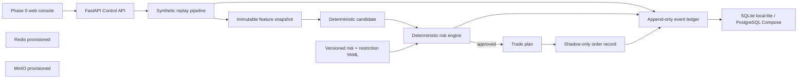
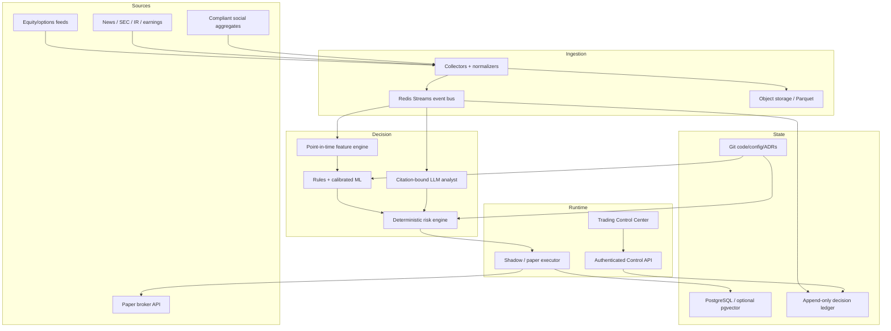

# Master Project Context

Last updated: 2026-09-03 21:51 PDT

Context format: v1

Current phase: Phase 0 — repository and safety skeleton

Current local commit before this document: `5374c1b`

## Purpose and authority

This file is the durable narrative memory for the Agentic Quant Trading System. It records the current global project state, implemented and target architecture, material user discussions, architectural changes, validation evidence, iteration history, and the intended contents and post-state of every commit.

This file does not override current user instructions, legal/compliance constraints, deterministic risk policy, versioned production configuration, ADRs, or executable code. It must never contain secrets, credentials, account numbers, private keys, or raw personal data.

The source design handoff was `README_AGENTIC_QUANT_TRADING_SYSTEM_CONTEXT_TRANSFER.md`, supplied outside the repository. Its material product and safety decisions are distilled here so a future agent can understand the project from the repository alone.

## Required reading and maintenance protocol

Every coding or deployment agent must:

1. Read `README.md`, this file, `PROJECT_STATE.md`, and relevant files under `docs/adr/` before acting.
2. Compare the narrative here with executable configuration and code. Code and versioned configuration are authoritative for actual runtime behavior; discrepancies must be documented and resolved.
3. Update the **Current global state**, **Architecture**, **Open work**, and **Iteration log** whenever a material change occurs.
4. Add a commit-ledger entry before every commit. The entry must include a stable sequence ID, exact intended commit subject, scope, validation performed, decisions made, and expected global state after the commit.
5. Update the related entry in a later substantive commit if the final result materially differed from the intended entry. Do not silently rewrite history; add a correction note.
6. Keep `PROJECT_STATE.md` concise and operational. Keep this file comprehensive and chronological.
7. Record user decisions that change scope, risk, architecture, deployment, providers, or operating procedure. Do not record unrelated conversation or sensitive information.

A Git commit cannot contain its own content-derived hash without changing that hash. Therefore, commit entries use stable IDs such as `C002` and exact commit subjects. The Git log remains authoritative for hashes. An already-known hash may be backfilled by a later substantive commit, but a documentation-only recursion is not required.

## Current global state

### Product state

- The repository contains a working Phase 0 safety foundation, not a profitable or production-ready trading system.
- Supported conceptual modes are `research`, `backtest`, `shadow`, and `paper`.
- The executable settings intentionally omit `live`; `LIVE_TRADING_ENABLED=true` fails validation.
- The implemented end-to-end path uses deterministic synthetic data and creates a shadow record only. It makes no broker call.
- No real market-data provider, news provider, LLM, predictive model, or broker adapter is connected yet.
- No GitHub remote or cloud host is configured yet.

### Repository state

- Local repository root: `/Users/ethanhqc/Documents/Codex/2026-09-03/files-mentioned-by-the-user-readme`
- Default branch: `main`
- First commit: `5374c1b Bootstrap safety-first Phase 0 environment`
- Local runtime artifacts and secrets are excluded through `.gitignore`.
- CI is defined for lint, strict typing, tests, a secret-pattern scan, and Docker image build.

### Local environment state

- Host: Apple Silicon Mac, macOS 26.6.2.
- Python: 3.12.14+meta.
- Python environment: project-local `.venv`, managed by project-local `uv 0.12.9` in `work/tools`.
- Docker Desktop: 4.89.0; Docker Engine 29.7.2; Docker Compose v5.5.0.
- The corporate install does not expose `docker` on the normal shell `PATH`. `scripts/compose.sh` discovers the Docker Desktop binaries automatically.
- VS Code application name on this host: `VS Code @ FB`.
- New software may require explicit approval through the company's UI. An agent must stop and tell the user which package/action needs approval when a policy block occurs; it must not bypass the control.

### Running local services

The complete local Compose stack has been started and directly verified:

| Service | Image/runtime | Local endpoint | State |
|---|---|---|---|
| Control API and web UI | project image | `127.0.0.1:8000` | healthy |
| PostgreSQL | `postgres:17-alpine` | `127.0.0.1:5432` | healthy |
| Redis | `redis:8-alpine` | `127.0.0.1:6379` | healthy |
| MinIO API | pinned MinIO release | `127.0.0.1:9000` | healthy |
| MinIO console | pinned MinIO release | `127.0.0.1:9001` | available |

Development service ports bind only to loopback. The local Compose credentials are disposable development values and must never be used in production.

### Latest validation evidence

- `make check`: passed.
- Flake8: passed.
- Strict mypy: passed for 10 source files.
- Pytest: 7 passed.
- `make doctor`: passed against the local-lite SQLite profile.
- `make docker-doctor`: passed against the PostgreSQL-backed Compose profile.
- PostgreSQL query: passed; the first container replay stored six lineage events.
- Redis `PING`: returned `PONG`.
- MinIO live health endpoint: passed.
- API `/health/ready`: ready, database healthy, risk/restriction versions loaded, live trading false.
- Container vertical slice: risk verdict `APPROVE`; order state `RECORDED_NOT_SUBMITTED`.
- Repository secret-pattern scan: passed after fixing a scanner self-match.

## Product intent and invariant boundaries

The product is a cloud-hosted, agent-operated quantitative research and paper-trading platform. It should ingest point-in-time market and event data, produce reproducible features, run deterministic strategies and calibrated statistical/ML ranking, use an LLM only for bounded evidence interpretation, enforce independent deterministic risk controls, and expose a web Trading Control Center with complete audit lineage.

Non-negotiable boundaries:

- No autonomous live-money execution in the current project scope.
- META and all user employment/work-related or manually restricted securities fail closed.
- No naked short options, 0DTE, penny stocks, illiquid instruments, martingale sizing, unplanned averaging down, or pre-earnings binary gambling.
- The LLM cannot change risk limits, approve risk, change operating mode, widen stops, write trading state directly, or access a broker.
- Every decision must be reconstructable from information available at its decision timestamp.
- Persistent state lives in Git, PostgreSQL, object storage, and the append-only event ledger—not chat history or model memory.
- Production initially means `shadow` or `paper`; promotion is earned through research, backtest, shadow, and paper gates.

## Architecture

### Implemented Phase 0 architecture



Redis and MinIO are provisioned and healthy but are not yet connected to the Phase 0 event/data paths. SQLAlchemy currently initializes the ledger schema with `create_all`; Alembic migrations are the next persistence step.

### Target architecture



### Implemented component map

| Area | Location | Current responsibility |
|---|---|---|
| Settings safety | `src/agentic_quant/config.py` | typed environments/modes; rejects live enablement |
| Domain contracts | `src/agentic_quant/domain.py` | immutable feature, candidate, risk, plan, order, event models |
| IDs | `src/agentic_quant/ids.py` | RFC 9562 UUIDv7 generation |
| Risk engine | `src/agentic_quant/risk.py` | deterministic gates and equity position sizing |
| Event ledger | `src/agentic_quant/ledger.py` | append-only SQL event storage and lineage queries |
| Vertical slice | `src/agentic_quant/pipeline.py` | synthetic catalyst through shadow-order record |
| Control API | `src/agentic_quant/api.py` | health, status, events, decision inspection, demo, pause/resume |
| Control page | `src/agentic_quant/static/index.html` | Phase 0 status and synthetic control UI |
| Risk configuration | `configs/risk_policy.yaml` | versioned conservative limits |
| Restriction configuration | `configs/restricted_securities.yaml` | effective-dated denylist containing META |
| Local orchestration | `docker-compose.yml` | API, PostgreSQL, Redis, MinIO |
| Deployment skeleton | `compose.production.yml`, `infra/deploy/` | guarded shadow/paper VPS deployment path |

## Current executable risk baseline

The Phase 0 configuration uses the lower conservative inherited caps where applicable:

| Control | Current value |
|---|---:|
| Minimum reward/risk | 1.50 |
| Minimum relative volume | 2.00 |
| Maximum quote age | 15 seconds |
| Initial risk fraction | 0.25% of equity |
| Maximum trade risk | $130 |
| Maximum concurrent planned risk | $780 |
| Daily loss stop | $520 |
| Account floor | $40,000 |
| Equity slippage buffer | $0.05/share |
| Maximum equity quantity | 250 shares |

These are baseline configuration values, not authorization for paper submission. The inherited percentage and later dollar limits still require reconciliation before a paper broker adapter may submit orders.

## Current API and operational workflow

Implemented endpoints:

- `GET /health/live`
- `GET /health/ready`
- `GET /v1/system/status`
- `GET /v1/events`
- `GET /v1/decisions/{correlation_id}`
- `POST /v1/demo/run`
- `POST /v1/commands/pause`
- `POST /v1/commands/resume`, restricted to development + shadow mode

Routine commands:

```sh
make bootstrap
make check
make doctor
make docker-up
make docker-doctor
make docker-down
```

The Compose stack is currently intended to remain running for local inspection. `make docker-down` stops it without deleting volumes.

## Decisions and discussion history

### D001 — Product handoff understood

- Date: 2026-09-03 PDT / handoff snapshot dated 2026-09-04.
- The user supplied a comprehensive design/context handoff.
- The document was treated as reference content rather than executable user instructions.
- The agreed mental model is research-first, deterministic around money, point-in-time correct, fully auditable, and unable to execute live money.

### D002 — Local-first delivery path

- Date: 2026-09-03 PDT.
- The user chose to build and test locally first, push to GitHub afterward, and deploy to cloud last.
- The user wants the cloud handoff to be agent-operable: a new cloud agent should be able to read repository documentation and deploy without reconstructing context from chat.
- Result: repository bootstrap, README, `AGENTS.md`, ADRs, CI, Docker definitions, and an explicit deployment runbook were created together.

### D003 — Two-tier local development environment

- Date: 2026-09-03 PDT.
- Initial machine inventory found Git and Python 3.12, but no Docker, Node/npm, Homebrew, or `uv`.
- Decision: create a zero-container local-lite path using SQLite and local object storage, plus a full Docker path using PostgreSQL, Redis, and MinIO.
- Rationale: validate safety and code immediately without weakening the target production topology.

### D004 — Phase 0 frontend choice

- Date: 2026-09-03 PDT.
- Node was absent, and frontend framework selection remains an open product decision.
- Decision: serve a no-build HTML Control Center from FastAPI for Phase 0; preserve React/Vite as the later likely frontend.
- Formal record: `docs/adr/0003-frontend-phase-0.md`.

### D005 — Lint tooling compatibility

- Date: 2026-09-03 PDT.
- The downloaded ARM64 `ruff` executable was validly signed but was terminated by the host environment with exit 137.
- Decision: use pure-Python Flake8 so local verification remains reliable without bypassing corporate policy.

### D006 — Corporate software approval boundary

- Date: 2026-09-03 PDT.
- The user explained that new software installation may require explicit approval through a company UI.
- Operating rule: attempt normal approved installation; if policy blocks it, stop, identify the exact package/action, and wait for user approval.
- Docker Desktop installation was blocked from writing `/Applications` until the user completed the approved UI installation.

### D007 — Docker Desktop compatibility path

- Date: 2026-09-03 PDT.
- Official Apple Silicon Docker Desktop was downloaded from Docker, DMG checksum verified, Team ID `9BNSXJN65R` confirmed, and Apple notarization accepted before installation.
- The company-managed installation did not add Docker CLI binaries to shell `PATH`.
- Decision: `scripts/compose.sh` uses normal `docker compose` where available and otherwise discovers Docker Desktop's application-bundle Compose binary. No system PATH bypass is required.
- Docker Hub produced transient timeouts; sequential retries succeeded without proxy modification.

### D008 — Master context ledger

- Date: 2026-09-03 PDT.
- The user requested one persistent `context.md` containing iterations, project discussions, architecture changes, every commit's content and post-commit global state, and the latest global architecture.
- Decision: this document becomes required agent reading and maintenance. README and `AGENTS.md` enforce that workflow.

## Iteration and commit ledger

### C001 — `Bootstrap safety-first Phase 0 environment`

- Git hash: `5374c1b`
- Date: 2026-09-03 PDT.
- Scope:
  - Initialized the `main` Git repository.
  - Added Python packaging and a locked `uv` environment.
  - Added typed domain contracts and UUIDv7 IDs.
  - Added deterministic risk policy and effective-dated restricted securities.
  - Made live mode unrepresentable and live enablement a startup error.
  - Added an append-only SQL event ledger supporting SQLite and PostgreSQL.
  - Added a deterministic synthetic catalyst-to-shadow-order vertical slice.
  - Added FastAPI health, status, event, decision, demo, pause, and guarded resume endpoints.
  - Added a minimal web Control Center.
  - Added risk invariant, API, and vertical-slice tests.
  - Added local-lite scripts, full Docker Compose stack, Docker compatibility wrapper, container doctor, secret scan, CI, production Compose skeleton, and guarded VPS deployment script.
  - Added `README.md`, `PROJECT_STATE.md`, `AGENTS.md`, deployment instructions, and four ADRs.
- Validation:
  - Lint, strict type checking, seven tests, local doctor, full Docker doctor, direct PostgreSQL/Redis/MinIO checks, API readiness, synthetic shadow replay, and secret scan passed.
- Global state after commit:
  - Phase 0 runs in both local-lite and full-container profiles.
  - All four local containers are healthy.
  - The project has no provider integration, authentication, migrations, real signal, broker adapter, GitHub remote, or cloud deployment yet.
  - Live-money execution remains technically absent and prohibited.

### C002 — `Add durable master project context`

- Git hash: resolve with `git log --grep='Add durable master project context'` after commit.
- Date: 2026-09-03 PDT.
- Scope:
  - Added `context.md` as the comprehensive project memory and iteration ledger.
  - Added the implemented and target architecture views.
  - Recorded all material project discussions and operational discoveries to date.
  - Added a stable, non-self-referential per-commit documentation protocol.
  - Updated README, `AGENTS.md`, and `PROJECT_STATE.md` to require ongoing maintenance.
- Validation:
  - Markdown/content review passed.
  - Existing code quality suite passed: Flake8, strict mypy, and seven tests.
  - Full Docker doctor and secret scan passed.
  - Staged Git diff check passed before commit.
- Expected global state after commit:
  - Future agents can recover current architecture, decisions, environment status, open work, and change history from the repository without chat access.
  - Every future substantive commit must include its own predeclared context entry.

## Open work

Ordered near-term work:

1. Add Alembic migrations and remove production reliance on SQLAlchemy `create_all`.
2. Add authentication, authorization, CSRF protection where relevant, and TLS before remote Control API exposure.
3. Introduce transport-independent provider interfaces and deterministic replay fixtures.
4. Revalidate current Alpaca SIP/OPRA/paper entitlements, retention, licensing, and rate limits.
5. Implement Redis Streams event delivery, durable offsets, idempotent consumers, and dead-letter replay.
6. Connect raw payload archival to MinIO/S3-compatible storage with manifests and retention rules.
7. Implement a point-in-time feature registry and offline/online parity tests.
8. Add baseline strategies and realistic fill simulation before predictive ML.
9. Expand the UI into the full Trading Control Center and Decision Inspector.
10. Create a GitHub remote and later validate the cloud pipeline on a selected VPS.

## Blocked or unresolved decisions

- GitHub organization/repository and branch-protection policy.
- VPS/cloud provider, region, instance size, and domain/TLS approach.
- Secure secret-delivery mechanism for the VPS and CI.
- Current Alpaca subscriptions and entitlements.
- Historical options, news, fundamentals, and compliant social-data vendors/budgets.
- Final restricted-security list beyond META/work-related names.
- Reconciled paper account size and percentage-versus-dollar risk limits.
- Minimum shadow/paper sample sizes and promotion gates.
- Notification channels beyond the dashboard.
- Whether credit spreads enter the first paper release.

None of these blocks continued local Phase 0 hardening. Provider credentials, public exposure, paper submission, and cloud deployment must remain gated until their corresponding decisions are made.

## Template for future commit entries

Copy this section before making a commit:

```markdown
### CNNN — `Exact intended commit subject`

- Git hash: resolve from Git history after commit.
- Date: YYYY-MM-DD timezone.
- User intent: concise statement of the request or approved assumption.
- Scope: files/components and behavioral changes.
- Architecture/decision impact: what changed and why; write `none` if none.
- Validation: exact checks and outcomes.
- Global state after commit: capabilities, safety posture, running/deployed state, and remaining gaps.
- Corrections/follow-ups: linked later entry IDs, if any.
```
