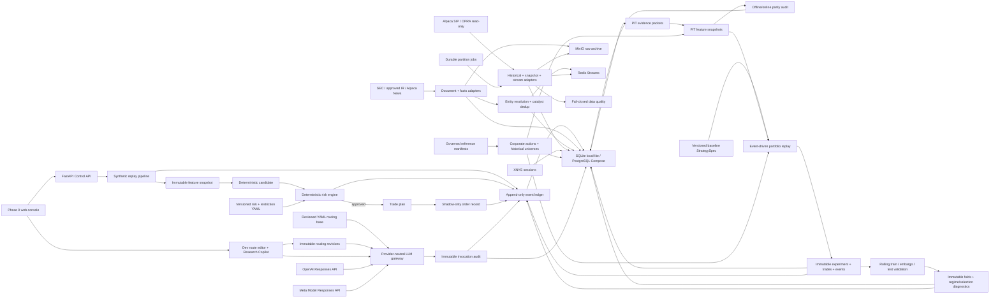
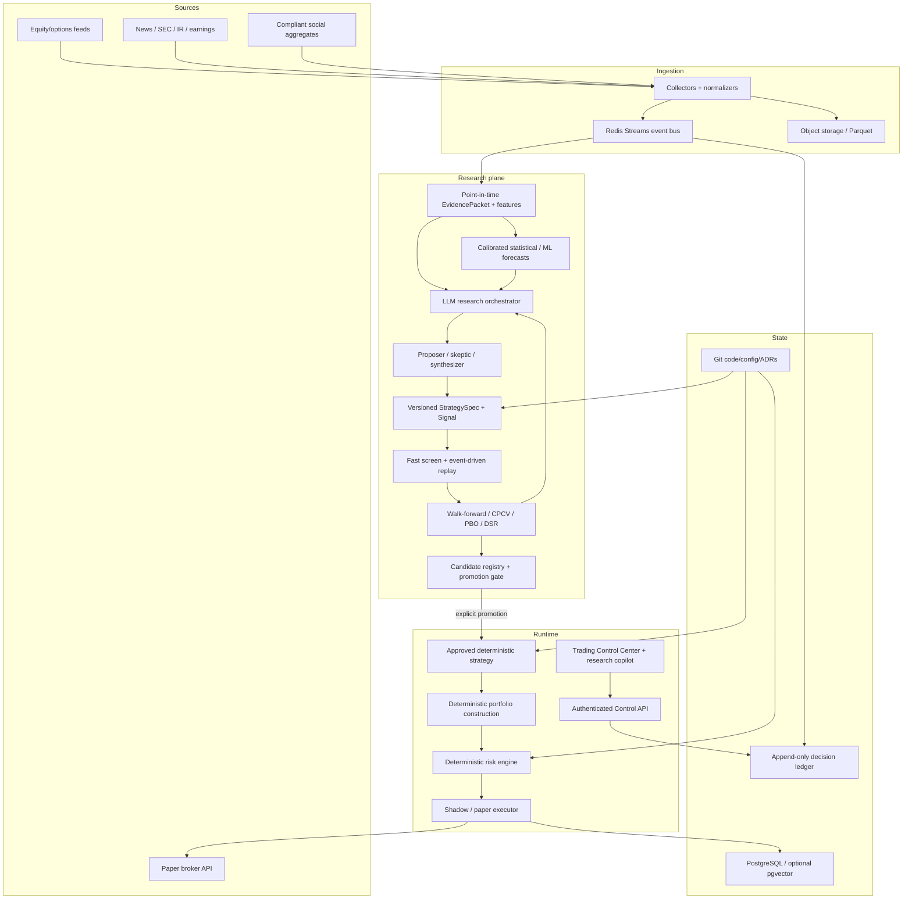

# Master Project Context

Last updated: 2026-09-04 PDT

Context format: v1

Current phase: Phase 3D plus Phase 5A reliability and front-loaded Phase 4B LLM Control Center implemented; Phase 1B open-session verification pending

Current documented baseline: C017 — `Add reliable scalable research workflows`

## Purpose and authority

This file is the durable narrative memory for the Agentic Quant Trading System. It records the current global project state, implemented and target architecture, material user discussions, architectural changes, validation evidence, iteration history, and the intended contents and post-state of every commit.

This file does not override current user instructions, legal/compliance constraints, deterministic risk policy, versioned production configuration, ADRs, or executable code. It must never contain secrets, credentials, account numbers, private keys, or raw personal data.

The source design handoff was `README_AGENTIC_QUANT_TRADING_SYSTEM_CONTEXT_TRANSFER.md`, supplied outside the repository. Its material product and safety decisions are distilled here so a future agent can understand the project from the repository alone.

## Required reading and maintenance protocol

Every coding or deployment agent must:

1. Read `README.md`, this file, `PROJECT_STATE.md`, and relevant files under `docs/adr/` before acting.
2. Compare the narrative here with executable configuration and code. Code and versioned configuration are authoritative for actual runtime behavior; discrepancies must be documented and resolved.
3. Update the **Current global state**, **Architecture**, **Open work**, and **Iteration log** whenever a material change occurs.
4. Add a commit-ledger entry before every commit. The entry must include a stable sequence ID, exact intended commit subject, scope, validation performed, decisions made, and expected global state after the commit.
5. Update the related entry in a later substantive commit if the final result materially differed from the intended entry. Do not silently rewrite history; add a correction note.
6. Keep `PROJECT_STATE.md` concise and operational. Keep this file comprehensive and chronological.
7. Record user decisions that change scope, risk, architecture, deployment, providers, or operating procedure. Do not record unrelated conversation or sensitive information.

A Git commit cannot contain its own content-derived hash without changing that hash. Therefore, commit entries use stable IDs such as `C002` and exact commit subjects. The Git log remains authoritative for hashes. An already-known hash may be backfilled by a later substantive commit, but a documentation-only recursion is not required.

## Current global state

### Product state

- The repository contains completed Phase 0 safety and Phase 2 event/document foundations,
  a Phase 1 read-only market-data foundation with open-session verification pending, and an
  implemented Phase 3A point-in-time research vertical slice. It is not a profitable or
  production-ready trading system.
- Supported conceptual modes are `research`, `backtest`, `shadow`, and `paper`.
- The executable settings intentionally omit `live`; `LIVE_TRADING_ENABLED=true` fails validation.
- The original synthetic shadow path remains operational and makes no broker call.
- A read-only Alpaca adapter now retrieves SIP historical stock bars, OPRA option-chain snapshots, and authenticates to the SIP stock WebSocket.
- Real provider responses flow through content-addressed MinIO raw storage, normalized PostgreSQL tables, the append-only event ledger, and Redis Streams.
- Alpaca News, SEC EDGAR, and an approved-host IR feed have passed live read-only ingestion.
  The social aggregate adapter is implemented but disabled by default. The LLM transport and
  routing layer has passed bounded live OpenAI and Meta probes; no predictive model or broker
  adapter is connected.
- Phase 3A persists immutable evidence packets, feature snapshots, strategy specifications,
  experiment runs, and backtest trades. Three deterministic baselines run with next-bar
  execution and nonzero commission/slippage; their output is infrastructure evidence only.
- Phase 3A.2 adds exact XNYS session-close availability, immutable corporate actions and
  historical-universe membership, split-adjusted point-in-time features, and persisted
  offline/online feature-parity checks.
- Phase 3B replaces direct round-trip arithmetic with a deterministic portfolio state
  machine. Ordered signal, order, fill, mark, split, and cash-dividend events are persisted;
  fills use exchange timestamps, explicit costs, and a bar-volume participation cap.
- Phase 3C adds immutable rolling train/embargo/test reports. Every candidate is evaluated
  both in and out of sample, with selection degradation, below-median selection rate, and
  realized-regime summaries retained rather than reporting only the winner.
- Phase 3D adds combinatorial selection-risk/PBO diagnostics and Deflated Sharpe to every
  report. A versioned gate can only mark sufficient results eligible for later human review;
  it never promotes automatically, and bounded local samples fail closed.
- Phase 5A adds persisted fail-closed market-data audits, configured half-spread fill costs,
  governed point-in-time reference imports, and idempotent resumable backfill partitions.
- A front-loaded Phase 4B gateway and local Control Center now present one audited contract over OpenAI GPT-5.6 Sol
  and Meta Muse Spark 1.3. Workload routing is versioned and cost-tier-aware; missing project
  credentials fail closed and no model has any monetary authority. Development operators can
  save immutable route revisions and chat through Auto or either explicit provider.
- No GitHub remote or cloud host is configured yet.

### Repository state

- Local repository root: `/Users/ethanhqc/Documents/Codex/2026-09-03/files-mentioned-by-the-user-readme`
- Default branch: `main`
- First commit: `5374c1b Bootstrap safety-first Phase 0 environment`
- Local runtime artifacts and secrets are excluded through `.gitignore`.
- CI is defined for lint, strict typing, tests, a secret-pattern scan, and Docker image build.

### Local environment state

- Host: Apple Silicon Mac, macOS 26.6.2.
- Python: 3.12.14+meta.
- Python environment: project-local `.venv`, managed by project-local `uv 0.12.9` in `work/tools`.
- Docker Desktop: 4.89.0; Docker Engine 29.7.2; Docker Compose v5.5.0.
- The corporate install does not expose `docker` on the normal shell `PATH`. `scripts/compose.sh` discovers the Docker Desktop binaries automatically.
- VS Code application name on this host: `VS Code @ FB`.
- New software may require explicit approval through the company's UI. An agent must stop and tell the user which package/action needs approval when a policy block occurs; it must not bypass the control.
- Local development is for correctness verification, not production-scale data acquisition.
  Prefer deterministic fixtures and the smallest bounded real samples that exercise provider,
  storage, replay, feature, and backtest invariants. Full-year or multi-year backfills are not
  a routine local development requirement.
- Development and production must execute the same partitionable, idempotent workflow.
  Dataset size may change batch size, concurrency, storage, and scheduling, but never the
  business contracts, point-in-time rules, lineage, or validation path.
- The ignored local `.env` explicitly sets `APP_ENV=development` and
  `DEVELOPMENT_MAX_BACKFILL_DAYS=120`, with a stricter 7-day one-minute-bar cap;
  `.env.example` documents the same safe defaults.
  `/v1/system/status` exposes the effective data operating scope without exposing secrets.

### Running local services

The complete local Compose stack has been started and directly verified:

| Service | Image/runtime | Local endpoint | State |
|---|---|---|---|
| Control API and web UI | project image | `127.0.0.1:8000` | healthy |
| PostgreSQL | `postgres:17-alpine` | `127.0.0.1:5432` | healthy |
| Redis | `redis:8-alpine` | `127.0.0.1:6379` | healthy |
| MinIO API | pinned MinIO release | `127.0.0.1:9000` | healthy |
| MinIO console | pinned MinIO release | `127.0.0.1:9001` | available |

Development service ports bind only to loopback. The local Compose credentials are disposable development values and must never be used in production.

### Latest validation evidence

- `make check`: passed.
- Flake8: passed.
- Strict mypy: passed for 40 source files.
- Pytest: 58 passed.
- `make doctor`: passed against the local-lite SQLite profile.
- `make docker-doctor`: passed against the PostgreSQL-backed Compose profile.
- PostgreSQL query: passed; the first container replay stored six lineage events.
- Redis `PING`: returned `PONG`.
- MinIO live health endpoint: passed.
- API `/health/ready`: ready, database healthy, risk/restriction versions loaded, live trading false.
- Container vertical slice: risk verdict `APPROVE`; order state `RECORDED_NOT_SUBMITTED`.
- Alpaca entitlements: SIP historical REST, OPRA option snapshot REST, and SIP WebSocket authentication passed.
- Real historical test: 391 AAPL one-minute bars inserted, zero duplicates after identical replay.
- Real options test: 10 AAPL option snapshots inserted from one bounded page, zero duplicates after replay.
- Live trade/quote/bar normalization, persistence, and XNYS-session gap detection: synthetic frames passed; real frames await an open market session.
- Real news test: 10 AAPL-related articles passed Alpaca News → MinIO → PostgreSQL → Redis; identical replay inserted zero documents, versions, catalysts, links, or events.
- Real primary-source test: 10 entries from Apple's official Newsroom RSS feed passed the same path; identical replay inserted zero documents, versions, catalysts, links, or events.
- Real SEC test: 20 AAPL filing records produced 19 catalysts and 20 links; identical replay inserted zero new records or events. A bounded 250-record AAPL XBRL facts run also replayed with zero duplicates.
- Phase 2 fixtures verify primary/secondary source distinction, correction-version retention, SEC filing and XBRL normalization, IR feed parsing, and cross-document catalyst deduplication.
- Alembic migrations through `20260904_0016` own the Phase 3D/4B/5A schema; a fresh SQLite
  upgrade/check/downgrade/re-upgrade cycle passed with no schema diff.
- `make research-smoke`: passed with 100 deterministic daily bars, three immutable baseline
  experiments, nonzero cost modeling, matching offline/online feature hashes, and ordered
  event-driven portfolio ledgers. Stored counts accumulate safely in the persistent ignored
  smoke database.
- Real daily-data test: 754 AAPL and 754 SPY SIP daily bars from 2023-09-01 through
  2026-09-04 were archived and normalized; identical replays inserted zero bars.
- Real baseline runs completed on stored daily bars. AAPL buy-and-hold, momentum, and mean
  reversion and SPY buy-and-hold produced reproducible dataset hashes, feature lineage,
  trades, costs, and metrics. These exploratory full-period results are not holdout evidence
  and do not establish strategy validity.
- Existing PostgreSQL daily rows were migrated to exact XNYS session-close availability;
  sampled AAPL/SPY rows now show same-session 20:00 UTC availability. A real stored AAPL
  offline/online parity audit at 2026-09-03 20:00 UTC produced matching feature hashes.
- PostgreSQL migration `20260904_0009` backfilled legacy trade exit quantities and added the
  portfolio-event ledger. A bounded real AAPL buy-and-hold replay stored 28 ordered events;
  its API sequence began with `signal` and ended with `fill`.
- PostgreSQL migration `20260904_0010` stored an immutable four-fold AAPL walk-forward
  report over a bounded 2026-07-01 through 2026-09-03 sample. All 16 underlying train/test
  candidate runs were retained and both validation APIs returned the complete audit graph.
  The selected strategies produced a `2.62%` compounded out-of-sample return but only a
  `25%` positive-fold rate; this is pipeline evidence, not an alpha or promotion claim.
- The dual-provider gateway passed mocked OpenAI/Meta Responses API contract tests, route
  selection, fail-closed credential handling, and immutable SQL/event audit tests. Bounded
  live probes returned `LLM_PROVIDER_OK` from both `gpt-5.6-sol` and `muse-spark-1.3` using
  project-scoped credentials in ignored `.env`; both calls also passed from the rebuilt
  PostgreSQL-backed Compose API container.
- The development Control Center route-save endpoint created and reloaded an immutable
  effective revision. The bounded chat endpoint completed real calls through both explicit
  providers; OpenAI returned in about 2.4 seconds and Meta in about 0.8 seconds during the
  final prompt-contract check. These are connectivity observations, not performance claims.
- Repository secret-pattern scan: passed after fixing a scanner self-match.

## Product intent and invariant boundaries

The product is a cloud-hosted, agent-operated quantitative research and paper-trading platform. It should ingest point-in-time market and event data, produce reproducible features, let an LLM orchestrate evidence analysis and strategy research, combine those hypotheses with calibrated statistical/ML forecasts, validate every candidate through bias-aware backtesting, enforce independent deterministic portfolio/risk/execution controls, and expose a web Trading Control Center with complete audit lineage.

Non-negotiable boundaries:

- No autonomous live-money execution in the current project scope.
- META and all user employment/work-related or manually restricted securities fail closed.
- No naked short options, 0DTE, penny stocks, illiquid instruments, martingale sizing, unplanned averaging down, or pre-earnings binary gambling.
- The LLM cannot change risk limits, approve risk, change operating mode, widen stops, write trading state directly, or access a broker.
- Every decision must be reconstructable from information available at its decision timestamp.
- Persistent state lives in Git, PostgreSQL, object storage, and the append-only event ledger—not chat history or model memory.
- Production initially means `shadow` or `paper`; promotion is earned through research, backtest, shadow, and paper gates.

## Core research philosophy

### Product thesis

The project's intended innovation is not “an LLM that picks stocks.” It is an automated,
auditable strategy-research and deployment system in which:

1. LLMs act as research orchestrators. They interpret time-bounded evidence, propose causal
   hypotheses, design candidate features and strategies, critique competing explanations,
   synthesize ML and qualitative findings, and choose useful follow-up experiments.
2. Statistical and ML models provide calibrated numerical forecasts, rankings, uncertainty,
   and out-of-sample evidence. They remain first-class peers rather than tools hidden behind
   an LLM persona.
3. A bias-aware backtester is the empirical judge. An eloquent thesis, high model confidence,
   or multi-agent consensus never substitutes for point-in-time out-of-sample validation.
4. Deterministic code owns portfolio construction, position sizing, restricted-security
   enforcement, risk limits, order state, and broker interaction. No LLM may bypass these
   controls or promote its own strategy into a trading mode.
5. Every research and runtime artifact is versioned and traceable: evidence, features,
   prompts, model versions, generated code, strategy specifications, data snapshots,
   experiment results, approvals, and realized outcomes.

The durable description of the product is therefore:

> An LLM-orchestrated, ML-calibrated, point-in-time-validated strategy research system with
> deterministic portfolio, risk, and execution control.

### Separation of authorities

| Authority | May do | Must not do |
|---|---|---|
| LLM research orchestrator | Read citation-bound evidence and ML summaries; propose hypotheses, features, `StrategySpec` candidates, and experiments; critique and synthesize results | Approve risk, alter hard limits, size or submit orders, promote itself, or treat narrative confidence as validation |
| Specialist evidence agents | Extract structured events, surprise, direction, horizon, uncertainty, and evidence links from filings/news/IR data | Invent unavailable facts, use post-decision information, or silently merge contradictory sources |
| Statistical/ML layer | Train point-in-time models; emit calibrated forecasts, ranks, uncertainty, and diagnostics | Select its own test period, hide failed trials, or bypass portfolio/risk policy |
| Backtest and validation layer | Replay realistic market state; model costs/fills; compare baselines; run out-of-sample and overfitting diagnostics | Rewrite source history, use future constituents/corrections, or certify a strategy from in-sample performance alone |
| Portfolio/risk/execution layer | Convert approved signals into bounded targets, enforce all hard controls, and operate only in an authorized mode | Accept free-form LLM orders or credentials, weaken fail-closed controls, or infer authorization for live money |

The LLM may be creative in the research plane. It has no monetary authority in the runtime
plane. Its outputs cross that boundary only as typed, versioned artifacts that have passed
independent validation and human-controlled promotion gates.

### Required research contracts

The target research system should converge on these stable contracts:

- `EvidencePacket`: immutable source references, content/version hashes, event and ingestion
  timestamps, source trust, entity resolution, and the exact as-of boundary visible to an
  experiment or decision.
- `FeatureSnapshot`: point-in-time numerical and categorical inputs, feature definitions,
  lineage, availability times, and data-quality flags.
- `Forecast`: model/version, instrument, horizon, expected return or class probability,
  calibrated uncertainty, and training-data cutoff.
- `Signal`: instrument, direction, horizon, conviction, expected return, uncertainty,
  supporting evidence IDs, and producing strategy/model versions.
- `StrategySpec`: universe, required data, features/models, entry/exit logic, rebalance
  schedule, sizing policy, risk assumptions, cost/fill model, and executable artifact hash.
- `ExperimentRun`: hypothesis, code/Git SHA, data hash, prompts and LLM version, dependency
  versions, random seeds, train/validation/test windows, all attempted variants, resource
  cost, metrics, artifacts, and disposition.
- `PromotionDecision`: candidate/champion comparison, validation gates, approver, target
  mode, effective time, rollback rule, and immutable reason.

LLM memory must be evidence memory rather than an ungoverned persona memory. It should link
each prior prediction to the evidence available at that time and its later realized outcome.
Research/test boundaries must prevent a reflection generated after an outcome from leaking
back into the earlier decision state.

### Research and promotion lifecycle

The intended lifecycle is:

```text
point-in-time evidence + features
  -> LLM/ML hypothesis generation
  -> typed StrategySpec and executable candidate
  -> static leakage and contract checks
  -> fast vectorized screen
  -> event-driven replay with realistic fills and costs
  -> walk-forward / regime / overfitting validation
  -> candidate registry and human-controlled promotion
  -> shadow
  -> paper
  -> controlled production only after a future explicit authorization
```

Backtest, shadow, and paper should execute the same strategy logic. Environment-specific
clock, data, and broker adapters may change; signal and portfolio semantics should not.
Research remains a parallel lab with many disposable candidates, while the runtime contains
only explicitly promoted, version-pinned strategies.

### Evaluation doctrine

- No open-source popularity, paper headline, backtest win rate, cumulative return, or LLM
  confidence is evidence of deployable alpha by itself.
- Always compare against buy-and-hold where relevant, simple rules, linear/statistical
  models, and at least one strong ML baseline. Complexity must earn its place.
- Report net annualized return, excess return, Sharpe, Sortino, Calmar, maximum drawdown,
  turnover, exposure, alpha/beta, capacity/liquidity, transaction costs, and performance by
  market regime. Win rate is secondary and cannot stand alone.
- Use immutable point-in-time universes, delisted securities, corporate actions, exchange
  calendars, publication/availability time, revisions, and realistic order/fill semantics.
- Daily strategies should normally span at least three years; weekly/monthly strategies
  should target ten to twenty years when reliable data exists. Any shorter experiment must
  be labeled exploratory rather than evidence for promotion.
- Separate train, validation, and untouched test periods; prefer walk-forward evaluation and
  add combinatorial purged cross-validation, Probability of Backtest Overfitting, and
  Deflated Sharpe Ratio where applicable.
- Record every attempted variant. Do not report only the best symbol, period, seed, prompt,
  agent persona, or risk profile. Stochastic LLM experiments require repeated runs and
  dispersion reporting.
- Include LLM inference cost, latency, failure rate, nondeterminism, and unavailable-data
  behavior. Proprietary LLM pretraining leakage cannot be fully ruled out and must remain an
  explicit limitation.
- A research result earns only the next promotion stage. Backtest success does not authorize
  paper submission, and paper success does not authorize live-money execution.

### External research synthesis

The following sources informed this philosophy. Their reported returns are research claims,
not audited live performance, and no external code has been copied into this repository.

| Source | Useful lesson | Limitation that governs our use |
|---|---|---|
| [TradingAgents: Multi-Agents LLM Financial Trading Framework](https://arxiv.org/abs/2412.20138) and [implementation](https://github.com/TauricResearch/TradingAgents) | Specialist analysts, adversarial bull/bear review, trader/risk roles, and outcome reflection demonstrate a useful multi-agent research decomposition | Published results cover only three stocks over roughly three months and report unusually high Sharpe ratios; recent point-in-time/look-ahead fixes further limit comparison. Treat it as a research scaffold, not performance evidence |
| [R&D-Agent-Quant](https://arxiv.org/abs/2505.15155) and [implementation](https://github.com/microsoft/RD-Agent) | Best reference for an automated scientific loop: specification, hypothesis synthesis, code implementation, Qlib validation, analysis, and persistent feedback; factor/model co-optimization is especially relevant | Results remain paper backtests in specific markets. Its bandit experiment scheduler outperforming an LLM-only scheduler supports deterministic/statistical resource allocation around the LLM |
| [FinMem](https://arxiv.org/abs/2311.13743) | Time-decayed, layered evidence memory and explicit outcome reflection are useful for event research | Evaluation uses five selected news-rich stocks and simplified daily action returns; choosing the best risk persona creates selection risk. Do not copy persona-driven risk behavior |
| [FINSABER: Can LLM-based Financial Investing Strategies Outperform the Market in Long Run?](https://arxiv.org/abs/2505.07078) and [implementation](https://github.com/waylonli/FINSABER) | Provides the necessary counterweight: long-horizon, broader-universe, delisting-aware, cost-aware, bias-mitigated evaluation | It finds that previously reported LLM advantages deteriorate and that simple strategies often win on risk-adjusted metrics. Its conclusion is a validation requirement, not proof that LLM research cannot add value |
| [Qlib](https://github.com/microsoft/qlib) | Modular dataset/model/strategy/backtest workflow and reproducible experiment records are strong research-layer references | Example returns are configuration-specific and not product guarantees; Qlib need not replace the current data/runtime architecture |
| [AI Hedge Fund](https://github.com/virattt/ai-hedge-fund) | Persistent fund/strategy/analyst hierarchy, shared `AlphaModel`/`Signal` contract, one runtime path, research lab, and deterministic master risk are highly aligned with this project | It is explicitly a proof of concept and does not provide credible live return evidence; several validation and promotion features remain roadmap items |
| [Alpha Forge](https://github.com/Liu-Ming-Yu/alpha-forge) | Governed text-event features, research campaigns, evidence packages, and Shadow → Paper → Live promotion closely match the desired product shape | It is a young project without independently validated returns; borrow architecture concepts only after license and implementation review |
| [LEAN](https://github.com/QuantConnect/Lean), [NautilusTrader](https://github.com/nautechsystems/nautilus_trader), [Freqtrade](https://github.com/freqtrade/freqtrade), and [VectorBT](https://github.com/polakowo/vectorbt) | Mature execution semantics, shared backtest/live code paths, look-ahead diagnostics, and fast parameter screening provide useful engineering patterns | These are engines rather than sources of alpha. Integration cost and licenses must be reviewed; Freqtrade is crypto-oriented, and VectorBT's community license includes the Commons Clause |

The durable market finding is that no reviewed open-source project publishes independently
audited, long-term live returns sufficient to establish a general “success rate” for LLM
trading. In FINSABER's 2004–2024 composite tests, for example, FinMem and FinAgent often
trailed buy-and-hold or ARIMA on risk-adjusted metrics even when FinAgent occasionally had a
higher absolute annual return. This project must therefore optimize for falsifiable research
quality and safe promotion, not for reproducing a headline backtest.

## Architecture

### Implemented architecture



Alembic migrations own the PostgreSQL/SQLite schema. Redis and MinIO are connected to both ingestion paths. The market stream client authenticates, reconnects with bounded exponential backoff, normalizes trades/quotes/minute bars, and requests historical repair for XNYS-session gaps; a real open-session frame capture remains outstanding. The Phase 2 path versions source documents, retains publication/ingestion/correction time, classifies source trust, resolves issuer entities, normalizes SEC facts, and deterministically links similar multi-source coverage to one catalyst.

The Phase 3A research path selects only evidence whose event and availability times are no
later than each snapshot's `as_of`, calculates a versioned price/event feature set, and runs
buy-and-hold, long/cash momentum, or long/cash mean-reversion baselines. Daily bars use exact
XNYS close times, historical universe membership is bitemporal, split-adjusted features use
only actions known and effective at `as_of`, and offline/online hashes can be compared and
persisted. Signals fill no earlier than the next exchange open. The event-driven portfolio
ledger applies splits and gross cash dividends, records marks/orders/fills, enforces a bar-
volume participation cap, and charges commission, slippage, and fixed market impact. All
source/feature/dataset/code hashes are retained. Corporate-action provider ingestion,
cross-symbol events, and advanced fill simulation remain open.

The Phase 3C validator runs every declared candidate in chronological rolling training and
out-of-sample windows separated by an embargo. Test windows cannot overlap. Selection uses
only training metrics, while every test result is retained for rank and selection-failure
analysis. Realized test returns define transparent up/down/sideways report buckets; they do
not feed the strategy. Phase 3D resamples selection across the already embargoed,
non-overlapping OOS folds, records PBO and Deflated Sharpe diagnostics, and applies the
versioned `research_gate@0.1.0` policy. The gate is advisory eligibility only and cannot
promote a candidate.

The front-loaded Phase 4A gateway gives OpenAI and Meta one internal Responses-style
contract. `configs/model_routing.yaml` sends critical research/generation/critique to the
premium OpenAI route and interactive explanation/routine pipelines to the value Meta route.
Every attempt is bounded and audited; raw inputs are hashed rather than copied into the audit
row. No generative strategy loop is connected yet, and neither model can reach runtime risk,
portfolio, execution, or broker components.

Phase 4B adds a local no-build model control surface. A route save appends a complete SQL
revision tied to the reviewed YAML base hash; the newest compatible revision becomes active.
The Research Copilot can use that automatic interactive route or explicitly select either
provider for one invocation. Browser history is bounded and session-local, while output,
usage, latency, model, source SHA, and effective routing lineage remain durable. Both write
and paid-call endpoints fail closed outside development until production authentication and
budget controls exist.

The Phase 5A reliability layer validates every historical ingestion and backtest dataset
against `market_data_quality@0.1.0`, including identity, chronology, OHLC, availability, and
expected exchange intervals. Fills now charge configured half-spread on each side. Reviewed
corporate-action/universe batches carry source, source-version, availability, and content
hashes. Long backfills are deterministic date partitions whose durable job state skips
completed work and retries interrupted work with bounded attempts.

### Target architecture



There is intentionally no direct edge from the LLM to portfolio, risk, execution, or the
broker. Research feedback may loop from validation to the LLM; crossing into runtime requires
a versioned candidate, independent validation, and explicit promotion.

### Target Web Control Center

The remotely deployed application is expected to provide one authenticated interface with:

- a data explorer for normalized market data, filings, news, catalysts, feature snapshots,
  freshness, gaps, source provenance, and raw-object lineage;
- an LLM analysis workspace showing citation-bound interpretations, evidence used, model and
  prompt versions, uncertainty, disagreements, and prior-analysis outcomes;
- a strategy lab showing `StrategySpec` contents, ML forecasts, backtest/validation results,
  trades, costs, regime breakdowns, candidate/champion comparisons, and promotion state;
- a conversational research copilot through which the user can ask the LLM to explain the
  latest data, analysis, strategy outputs, risks, and why a candidate passed or failed;
- an operations view for ingestion health, experiment jobs, shadow/paper status, alerts,
  audit lineage, pause controls, and deployment readiness.

The conversational interface is explanatory and research-oriented. It must answer from
versioned, time-scoped project data with citations and must not receive credentials or gain a
direct command path to portfolio, risk, execution, or broker services. Authentication,
authorization, session auditing, prompt-injection defenses, and safe tool capability gates are
prerequisites before this UI is exposed remotely.

Long-horizon data acquisition and compute-heavy research belong on the remote server after its
storage, scheduling, observability, and data-license controls are configured. Local development
should prove the same code paths with compact datasets; tests must not depend on downloading a
year or more of data.

### Implemented component map

| Area | Location | Current responsibility |
|---|---|---|
| Settings safety | `src/agentic_quant/config.py` | typed environments/modes; rejects live enablement |
| Domain contracts | `src/agentic_quant/domain.py` | immutable evidence, research, strategy, experiment, risk, plan, order, and event models |
| IDs | `src/agentic_quant/ids.py` | RFC 9562 UUIDv7 generation |
| Risk engine | `src/agentic_quant/risk.py` | deterministic gates and equity position sizing |
| Event ledger | `src/agentic_quant/ledger.py` | append-only SQL event storage and lineage queries |
| Vertical slice | `src/agentic_quant/pipeline.py` | synthetic catalyst through shadow-order record |
| Control API | `src/agentic_quant/api.py` | health, status, LLM routing/chat, events, decision inspection, demo, pause/resume |
| Control page | `src/agentic_quant/static/index.html` | model routing, bounded research chat, status, and local operations |
| Risk configuration | `configs/risk_policy.yaml` | versioned conservative limits |
| Restriction configuration | `configs/restricted_securities.yaml` | effective-dated denylist containing META |
| Local orchestration | `docker-compose.yml` | API, PostgreSQL, Redis, MinIO |
| Deployment skeleton | `compose.production.yml`, `infra/deploy/` | guarded shadow/paper VPS deployment path |
| Alpaca REST adapter | `src/agentic_quant/providers/alpaca.py` | SIP bars, OPRA snapshots, entitlement checks |
| Alpaca stream adapter | `src/agentic_quant/providers/alpaca_stream.py` | SIP authentication, subscription, reconnect, normalization |
| Raw archive | `src/agentic_quant/archive.py` | content-addressed local or MinIO JSON evidence |
| Market persistence | `src/agentic_quant/market_store.py` | idempotent bars, trades, quotes, options, ingestion runs |
| Data quality | `src/agentic_quant/data_quality.py` | persisted structural/timing/session checks and fail-closed enforcement |
| Durable workflow | `src/agentic_quant/workflow.py` | deterministic partition plans, checkpoints, bounded retry, and resume |
| Event transport | `src/agentic_quant/event_bus.py` | Redis Streams publisher with local no-op fallback |
| Market calendar | `src/agentic_quant/market_calendar.py` | exact XNYS daily availability and missing-minute detection |
| Document providers | `src/agentic_quant/providers/documents.py` | Alpaca News, SEC EDGAR, approved-host IR, gated social adapters |
| Event ingestion | `src/agentic_quant/document_ingestion.py` | raw-first document/fact ingestion and normalized events |
| Document persistence | `src/agentic_quant/document_store.py` | immutable versions, entities, search, catalyst dedup, SEC facts |
| Event operations | `src/agentic_quant/event_cli.py` | bounded provider ingestion, search, and health CLI |
| Research engine | `src/agentic_quant/research.py` | point-in-time price/event features and cost-aware deterministic baselines |
| Portfolio replay | `src/agentic_quant/backtest_engine.py` | event-driven cash/share accounting, fills, marks, costs, and liquidity caps |
| Research persistence | `src/agentic_quant/research_store.py` | immutable evidence/features/specs/experiments/trades and as-of reads |
| Reference data | `src/agentic_quant/reference_data.py` | bitemporal corporate-action and historical-universe queries |
| Research operations | `src/agentic_quant/research_cli.py` | synthetic smoke, stored-data baselines, parity audit, experiment listing |
| Validation engine | `src/agentic_quant/validation.py` | rolling train/embargo/test selection, regime reports, selection diagnostics |
| Research gate | `configs/research_promotion_policy.yaml` | versioned PBO, DSR, sample, regime, positive-fold, and drawdown thresholds |
| LLM gateway | `src/agentic_quant/llm.py` | versioned workload routing and bounded OpenAI/Meta Responses calls |
| LLM persistence | `src/agentic_quant/llm_store.py` | immutable route revisions, source/config lineage, output, usage, latency, and status |
| LLM routing | `configs/model_routing.yaml` | premium/value model assignments and bounded provider settings |
| Schema migrations | `migrations/` | Alembic schema history through front-loaded Phase 4B |

## Current executable risk baseline

The Phase 0 configuration uses the lower conservative inherited caps where applicable:

| Control | Current value |
|---|---:|
| Minimum reward/risk | 1.50 |
| Minimum relative volume | 2.00 |
| Maximum quote age | 15 seconds |
| Initial risk fraction | 0.25% of equity |
| Maximum trade risk | $130 |
| Maximum concurrent planned risk | $780 |
| Daily loss stop | $520 |
| Account floor | $40,000 |
| Equity slippage buffer | $0.05/share |
| Maximum equity quantity | 250 shares |

These are baseline configuration values, not authorization for paper submission. The inherited percentage and later dollar limits still require reconciliation before a paper broker adapter may submit orders.

## Current API and operational workflow

Implemented endpoints:

- `GET /health/live`
- `GET /health/ready`
- `GET /v1/system/status`
- `GET /v1/events`
- `GET /v1/decisions/{correlation_id}`
- `POST /v1/demo/run`
- `POST /v1/demo/market-data`
- `GET /v1/data-health`
- `GET /v1/data-quality`
- `GET /v1/workflow-jobs`
- `GET /v1/documents/search`
- `GET /v1/catalysts`
- `GET /v1/research/experiments`
- `GET /v1/research/experiments/{experiment_run_id}/events`
- `GET /v1/research/validations`
- `GET /v1/research/validations/{validation_report_id}`
- `GET /v1/llm/routes`
- `PUT /v1/llm/routes`, restricted to development; appends a complete route revision
- `GET /v1/llm/routes/history`
- `POST /v1/llm/chat`, restricted to development; makes a bounded paid call
- `GET /v1/llm/invocations`
- `GET /v1/llm/invocations/{invocation_id}`
- `POST /v1/llm/probe/{provider}`, restricted to development
- Development-only read-only Alpaca probe, bar backfill, and option snapshot endpoints.
- Development-only Alpaca News, SEC filing, and SEC company-facts ingestion endpoints.
- `POST /v1/commands/pause`
- `POST /v1/commands/resume`, restricted to development + shadow mode

Routine commands:

```sh
make bootstrap
make check
make doctor
make research-smoke
make validation-smoke
make llm-routes
make docker-up
make docker-doctor
make docker-event-health
make docker-down
```

The Compose stack is currently intended to remain running for local inspection. `make docker-down` stops it without deleting volumes.

## Decisions and discussion history

### D001 — Product handoff understood

- Date: 2026-09-03 PDT / handoff snapshot dated 2026-09-04.
- The user supplied a comprehensive design/context handoff.
- The document was treated as reference content rather than executable user instructions.
- The agreed mental model is research-first, deterministic around money, point-in-time correct, fully auditable, and unable to execute live money.

### D002 — Local-first delivery path

- Date: 2026-09-03 PDT.
- The user chose to build and test locally first, push to GitHub afterward, and deploy to cloud last.
- The user wants the cloud handoff to be agent-operable: a new cloud agent should be able to read repository documentation and deploy without reconstructing context from chat.
- Result: repository bootstrap, README, `AGENTS.md`, ADRs, CI, Docker definitions, and an explicit deployment runbook were created together.

### D003 — Two-tier local development environment

- Date: 2026-09-03 PDT.
- Initial machine inventory found Git and Python 3.12, but no Docker, Node/npm, Homebrew, or `uv`.
- Decision: create a zero-container local-lite path using SQLite and local object storage, plus a full Docker path using PostgreSQL, Redis, and MinIO.
- Rationale: validate safety and code immediately without weakening the target production topology.

### D004 — Phase 0 frontend choice

- Date: 2026-09-03 PDT.
- Node was absent, and frontend framework selection remains an open product decision.
- Decision: serve a no-build HTML Control Center from FastAPI for Phase 0; preserve React/Vite as the later likely frontend.
- Formal record: `docs/adr/0003-frontend-phase-0.md`.

### D005 — Lint tooling compatibility

- Date: 2026-09-03 PDT.
- The downloaded ARM64 `ruff` executable was validly signed but was terminated by the host environment with exit 137.
- Decision: use pure-Python Flake8 so local verification remains reliable without bypassing corporate policy.

### D006 — Corporate software approval boundary

- Date: 2026-09-03 PDT.
- The user explained that new software installation may require explicit approval through a company UI.
- Operating rule: attempt normal approved installation; if policy blocks it, stop, identify the exact package/action, and wait for user approval.
- Docker Desktop installation was blocked from writing `/Applications` until the user completed the approved UI installation.

### D007 — Docker Desktop compatibility path

- Date: 2026-09-03 PDT.
- Official Apple Silicon Docker Desktop was downloaded from Docker, DMG checksum verified, Team ID `9BNSXJN65R` confirmed, and Apple notarization accepted before installation.
- The company-managed installation did not add Docker CLI binaries to shell `PATH`.
- Decision: `scripts/compose.sh` uses normal `docker compose` where available and otherwise discovers Docker Desktop's application-bundle Compose binary. No system PATH bypass is required.
- Docker Hub produced transient timeouts; sequential retries succeeded without proxy modification.

### D008 — Master context ledger

- Date: 2026-09-03 PDT.
- The user requested one persistent `context.md` containing iterations, project discussions, architecture changes, every commit's content and post-commit global state, and the latest global architecture.
- Decision: this document becomes required agent reading and maintenance. README and `AGENTS.md` enforce that workflow.

### D009 — Phase 1 read-only Alpaca integration

- Date: 2026-09-03 PDT.
- The user confirmed a paid Alpaca subscription and authorized direct local credential configuration.
- Credentials are stored only in ignored `.env`; values are intentionally absent from source, logs, this context, and Git.
- Live-money and broker order endpoints remain absent. Phase 1 uses only `data.alpaca.markets` and its market-data WebSocket.
- SIP historical bars, OPRA option snapshots, and SIP WebSocket authentication were verified against the real service.
- Because the credential was supplied through chat, rotation after the current validation is recommended.

### D010 — Defer Phase 1B and begin Phase 2

- Date: 2026-09-03 PDT.
- The user directed that Phase 1B open-session work remain pending until the next market
  open and that implementation proceed with Phase 2.
- Phase 1B here includes real SIP frame capture plus live reconnect/gap-repair validation;
  it is deferred, not waived.
- Phase 2 begins with point-in-time event/document infrastructure and deterministic
  catalyst deduplication. LLM analysis remains out of scope until Phase 4.
- Source trust is explicit: SEC and verified issuer IR are primary, Alpaca News is
  secondary, and social aggregates remain feature-flagged off pending a licensed vendor.
- SEC network use requires a real operator/contact email in `SEC_USER_AGENT`; an agent
  must not invent this identity.
- Formal record: `docs/adr/0005-event-document-provenance.md`.

### D011 — SEC fair-access identity and live verification

- Date: 2026-09-03 PDT.
- The user supplied a contact email for the SEC-required HTTP User-Agent after its purpose
  and transmission behavior were explained.
- The contact identity is stored only in ignored `.env`; its value is excluded from Git,
  logs, and this context.
- Live SEC filing and company-facts ingestion is now verified. This completes the Phase 2
  exit criteria locally; it does not authorize trading or make catalyst dedup a strategy.

### D012 — LLM-orchestrated research, ML calibration, and empirical authority

- Date: 2026-09-03 PDT.
- The user clarified that LLM participation in strategy generation is a central product
  innovation, not merely a summarization feature. The LLM should reason over raw evidence,
  orchestrate research, propose strategies, and synthesize its findings with traditional ML.
- External review covered TradingAgents, FinMem, R&D-Agent-Quant, FINSABER, Qlib, AI Hedge
  Fund, Alpha Forge, LEAN, NautilusTrader, Freqtrade, VectorBT, and emerging quant-agent
  skill files.
- Decision: the LLM becomes the creative orchestrator of the research plane, while the
  backtester remains empirical authority and deterministic code retains exclusive control
  over portfolio construction, risk, promotion, order state, and broker interaction.
- The prior shorthand that limited the LLM to “bounded evidence interpretation” is
  superseded by the more complete doctrine in **Core research philosophy**. Citation-bound,
  point-in-time evidence and typed outputs remain mandatory.
- Strategy research will use versioned `EvidencePacket`, `Forecast`, `Signal`,
  `StrategySpec`, `ExperimentRun`, and `PromotionDecision` contracts. The LLM may propose
  these artifacts but cannot approve its own output.
- Open-source return claims are not adopted as expectations. Reviewed systems provide no
  independently audited long-term live success rate, and bias-aware long-horizon studies
  show material degradation of several headline LLM results.
- This is a target-architecture decision. It does not move LLM work into the current phase,
  introduce a model dependency, authorize paper submission, or alter the live-money ban.

### D013 — Phase 3A point-in-time research foundation

- Date: 2026-09-04 PDT.
- The user authorized the next milestone after reviewing the proposed Phase 3A scope.
- Decision: implement the minimum complete research loop now—typed evidence/features/specs,
  immutable experiment storage, point-in-time guards, next-bar execution, explicit costs,
  simple baselines, a one-command smoke path, and real daily-data verification.
- Daily Alpaca bars are supported with `adjustment=raw`; `available_from` is conservatively
  assigned to the following UTC day. This prevents use of a completed daily bar in a
  same-day decision but is not yet an exchange-close-exact availability model.
- Buy-and-hold, momentum, and mean-reversion are infrastructure baselines. Their full-period
  results are never promotion evidence and must not be described as discovered alpha.
- Strategy content is immutable by name/version; the initial generated version includes a
  strategy-code hash prefix. Every experiment separately records the complete strategy code
  hash, source Git SHA, dataset hash, feature IDs, cost model, metrics, and trades.
- Formal record: `docs/adr/0006-point-in-time-research-foundation.md`.

### D014 — Bounded local validation and remote research interface

- Date: 2026-09-04 PDT.
- The user clarified that local development does not require complete one-year-or-longer
  backfills. Local work should validate pipeline correctness and operability using
  deterministic fixtures and bounded real samples.
- Decision: production-scale and long-horizon backfill jobs belong on the future remote
  server, where storage capacity, scheduling, monitoring, retention, and licensing can be
  managed explicitly. Local tests must remain fast and independent of large downloads.
- The AAPL/SPY history already present locally remains ignored runtime data and may be useful
  for bounded exploratory checks, but it is not a precedent or requirement for future local
  development and will not be expanded automatically.
- The future remote Web Control Center must expose data/provenance, LLM analyses, strategy
  and experiment analyses, risk/operational state, and a conversational LLM research
  interface that can explain the latest data and strategy outputs with citations.
- The conversational LLM remains outside the monetary control path. Remote exposure requires
  authentication, authorization, session/audit logging, prompt-injection defenses, and
  explicit tool capability gates.

### D015 — Environment-enforced data operating scope

- Date: 2026-09-04 PDT.
- The user requested that development and production responsibilities be explicit in the
  environment configuration rather than remaining only a documentation convention.
- Decision: `APP_ENV=development` selects `bounded_correctness_samples` and rejects daily or
  news backfill windows over `DEVELOPMENT_MAX_BACKFILL_DAYS`, default 120, and one-minute
  windows over `DEVELOPMENT_MAX_INTRADAY_BACKFILL_DAYS`, default 7, before contacting a
  provider. The limits are explicit and may be deliberately changed for a special local test.
- `APP_ENV=production` selects `durable_long_horizon`; the development cap does not apply.
  Production remains responsible for durable storage, restarts, scheduled backfills,
  monitoring, licensing, and authenticated job control.
- The environment distinction changes scale and operational expectations, not correctness,
  audit, point-in-time, risk, or security requirements.

### D016 — Exact point-in-time reference data and feature parity

- Date: 2026-09-04 PDT.
- The next approved Phase 3A milestone is to close the largest correctness gaps before
  adding more sophisticated strategy or LLM behavior.
- Decision: daily bars use their exact configured XNYS session close as `available_from`,
  including early closes. Non-session dates fail closed.
- Corporate actions are immutable records with separate effective and availability times;
  raw provider prices remain unchanged. Feature snapshots apply only known, effective split
  adjustments and include action evidence in their hashes.
- Historical universe membership is represented by effective intervals plus the time the
  membership record became knowable, preventing current-constituent survivorship leakage.
- Offline/full-history and online/as-of feature materialization are compared by persisted
  hashes. A mismatch is a failed audit, not a warning to ignore.
- The current baseline runner does not model corporate-action changes to portfolio shares or
  cash. It therefore rejects affected replay windows instead of emitting misleading metrics.
- Corporate-action and universe provider ingestion remains open; bounded deterministic
  fixtures establish the storage and query contracts locally.
- Formal record: `docs/adr/0007-point-in-time-reference-data-and-feature-parity.md`.

### D017 — Event-driven portfolio accounting baseline

- Date: 2026-09-04 PDT.
- The user authorized continuation into the next research implementation milestone.
- Decision: replace direct trade-return arithmetic with a deterministic portfolio state
  machine whose full event sequence is persisted and inspectable.
- Daily signals execute no earlier than the following XNYS session open; session-close exits
  use the true exchange close. Each signal, order, fill, mark, split, and dividend records the
  resulting cash and position quantity.
- The cost contract now includes commission, slippage, fixed market impact, and maximum
  bar-volume participation. Entry is capped by available volume and an impossible final exit
  fails closed.
- Splits change held quantity without fabricating P&L. Gross cash dividends credit held
  shares and are separated in the trade summary. Taxes and withholding remain unmodeled.
- Symbol changes require cross-symbol market data and therefore remain fail-closed. Late
  split metadata is rejected because it would have contaminated historical feature values.
- This is a single-symbol, long/cash event-driven baseline, not yet a production exchange
  simulator. It adds no broker connectivity or trading authority.
- Formal record: `docs/adr/0008-event-driven-backtest-ledger.md`.

### D018 — Walk-forward validation before generative strategy research

- Date: 2026-09-04 PDT.
- The user authorized continuing to the next milestone after the event-driven baseline.
- Decision: add rolling chronological train/embargo/test evaluation before introducing an
  LLM strategy generator, so generated candidates will enter an existing rejection system.
- Every declared candidate is evaluated on both train and test windows. Only the training
  metric selects the fold winner; all test results remain linked and queryable.
- Test windows cannot overlap, and every train/test pair requires at least one embargo bar.
- The first transparent overfitting indicators are train-to-test Sharpe degradation and the
  rate at which a training winner ranks below the test median. These are not mislabeled as
  formal PBO or Deflated Sharpe.
- Regimes are ex-post report labels based on test-window price movement and cannot affect
  candidate selection or trading decisions.
- Formal record: `docs/adr/0009-walk-forward-validation.md`.

### D019 — One scalable workflow across development and production

- Date: 2026-09-04 PDT.
- The user clarified that the product under construction is the workflow itself, not a local
  research result tied to the current bounded dataset.
- Decision: development and production use the same domain contracts, point-in-time rules,
  idempotency, lineage, and orchestration. Environment changes affect only data windows,
  partitions, concurrency, durable infrastructure, scheduling, and capacity.
- Local fixtures and bounded real samples establish functional correctness. Synthetic volume
  tests and later remote runs establish throughput; multi-year production data establishes
  statistical reliability and calibrates market-impact/capacity assumptions.
- New workflows must be resumable and partitionable rather than loading an unrestricted
  history into memory or requiring one monolithic job.

### D020 — Front-load configurable OpenAI and Meta connectivity

- Date: 2026-09-04 PDT.
- The user selected two model tiers: OpenAI `gpt-5.6-sol` for highest-quality critical
  analysis and Meta `muse-spark-1.3` for lower-cost interactive explanations and routine
  pipeline work. Workload assignments must later be editable in the Control Center.
- Decision: implement the provider-neutral gateway before the full Phase 4 orchestrator so
  Phases 3D, 5A, and 4 can proceed without another transport-design checkpoint.
- Routes are versioned in `configs/model_routing.yaml`; model IDs, reasoning effort, token
  limits, timeouts, retries, and cost tier are configuration rather than application logic.
- Automatic provider fallback is disabled. It would silently alter cost and model behavior;
  any future fallback or route change must be explicit, authenticated, and versioned.
- Local LLM credentials must use project-specific `.env` variables. The gateway deliberately
  ignores a machine-wide generic `OPENAI_API_KEY` so unrelated computer configuration cannot
  be consumed accidentally.
- The user supplied separate OpenAI and Meta Model API credentials. They are stored only in
  ignored `.env`; no credential value is copied into Git, logs, the database, or this context.
- All calls are bounded and auditable, while LLMs remain isolated from portfolio, risk,
  execution, and broker credentials. Full strategy generation still waits for its typed
  orchestration and independent rejection gates.
- Formal record: `docs/adr/0010-configurable-dual-provider-llm-gateway.md`.

### D021 — Local model control and direct research chat

- Date: 2026-09-04 PDT.
- The user asked to place model configuration in the website and add a conversation area
  where either LLM can be selected and tested directly.
- Decision: the tracked YAML remains the reviewed provider/base-routing source. The local
  Control Center may append complete workload-to-provider revisions to SQL; only the newest
  revision matching the current YAML hash becomes active, so a base change cannot inherit a
  stale override silently.
- Research Copilot offers `Auto`, OpenAI, and Meta. Auto follows the active
  `interactive_explanation` route; explicit selection applies to one invocation and never
  mutates the global route or introduces automatic fallback.
- The browser retains at most the current session history. Each request is bounded to 20
  prior turns, 100,000 total input characters, 1,200 output tokens, and 120 seconds. Durable
  invocation records hash raw input and retain output, usage, latency, provider/model,
  prompt, route, and Git lineage.
- Route mutation and paid chat remain available only in development. Remote production use
  still requires authentication, authorization, rate/budget enforcement, CSRF protection,
  session audit, and prompt/tool capability hardening.
- The copilot remains research-only: no credential access, tools, risk approval, strategy
  promotion, portfolio sizing, order submission, or broker path.
- Formal record: `docs/adr/0011-development-llm-control-center.md`.

### D022 — Complete Phase 6 prerequisites autonomously and reject weak evidence

- Date: 2026-09-04 PDT.
- The user authorized autonomous implementation through the end of Phase 5 and asked to be
  interrupted only when their help is required.
- The original handoff defines Phase 6 as the shadow runtime. Work before it therefore
  includes closing Phase 3 validation, completing the evidence-bound Phase 4 analyst and
  Decision Inspector, and implementing Phase 5 ML ranking/model registry. The previously
  agreed spread, data-quality, governed-reference-data, and resumable-workflow work remains
  part of the prerequisite correctness layer.
- Local development proves workflow correctness with bounded fixtures. It cannot honestly
  satisfy a statistical exit criterion that requires durable multi-year OOS evidence.
  Therefore implementation may complete while candidate/champion promotion remains
  `INSUFFICIENT_EVIDENCE` or `REJECTED`.
- Phase 3D uses combinations of already embargoed, non-overlapping OOS folds to estimate
  selection PBO and computes Deflated Sharpe from fold returns. A versioned deterministic
  gate can only grant eligibility for human review and has no automatic promotion path.
- Formal record: `docs/adr/0012-robust-validation-and-research-gate.md`.

### D023 — Fail closed on bad market data without treating closures as gaps

- Date: 2026-09-04 PDT.
- Market-bar ingestion and research must persist a versioned structural/timing audit before
  downstream use. Fatal identity, chronology, OHLC, availability, or exchange-interval
  findings stop the workflow; zero volume is retained as a warning.
- Completeness is evaluated against explicit request bounds and the XNYS calendar. An empty
  weekend/holiday partition is valid when no interval is expected, while an empty open
  session or an internal missing bar fails. Assessment scope participates in report identity.
- Long backfills use deterministic, idempotent SQL partitions. Completed work is skipped;
  only stale `RUNNING` work is requeued, so a fresh concurrent worker is not silently stolen.
- Simulation fills charge configured half-spread on entry and exit. Corporate-action and
  universe batches require reviewed source/version/availability metadata and content hashes.
- Formal record: `docs/adr/0013-fail-closed-data-quality-and-resumable-workflows.md`.

## Iteration and commit ledger

### C001 — `Bootstrap safety-first Phase 0 environment`

- Git hash: `5374c1b`
- Date: 2026-09-03 PDT.
- Scope:
  - Initialized the `main` Git repository.
  - Added Python packaging and a locked `uv` environment.
  - Added typed domain contracts and UUIDv7 IDs.
  - Added deterministic risk policy and effective-dated restricted securities.
  - Made live mode unrepresentable and live enablement a startup error.
  - Added an append-only SQL event ledger supporting SQLite and PostgreSQL.
  - Added a deterministic synthetic catalyst-to-shadow-order vertical slice.
  - Added FastAPI health, status, event, decision, demo, pause, and guarded resume endpoints.
  - Added a minimal web Control Center.
  - Added risk invariant, API, and vertical-slice tests.
  - Added local-lite scripts, full Docker Compose stack, Docker compatibility wrapper, container doctor, secret scan, CI, production Compose skeleton, and guarded VPS deployment script.
  - Added `README.md`, `PROJECT_STATE.md`, `AGENTS.md`, deployment instructions, and four ADRs.
- Validation:
  - Lint, strict type checking, seven tests, local doctor, full Docker doctor, direct PostgreSQL/Redis/MinIO checks, API readiness, synthetic shadow replay, and secret scan passed.
- Global state after commit:
  - Phase 0 runs in both local-lite and full-container profiles.
  - All four local containers are healthy.
  - The project has no provider integration, authentication, migrations, real signal, broker adapter, GitHub remote, or cloud deployment yet.
  - Live-money execution remains technically absent and prohibited.

### C002 — `Add durable master project context`

- Git hash: `ab7e620`
- Date: 2026-09-03 PDT.
- Scope:
  - Added `context.md` as the comprehensive project memory and iteration ledger.
  - Added the implemented and target architecture views.
  - Recorded all material project discussions and operational discoveries to date.
  - Added a stable, non-self-referential per-commit documentation protocol.
  - Updated README, `AGENTS.md`, and `PROJECT_STATE.md` to require ongoing maintenance.
- Validation:
  - Markdown/content review passed.
  - Existing code quality suite passed: Flake8, strict mypy, and seven tests.
  - Full Docker doctor and secret scan passed.
  - Staged Git diff check passed before commit.
- Expected global state after commit:
  - Future agents can recover current architecture, decisions, environment status, open work, and change history from the repository without chat access.
  - Every future substantive commit must include its own predeclared context entry.

### C003 — `Add read-only Alpaca market-data foundation`

- Git hash: `f31f3b6`
- Date: 2026-09-03 PDT.
- User intent: begin Phase 1 by connecting the paid Alpaca data subscription and verifying the data pipeline end to end.
- Scope:
  - Added Alembic and three migrations for the ledger, ingestion runs, raw-object manifests, equity bars/trades/quotes, and option snapshots.
  - Added typed provider contracts and a read-only Alpaca REST adapter.
  - Added SIP historical bar pagination and normalization with raw corporate-action adjustment policy.
  - Added OPRA option-chain snapshot pagination and normalization.
  - Added a SIP WebSocket client with authentication, subscription, retries, reconnects, and trade/quote/bar normalization.
  - Added content-addressed filesystem and MinIO raw archives.
  - Added idempotent PostgreSQL/SQLite market stores and Redis Stream publication.
  - Added ingestion CLIs, development-only API controls, data-health reporting, and a full-infrastructure synthetic data test.
  - Optimized Docker dependency caching and passed ignored local credentials into the development API container.
- Architecture/decision impact:
  - The market-data boundary is provider-specific only inside adapters; normalized schemas contain no Alpaca field names.
  - Market data is stored before downstream strategy use; broker/order APIs remain completely absent.
  - Raw historical bars default to `adjustment=raw` to avoid silently applying future corporate actions.
- Validation:
  - SIP historical REST, OPRA snapshot REST, and SIP WebSocket authentication succeeded with the user's account.
  - 391 real AAPL minute bars passed Alpaca → MinIO → PostgreSQL → Redis; identical replay inserted zero records and emitted zero new events.
  - 10 real AAPL option snapshots passed the same path; identical replay inserted zero records and emitted zero new events.
  - Synthetic live trade/quote/bar frame persistence and deduplication passed.
  - Full lint and strict type checking passed across the Phase 1 source and migrations.
  - Thirteen unit/integration tests passed.
  - Docker doctor, Alembic migration head `20260904_0003`, and secret scan passed.
  - The final database checks found 391 Alpaca equity bars, 10 Alpaca option snapshots, and zero duplicate identities in both tables.
- Expected global state after commit:
  - Phase 1 historical equity and bounded option-snapshot ingestion are operational.
  - SIP streaming is authenticated and the live frame path is implemented, but real frame persistence remains unverified until market hours.
  - Gap repair, durable consumer groups/outbox, and broader data-quality monitoring remain open.

### C004 — `Add market-session gap repair`

- Git hash: `1d075ec`
- Date: 2026-09-03 PDT.
- User intent: continue Phase 1 after real Alpaca credentials and entitlements were validated.
- Scope:
  - Added `exchange-calendars` and a configurable `XNYS` market calendar.
  - Added same-session missing-minute detection that does not treat overnight/weekend boundaries as gaps.
  - Wired detected live-bar gaps to bounded Alpaca REST backfill in the live collector.
  - Added the market-data operations runbook and surfaced Phase 1 data state in the Control Center.
  - Hardened provider transport retries and production migration execution.
- Architecture/decision impact:
  - Exchange sessions, not naive weekday or wall-clock logic, now govern intraday gap detection.
  - Automatic repair remains read-only and writes through the same raw/archive/normalize/event path.
- Validation:
  - Fourteen tests, lint, strict typing, fresh migration upgrade/check/downgrade, Docker doctor, and secret scan passed.
  - SIP/OPRA entitlement and SIP WebSocket subscription probes passed after the final container rebuild.
  - A bounded five-second after-hours stream completed cleanly with zero frames, as expected while the market was closed.
  - Real open-session reconnect and gap-repair behavior remains a time-dependent validation gate.
- Expected global state after commit:
  - Phase 1 code covers historical equity bars, option snapshots, live stock stream parsing, reconnects, and gap repair.
  - Historical and snapshot paths are externally verified; live frame persistence remains pending market hours.

### C005 — `Add point-in-time event document pipeline`

- Git hash: `5645928`
- Date: 2026-09-03 PDT.
- User intent: keep Phase 1B pending until the next open market session and proceed with
  Phase 2.
- Scope:
  - Added Alpaca News, SEC EDGAR filing/company-facts, approved-host RSS/Atom IR, and
    disabled-by-default generic social aggregate adapters.
  - Added immutable document/version, issuer entity, catalyst/link, and normalized
    corporate-fact schemas under Alembic migrations `20260904_0004` through `0006`.
  - Added raw-first document/fundamentals services that publish `document.ingested.v1`,
    `catalyst.normalized.v1`, and `fundamental.fact.received.v1` only for new records.
  - Added deterministic catalyst classification and conservative cross-document dedup by
    symbol, class, time window, and headline similarity.
  - Added document search, recent catalyst APIs, development-only ingestion APIs, the
    `quant-events` CLI, health counts, and an operator runbook.
  - Added ADR 0005 for versioned evidence, source trust, and deterministic catalyst identity.
  - Marked Phase 1B open-session verification explicitly pending.
- Architecture/decision impact:
  - Documents have stable provider identities while every changed content version remains
    immutable, preserving publication, ingestion, and correction times.
  - Source tier is data, not inference: SEC/verified IR are primary; news is secondary;
    social is aggregate and default-disabled.
  - Catalyst dedup is deterministic and conservative; it does not depend on an LLM and is
    not yet authorized as a production trading feature.
- Validation:
  - Flake8 and strict mypy passed across 29 source files; 22 tests passed.
  - Tests cover duplicate coverage collapsing to one catalyst, replay idempotency,
    correction versions, primary/secondary trust, SEC/XBRL normalization, IR parsing and
    host validation, and the disabled social feature gate.
  - Fresh SQLite Alembic upgrade-to-head, schema diff, and downgrade-to-base passed;
    PostgreSQL upgraded through `20260904_0006`.
  - Docker doctor passed with API, PostgreSQL, Redis, and MinIO healthy.
  - A real bounded Alpaca News page inserted 10 documents, 10 versions, and 10 catalysts;
    identical replay inserted zero documents, versions, catalysts, links, or events.
  - Ten entries from Apple's official Newsroom feed passed as primary sources; identical
    replay also inserted zero new records or events.
- Expected global state after commit:
  - The first complete Phase 2 event/document vertical slice is operational locally.
  - Live SEC verification awaits a compliant contact identity; live IR verification awaits
    an approved issuer feed; social remains intentionally disabled.
  - No LLM, predictive strategy, broker submission, or live-money path is introduced.

### C006 — `Verify live SEC event ingestion`

- Git hash: `2fb03b6`
- Date: 2026-09-03 PDT.
- User intent: configure the SEC fair-access contact identity and finish real Phase 2
  validation.
- Scope:
  - Kept the supplied SEC contact identity exclusively in ignored `.env`.
  - Marked Phase 2 complete in runtime and operator documentation.
  - Recorded real SEC filing/company-facts validation and refreshed current project state.
- Architecture/decision impact:
  - No architecture change; the existing SEC primary-source path was exercised against the
    public service.
- Validation:
  - Twenty AAPL 8-K/10-K/10-Q documents were stored as primary sources and linked into 19
    catalysts; identical replay inserted zero documents, versions, catalysts, or links.
  - A bounded 250-record AAPL SEC XBRL run inserted 250 normalized facts; identical replay
    inserted zero.
  - The live Postgres state contained 40 source documents, 60 immutable versions, 39
    catalysts, and 250 corporate facts after all Phase 2 exercises.
  - Docker doctor passed with API, PostgreSQL, Redis, and MinIO healthy.
- Expected global state after commit:
  - Phase 2 is complete against its MVP exit criteria.
  - Phase 1B remains pending for the next open U.S. market session.
  - Phase 3 point-in-time feature work is the next implementation milestone after that
    scheduled validation.

### C007 — `Record agentic research philosophy`

- Git hash: `261d23f`
- Date: 2026-09-03 PDT.
- User intent: preserve the latest complete product understanding as the project's durable
  philosophical and architectural guidance, with citations to relevant papers and projects.
- Scope:
  - Reframed the product thesis around an LLM research orchestrator combined with calibrated
    statistical/ML forecasts, bias-aware backtesting, and deterministic runtime controls.
  - Added separation-of-authority rules, required research contracts, the research and
    promotion lifecycle, and a strict evaluation doctrine.
  - Added a cited synthesis of open-source systems and research, including both promising
    architectures and long-horizon counterevidence to narrow headline backtests.
  - Replaced the target decision flow so no LLM path reaches portfolio, risk, execution, or
    broker components without validation and explicit promotion.
  - Refreshed the near-term work order and backfilled the known C005/C006 Git hashes.
- Architecture/decision impact:
  - LLM scope expands conceptually from bounded evidence interpretation to strategy-research
    orchestration, while all existing safety boundaries remain unchanged.
  - The future research/runtime boundary now depends on typed, versioned artifacts and an
    explicit candidate/champion promotion gate.
- Validation:
  - Documentation content, citations, Mermaid flow, and staged diff reviewed.
  - `make check` passed: Flake8, strict mypy across 29 source files, and 22 tests.
  - `make doctor` passed with API readiness, safety state, and the local vertical slice
    healthy; repository secret scan and `git diff --check` also passed.
- Expected global state after commit:
  - Future agents have one durable source for the project's product thesis, external
    research lessons, validation standard, and division of LLM/ML/backtest/risk authority.
  - No runtime code, dependency, provider configuration, current phase, or trading
    authorization changes.

### C008 — `Add point-in-time research foundation`

- Git hash: `826854d`
- Date: 2026-09-04 PDT.
- User intent: proceed with Phase 3A and build the point-in-time feature/backtest research
  vertical slice.
- Scope:
  - Added typed `EvidencePacket`, point-in-time feature, forecast, signal, `StrategySpec`,
    cost, trade, metrics, and `ExperimentRun` contracts.
  - Added Alembic revision `20260904_0007` for immutable evidence packets, feature
    snapshots, strategy specifications, experiment runs, and backtest trades.
  - Added an as-of research store that filters market, catalyst, and corporate-fact evidence
    by both event and availability time and deduplicates identical evidence/features.
  - Added the `price_event_pit@0.1.0` feature set: price returns, moving averages,
    realized volatility, relative volume, and time-safe catalyst/fact counts.
  - Added cost-aware buy-and-hold, long/cash momentum, and long/cash mean-reversion
    baselines with next-bar execution and immutable result lineage.
  - Added `quant-research smoke|run|list`, `make research-smoke`, and the read-only
    `/v1/research/experiments` endpoint.
  - Extended the read-only Alpaca adapter and CLI to ingest `1Day` bars with conservative
    availability timestamps.
  - Added ADR 0006, a research runbook, README setup/usage instructions, Docker build Git
    provenance, project-state updates, and new invariant/API/provider tests.
- Architecture/decision impact:
  - The first implemented research plane now sits between normalized evidence and any
    future LLM/ML generation. It produces empirical artifacts but has no path to broker
    submission or new runtime authority.
  - Fast baseline replay is deliberately a first-stage screen; production-grade
    event-driven fills, corporate-action handling, universe history, walk-forward analysis,
    and promotion gates remain required before predictive research.
- Validation:
  - Flake8, strict mypy across 32 source files, and 26 tests passed.
  - Fresh SQLite upgrade/check/downgrade/re-upgrade through migration `20260904_0007`
    passed with no schema diff.
  - `make research-smoke` completed three synthetic baseline experiments with immutable
    feature, experiment, trade, cost, hash, and ledger records.
  - Docker image rebuild and PostgreSQL-backed doctor passed after one transient Docker Hub
    metadata timeout resolved on retry.
  - Real AAPL and SPY daily backfills each inserted 754 bars; identical replays inserted
    zero. Four real-data baseline runs completed and were visible through the API.
  - A concurrent real-data run exposed a strategy-registration race; registration now uses
    database-native conflict handling, and the idempotent replay regression test passes.
  - Final local doctor, Docker/PostgreSQL doctor, compact research API check, repository
    secret scan, and `git diff --check` passed.
- Expected global state after commit:
  - Phase 3A's reproducible research foundation is operational in SQLite and PostgreSQL.
  - Real daily data exists locally for AAPL and SPY; runtime data remains ignored and is not
    part of Git.
  - Phase 1B remains pending until the U.S. market is open. LLM/ML strategy generation,
    final validation gates, paper broker submission, and live-money execution remain absent.

### C009 — `Record local validation and remote UI scope`

- Git hash: `64b1fd2`
- Date: 2026-09-04 PDT.
- User intent: keep local development focused on pipeline correctness rather than large
  historical backfills, and preserve the intended remote Web/LLM interaction model.
- Scope:
  - Added the bounded-local-data operating rule and assigned long-horizon backfills to the
    future remote environment.
  - Defined the target Web Control Center surfaces for data, provenance, LLM analysis,
    strategy/experiment analysis, operations, and conversational explanation.
  - Recorded security boundaries for the conversational LLM and clarified the status of the
    already-downloaded local AAPL/SPY sample.
- Architecture/decision impact:
  - Data scale becomes an environment responsibility: compact correctness fixtures locally,
    governed long-horizon jobs remotely.
  - The target UI explicitly includes a citation-bound research copilot but provides no
    direct path to risk, execution, credentials, or broker services.
- Validation:
  - Documentation consistency and staged diff reviewed.
  - `make check` passed with Flake8, strict mypy across 32 source files, and 26 tests.
  - `make doctor`, repository secret scan, and `git diff --check` passed.
- Expected global state after commit:
  - Runtime behavior and stored data are unchanged.
  - Future agents will not treat large local backfills as a development prerequisite and
    will preserve the complete remote UI/research-copilot product requirement.

### C010 — `Enforce bounded development data scope`

- Git hash: `c3ec221`
- Date: 2026-09-04 PDT.
- User intent: make development versus production behavior explicit in `.env` and ensure
  local work uses small datasets to prove correctness rather than long-running backfills.
- Scope:
  - Added 120-day daily/news and 7-day one-minute development limits to the ignored local
    `.env` and tracked `.env.example`.
  - Added the effective `data_operating_scope` and development backfill policy to typed
    settings and `/v1/system/status`.
  - Enforced the development window before Alpaca market or news backfill calls in both CLI
    and API paths; production mode is not subject to this development-only cap.
  - Updated local research examples to bounded windows and documented remote long-horizon
    job responsibilities and image Git provenance.
  - Added configuration and API regression tests for the environment boundary.
- Architecture/decision impact:
  - Development and production now share correctness/safety invariants but have explicitly
    different data-scale and durability responsibilities.
- Validation:
  - `make check` passed with Flake8, strict mypy across 32 source files, and 27 tests.
  - `make doctor`, repository secret scan, and `git diff --check` passed.
  - The active ignored `.env` resolved to `development`,
    `bounded_correctness_samples`, a 120-day general limit, and a 7-day intraday limit
    without printing secrets.
  - Docker/PostgreSQL doctor passed; the container status exposed the same development scope,
    and an attempted 365-day API backfill was rejected with HTTP 422 before provider access.
- Expected global state after commit:
  - Accidental large development backfills fail locally with an actionable error before any
    provider request, while future production workers may perform governed long-horizon jobs.
  - No stored runtime data, credentials, trading authority, or Phase 1B status changes.

### C011 — `Harden point-in-time research semantics`

- Git hash: `c3bb548`
- Date: 2026-09-04 PDT.
- User intent: proceed with the next research milestone while keeping local verification
  bounded and preserving the future remote deployment/UI plan.
- Scope:
  - Replaced the fixed next-UTC-day daily-bar rule with exact XNYS session-close
    availability, including early-close and holiday behavior, and migrated existing rows.
  - Added immutable corporate-action, historical-universe, and feature-parity tables under
    Alembic revision `20260904_0008`.
  - Added bitemporal reference-data storage and as-of queries with idempotent inserts.
  - Added split-adjusted price/volume features using only actions known and effective at the
    requested timestamp; included action references in evidence lineage.
  - Added an offline/full-history versus online/as-of parity checker, persisted hashes, a
    `quant-research parity` command, and parity execution in `make research-smoke`.
  - Made the baseline backtester reject corporate-action windows until the event-driven
    engine implements correct share and cash effects.
  - Updated the data manifest, README, research runbook, project state, context, and ADR 0007.
- Architecture/decision impact:
  - Point-in-time correctness now covers session availability, reference-data knowledge
    time, split feature adjustment, historical universe queries, and materialization parity.
  - This adds no broker authority and makes an unsupported replay fail closed.
- Validation:
  - `make check` passed with Flake8, strict mypy across 33 source files, and 34 tests.
  - `make research-smoke` passed with matching offline/online feature hashes and three
    deterministic baseline experiments.
  - Fresh SQLite migration upgrade/check/downgrade/re-upgrade and the legacy-row timing
    migration test passed.
  - `make doctor`, rebuilt-image `make docker-doctor`, PostgreSQL revision/table checks, a
    real stored AAPL parity audit, secret scan, and final diff checks passed.
- Expected global state after commit:
  - The Phase 3A.2 correctness layer is operational for bounded local fixtures and stored
    bars; provider ingestion for reference data and the event-driven simulator remain next.
  - Phase 1B remains pending until an open U.S. market session. No paper or live execution
    capability has been added.

### C012 — `Add event-driven backtest accounting`

- Git hash: `be9e94a`
- Date: 2026-09-04 PDT.
- User intent: continue into the next research milestone after Phase 3A.2.
- Scope:
  - Added a deterministic single-symbol portfolio state machine for signal, order, fill,
    mark, split, and cash-dividend events.
  - Added exact daily session-open and session-close fill timestamps, commission, slippage,
    fixed market impact, and bar-volume participation limits.
  - Added split quantity and gross dividend cash accounting, exit quantity/dividend trade
    summaries, and fail-closed handling for late splits, symbol changes, and insufficient
    exit liquidity.
  - Added immutable portfolio-event persistence and a read-only per-experiment API endpoint
    under Alembic revision `20260904_0009`.
  - Versioned strategy/engine inputs and included corporate actions in dataset hashes.
  - Updated the manifest, README, runbook, project state, context, and ADR 0008.
- Architecture/decision impact:
  - Backtest results are now reconstructable as a cash/share state transition sequence,
    rather than only aggregate trade rows.
  - The implementation remains a bounded research simulator and does not cross the
    deterministic research/runtime or no-live-trading boundaries.
- Validation:
  - `make check` passed with Flake8, strict mypy across 34 source files, and 38 tests.
  - A zero-cost 2:1 split plus dividend fixture preserved economic value and credited exactly
    $500 to a 2,000-share post-split position; liquidity-cap and fail-closed paths passed.
  - Fresh SQLite migration upgrade/check/downgrade/re-upgrade passed with no schema diff.
  - Research smoke passed with three event-driven baselines and matching feature hashes.
  - The rebuilt Docker image passed its doctor; PostgreSQL upgraded to `20260904_0009`,
    legacy exit quantities were backfilled, and a bounded real AAPL replay persisted 28
    ordered events exposed by the read-only API.
  - Local doctor, repository secret scan, and final diff checks passed.
- Expected global state after commit:
  - Phase 3B has a deterministic, inspectable event-driven baseline with basic corporate-
    action accounting and liquidity constraints.
  - Multi-bar partial fills, quote/spread modeling, symbol changes, delistings, taxes, and
    advanced validation remain open. Phase 1B is still pending an open market session.

### C013 — `Add walk-forward validation baseline`

- Git hash: `6d1bdfa`.
- Date: 2026-09-04 PDT.
- User intent: continue directly into the next research milestone.
- Scope:
  - Added immutable walk-forward report and fold contracts plus Alembic revision
    `20260904_0010`.
  - Added rolling chronological train/embargo/test orchestration across all declared
    candidates, with non-overlapping out-of-sample windows.
  - Persisted every underlying train/test experiment and linked it from its fold rather than
    discarding losing candidates.
  - Added selected out-of-sample rank, compounded/mean return, Sharpe degradation,
    below-median selection rate, strategy-switch count, and up/down/sideways regime reports.
  - Added `quant-research validate`, `make validation-smoke`, report-list/detail APIs, data
    health counts, the versioned manifest, runbook, project state, context, and ADR 0009.
- Architecture/decision impact:
  - Candidate selection is now separated chronologically from evaluation and produces an
    immutable audit graph suitable for later ML/LLM-generated strategies.
  - Regime labels remain reporting-only; no test-period value enters training selection.
- Validation:
  - `make check` passed with Flake8, strict mypy across 35 source files, and 40 tests.
  - Deterministic validation smoke produced four folds and retained all train/test runs; its
    synthetic metrics remain infrastructure-only.
  - Fresh SQLite upgrade/check/downgrade/re-upgrade passed through `20260904_0010` with no
    schema diff; local doctor and the rebuilt PostgreSQL-backed Compose stack passed.
  - A bounded real AAPL run produced four non-overlapping out-of-sample folds and retained
    16 train/test candidate experiments. The report-list and report-detail APIs returned the
    stored report and folds; its `2.62%` compounded selected OOS return paired with only a
    `25%` positive-fold rate and is explicitly not treated as alpha evidence.
  - Repository secret scan and final diff checks passed before commit.
- Expected global state after commit:
  - The repository can reject unstable baseline selection through bounded walk-forward and
    realized-regime evidence before any LLM strategy-generation work begins.
  - Formal CPCV/PBO, Deflated Sharpe, promotion thresholds, larger remote datasets, and
    reference-data provider selection remain open.

### C014 — `Add configurable dual-provider LLM gateway`

- Git hash: `07d9a98`.
- Date: 2026-09-04 PDT.
- User intent: front-load OpenAI and Meta model connectivity so later research phases can be
  completed without another provider-integration pause; keep workload allocation configurable.
- Scope:
  - Added a provider-neutral Responses API client for OpenAI `gpt-5.6-sol` and Meta
    `muse-spark-1.3`, with bounded timeouts, retries, and output limits.
  - Added versioned premium/value workload routing, deliberately without automatic fallback.
  - Added immutable LLM invocation storage and ledger events for request/input hashes,
    provider/model, prompt/route versions, output, usage, latency, and failure status through
    Alembic revisions `20260904_0011`–`20260904_0012`.
  - Added project-scoped credential settings, CLI route/probe/audit commands, read-only API
    inspection, development-only probe endpoints, tests, runbook, ADR, and agent handoff docs.
- Architecture/decision impact:
  - Development and production share one provider-neutral gateway and routing contract;
    configuration selects models and workload allocation without changing workflow code.
  - The gateway is transport and audit infrastructure only. Models receive no broker
    credentials and have no risk, promotion, portfolio, or execution authority.
  - Project keys use `LLM_OPENAI_API_KEY` and `LLM_META_API_KEY`; generic machine-wide model
    environment variables are intentionally ignored.
- Validation:
  - `make check` passed with Flake8, strict mypy across 38 source files, and 47 tests.
  - Mocked OpenAI and Meta request/response contracts, bounded retry behavior, route
    selection, persistence, event audit, and fail-closed credential handling passed.
  - A fresh SQLite upgrade/check/downgrade/re-upgrade passed through `20260904_0012` with no
    schema diff. Local doctor, rebuilt Docker/PostgreSQL doctor, route API, secret scan, and
    diff checks passed; PostgreSQL is at revision `20260904_0012`.
  - Project-scoped live probes succeeded from both the host and rebuilt Compose API against
    OpenAI `gpt-5.6-sol` and Meta `muse-spark-1.3`. The first Meta call authenticated but
    exhausted the original 32-token probe limit; the corrected 128-token probe completed and
    reported reasoning usage. Probe reasoning effort and total timeout are explicitly bounded.
- Expected global state after commit:
  - Phase 3D and Phase 5A can proceed while the stable gateway remains ready for the later
    evidence-bound Phase 4 research orchestrator.
  - Both selected model providers are reachable through project-scoped configuration; the
    full evidence-bound strategy orchestrator remains intentionally unimplemented.

### C015 — `Add configurable LLM Control Center`

- Git hash: `4e6f505`.
- Date: 2026-09-04 PDT.
- User intent: put model configuration into the website and provide a direct chat workspace
  in which Auto, OpenAI GPT-5.6 Sol, or Meta Muse Spark 1.3 can be selected.
- Scope:
  - Added a responsive no-build model-routing panel with provider readiness/model metadata,
    complete per-workload selectors, immutable save reasons, and effective route provenance.
  - Added a bounded Research Copilot with session-local history, Auto/explicit provider
    selection, safe text rendering, call progress/errors, and model/token/latency audit data.
  - Added complete immutable SQL routing revisions, current/history APIs, effective-route
    resolution, audit ledger events, and Alembic revision `20260904_0013`.
  - Added a development-only bounded chat API over the existing provider-neutral gateway;
    raw input remains hash-only in durable audit while output and invocation lineage persist.
  - Added production fail-closed checks, route and chat contract tests, README/runbook/state
    updates, and ADR 0011.
- Architecture/decision impact:
  - The reviewed YAML is now an explicit base layer and database revisions are the local
    runtime control layer. Revisions are valid only against their recorded base hash.
  - Direct provider selection is per invocation, while Auto honors the active interactive
    route. Neither path adds fallback, tools, risk authority, promotion, or execution.
  - Paid and mutating controls remain development-only until the production security and
    budget prerequisites are implemented.
- Validation:
  - Flake8, strict mypy across 38 source files, and 50 tests passed.
  - Fresh SQLite upgrade, downgrade to `20260904_0012`, and re-upgrade to
    `20260904_0013` passed; Alembic detected no schema drift.
  - Local doctor passed. Real bounded `/v1/llm/chat` calls completed against both configured
    providers; the final Meta prompt-contract retry returned the exact expected response.
  - Docker/PostgreSQL doctor, rendered Control Center delivery, PostgreSQL route persistence,
    secret scan, and diff checks passed.
- Expected global state after commit:
  - The local website can configure auditable model allocation and test both LLMs directly.
  - The full evidence-bound research orchestrator and authenticated remote Control Center
    remain future work; no model has monetary or broker authority.

### C016 — `Add robust research validation gate`

- Git hash: `cfadc3b`.
- Date: 2026-09-04 PDT.
- User intent: proceed autonomously through all implementation prerequisites before Phase 6.
- Scope:
  - Added deterministic combinatorial train/test selection over pre-purged,
    non-overlapping OOS folds and formal Probability of Backtest Overfitting output.
  - Added Bailey–López de Prado Deflated Sharpe diagnostics with sample/trial count,
    skewness, kurtosis, expected maximum Sharpe, and probability.
  - Added `research_gate@0.1.0` with versioned minimum folds/candidates/regimes and maximum
    PBO, minimum DSR/positive-fold, and drawdown thresholds.
  - Persisted robustness metrics and gate assessment in immutable validation reports through
    Alembic revision `20260904_0014`; surfaced them through CLI, API, and ledger lineage.
  - Added deterministic math/gate tests, configuration, ADR 0012, runbook, manifest, README,
    project-state, and context updates.
- Architecture/decision impact:
  - Generated candidates now enter a quantitative rejection surface that accounts for
    multiple testing and sample sufficiency before LLM/ML orchestration is connected.
  - Gate outcomes are limited to insufficient, rejected, or eligible for human review.
    Automatic promotion remains structurally false.
- Validation:
  - Flake8, strict mypy, and 52 tests passed.
  - Validation smoke generated four folds, six combinatorial splits, PBO and DSR output, and
    correctly returned `INSUFFICIENT_EVIDENCE` because the local sample had fewer than 12
    OOS folds and failed configured statistical thresholds.
  - Fresh migration roundtrip, local/Docker doctors, secret scan, and schema-drift checks are
    completed before commit.
- Expected global state after commit:
  - Phase 3D tooling is implemented and ready to reject future LLM/ML candidates.
  - No strategy has been promoted; production-scale statistical acceptance remains pending
    future remote data rather than blocking workflow implementation.

### C017 — `Add reliable scalable research workflows`

- Git hash: resolve from Git history after commit.
- Date: 2026-09-04 PDT.
- User intent: autonomously complete the scale-independent correctness prerequisites before
  Phase 6 while keeping local data bounded to workflow validation.
- Scope:
  - Added persisted fail-closed market-bar audits with request-bound XNYS completeness,
    deterministic scope/data hashes, and explicit closed-market handling.
  - Added configurable half-spread to both simulated fill sides and retained the assumption
    in strategy/backtest lineage.
  - Added governed, idempotent corporate-action and historical-universe JSON imports with
    source/version/content audit records.
  - Added deterministic date-partitioned SQL jobs that skip completed partitions, protect
    fresh running work, requeue stale work, bound attempts, and emit lifecycle events.
  - Added CLI/API inspection surfaces, data manifest/runbooks, ADR 0013, and Alembic
    revisions `20260904_0015`–`20260904_0016`.
- Architecture/decision impact:
  - Research now refuses malformed or incomplete expected market data before strategy logic.
    Normal exchange closures no longer create false failures in partitioned backfills.
  - Production-scale history can use the same deterministic workflow without requiring a
    multi-year local download; concurrency and capacity sizing remain deployment work.
- Validation:
  - Flake8, strict mypy across 40 source files, and 58 tests passed.
  - Research and robust-validation smokes passed; synthetic metrics remain explicitly
    non-alpha evidence and the validation gate returned `INSUFFICIENT_EVIDENCE`.
  - A pre-existing revision-0015 database with nine quality reports upgraded to 0016 without
    data loss. Fresh SQLite upgrade/check/downgrade/re-upgrade passed with no schema drift.
  - Local doctor, rebuilt Docker/PostgreSQL doctor at revision 0016, endpoint probes, secret
    scan, and diff checks passed.
- Expected global state after commit:
  - The reliable data/backfill layer is ready for the Phase 4 analyst and Phase 5 ML system.
  - Phase 6 shadow runtime remains intentionally unimplemented; no strategy is promoted.

## Open work

Ordered near-term work:

1. Complete the evidence-bound LLM research orchestrator and calibrated ML layer on top of
   the front-loaded gateway.
2. During the next U.S. market session, finish Phase 1B real frame/reconnect/gap checks.
3. Size remote backfill concurrency and identify equity/options sources with suitable historical
   coverage, retention, and licensing; do not require those large downloads for local tests.
4. Extend replay with multi-bar partial fills, cancellation, symbol changes, delistings, and
   later capacity calibration on production-scale data.
5. Add Redis consumer groups, a transactional outbox, dead-letter replay, provider lag,
   sequence-gap, reconciliation, and data-quality dashboards.
6. Build a labeled corpus and measure cross-provider catalyst dedup precision/recall.
7. Add authentication/authorization, rate/budget enforcement, and project-data retrieval to
   turn the local Research Copilot into the citation-bound remote Control Center; create the
   GitHub remote and later validate the guarded cloud pipeline on a selected VPS.

## Blocked or unresolved decisions

- GitHub organization/repository and branch-protection policy.
- VPS/cloud provider, region, instance size, and domain/TLS approach.
- Secure secret-delivery mechanism for the VPS and CI.
- Historical options, premium news/fundamentals, and compliant social-data vendors/budgets.
- Final restricted-security list beyond META/work-related names.
- Reconciled paper account size and percentage-versus-dollar risk limits.
- Minimum shadow/paper sample sizes and promotion gates.
- Notification channels beyond the dashboard.
- Whether credit spreads enter the first paper release.

None of these blocks local implementation or fixture testing. Provider credentials,
public exposure, paper submission, and cloud deployment must remain gated until their
corresponding decisions are made.

## Template for future commit entries

Copy this section before making a commit:

```markdown
### CNNN — `Exact intended commit subject`

- Git hash: resolve from Git history after commit.
- Date: YYYY-MM-DD timezone.
- User intent: concise statement of the request or approved assumption.
- Scope: files/components and behavioral changes.
- Architecture/decision impact: what changed and why; write `none` if none.
- Validation: exact checks and outcomes.
- Global state after commit: capabilities, safety posture, running/deployed state, and remaining gaps.
- Corrections/follow-ups: linked later entry IDs, if any.
```
